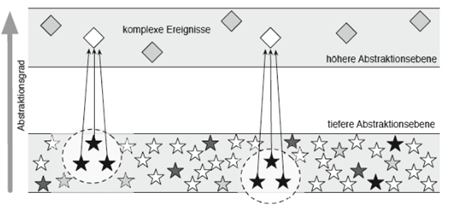

# Ereignismuster
Nach  [BrDu15]  ergibt sich ein Informationsgehalt eines Ereignisstroms nur durch das Erkennen von Zusammenhängen, Abhängigkeiten und Korrelationen zwischen mehreren Ereignissen. Die zwischen den zusammenhängenden Ereignissen bestehenden Beziehungen, stellen Muster (Event Pattern) dar, die es gilt zu erkennen. Pattern Matching beschreibt das Ziel der Verarbeitung von Ereignisströmen. Es erfolgt eine Unterscheidung in „low level events“ und „high level events“. Low level events sind die direkt aus den Datenquellen stammenden Ereignisse, die ein konkretes Vorkommnis in der realen Welt repräsentieren. Low level events befinden sich auf einer niedrigen Abstraktionsebene. Neue, höherwertige komplexe Ereignisse (high level events) repräsentieren ein erkanntes Muster. High level events befinden sich auf einer höheren Abstraktionsebene, da sie aus der Korrelation von einfachen Ereignissen entstehen (siehe Abbildung1).
 

Abbildung 1: Ereignisse auf unterschiedlichen Abstraktionsebenen [BrDu15]

Nach [BrDu15] lassen sich drei Arten der Mustererkennung differenzieren. Eine einfache Mustererkennung identifiziert Einzelereignisse oder boolesche Kombinationen von Ereignissen in einer Ereignismenge. Beispielsweise beschreibt das Muster (A˄B˄⌐C), dass zwei Ereignisse A und B auftreten, bei Abwesenheit des Ereignisses C. Falls weitere Operatoren für die Spezifikation von komplexeren Mustern nötig sind, ist die Sprache von komplexer Mustererkennung. Besondere Bedeutung haben dabei Operatoren zur Spezifikation der Reihenfolge von Ereignissen oder zur Festlegung von Zeitfenstern für das Auftreten der Ereignisse. Ein dritter Aspekt ist die Abstraktion von Ereignismustern, da bei der Erkennung eines Musters in einer Folge einfacher Ereignisse somit ein komplexeres Ereignis auf einer höheren Abstraktionsebene erzeugt werden kann, das das erkannte Muster repräsentiert. Durch eine derartige Abstraktion kann die Anzahl der relevanten Ereignisse reduziert werden und eine verständlichere Sicht auf komplexe Situationen ermöglicht werden. [BrDu15]

