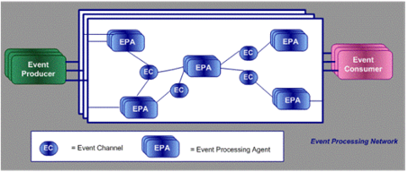

# Event Processing Network
Ein Event Processing Network zeigt eine Architektur, bei der das Event Processing mithilfe eines Netzwerks aus Event Processing Agents erfolgt. 
Ein Event Processing Network besteht aus den Komponenten Event, Event Producer, Event Consumer und Event Processing Agent (siehe Abbildung 2). Der Begriff Ereignis (Event) wurde bereits definiert. 

 
 
Abbildung 2: Event Processing Network [IBM10]

Im Folgenden werden die weiteren Komponenten eines Event Processing Networks erläutert.  

## Event Producer
Bei einem Event Producer handelt es sich um eine Entität am Rande eines Event Processing Systems. Event Producer generieren ausschließlich Events, ohne diese empfangen oder weiterverarbeiten zu können. [EtNi10] 
Ein Beispiel für einen Event Producer ist ein GPS-Sensor in einem LKW, der anhand empfangener GPS-Daten regelmäßig Position-Events produziert und sie in das System einspeist. Durch die Produktion dieser Events ist dem Event Processing System immer die genaue Position des LKWs bekannt und andere Komponenten, die die Position des LKW benötigen, können die Daten vom Event Processing System erhalten. [Lack12]

## Event Consumer
Ein Event Consumer ist eine Entität am Rande eines Event Processing Systems, die jedoch Events vom System empfängt [EtNi10]
Event Consumer können nicht, wie die Event Producer Events produzieren. Sie empfangen ausschließlich Events von dem Event Processing System, somit liegt ihre Aufgabe in der finalen Verarbeitung von Ereignissen.
Die vom System empfangenen Events können für eine spätere Analyse gespeichert oder direkt in einem Programm zur Anzeige gebracht
werden. Beziehen wir uns erneut auf das zuvor genannte Beispiel, so könnte der Event Consumer ein Programm zur Verwaltung der Empfangenen GPS-Daten von mehreren LKWs sein. 
Event Producer und Event Consumer sind völlig unabhängig voneinander. Entsprechend lassen sich Komponenten austauschen oder auch erweitern. 

## Event Processing Agents
Event Processing Agents können, im Gegensatz zu Event Producer und Event Consumer, Events sowohl senden, als auch Empfangen und sind somit Produzenten und Konsumenten.  Die Verarbeitung von Events wird in einem Netzwerk von Event Processing Agents übernommen. Zu den Aufgaben von Event Processing Agents gehören einfache Routing-Aufgaben, bis hin zur Erkennung von Mustern. Betrachtet man den einfachsten Fall, so nehmen Event Processing Agents Events entgegen und leiten diese weiter. Es erfolgt eine Unterscheidung in Filter Agents, die Events entgegennehmen und Events, die nicht benötigt werden rausfiltern, Transformation Events, die den Inhalt der eingehenden Events modifizieren und Pattern  Detect Events, die als Reaktion auf ein gefundenes Muster ein neues komplexes Event erstellen. Event Processing Agents können ebenfalls mehrere Funktionen gleichzeitig erfüllen. [EtNi10]
