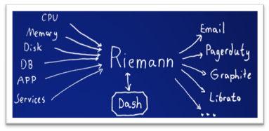
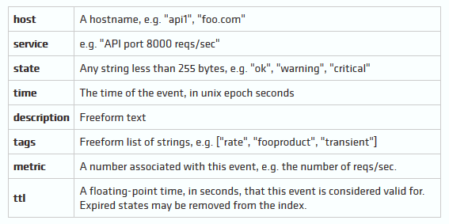
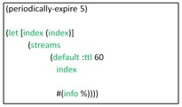

# Anwendungsgebiete
Event Processing findet in den unterschiedlichsten Bereichen Anwendung. 
Im Folgenden werden beispielhaft Einsatzgebiete für Event Processing erläutert. 
Eine Einsatzmöglichkeit zeigt sich im Business Activity Monitoring (BAM). Das Business Activity Monitoring überwacht Geschäftsprozess und unternehmenskritische Ressourcen, indem es Ereignisse in Key Performance Indikatoren zusammenfasst, mit dem Ziel, Probleme und Chancen frühzeitig zu erkennen.  [EcBr09]
Neben der Aggregation von Standardindikatoren können benutzerdefinierte Auswertungen durchgeführt werden. [SeBr14]
Auch Aktien- und Rohstoffpreise können als Ereignisse aufgefasst werden, die frühzeitig und kontinuierlich analysiert werden müssen, um entsprechende „Trends“ zu erkennen und auf diese zu reagieren. Somit ergibt sich eine Anwendung von Event Processing im Bereich der Marktdaten. 
Nach [SeBr14] kann Event Processing ebenfalls zur Sicherung von B2B und B2C Schnittstellen, anhand der Erkennung gewisser Nutzungsmuster und entsprechender Alarmierung, beitragen. Ebenso ermöglicht Event Processing eine zeitnahe und individuell gestaltbare Analyse von Kundenverhalten, wie beispielsweise die Analyse von Warenkörben in Online-Shops.

## Tool Riemann 

 

Abbildung 3: Riemann

Ein Tool für Event Processing bietet Riemann.
Anwendung findet Riemann beispielsweise, um die Latenzverteilung einer Web-App zu testen, für das Senden einer E-Mail für jede Ausnahme in einer App oder auch für das Anzeigen der Top-Prozesse auf jedem Host (siehe Abbildung 3) [Riem17].
Das Tool Riemann aggregiert Ereignisse von Servern und Anwendungen durch eine leistungsfähige Stream-Verarbeitungssprache. Die Idee hinter Riemann ist, das Überwachen und Messen von Ereignissen zu einem einfachen Standard zu machen. Der Zustand von eingehenden Ereignissen kann verfolgt werden. [Turn16]
Ereignisse (events) sind nach Riemann nur Strukturen, die über „Protocol Buffer“ versendet werden und in Riemann werden diese als unabänderlich behandelt. Jedes Ereignis hat bestimmte, optionale Felder (siehe Abbildung 4) und wird eindeutig durch seinen „Host“ und „Service“ identifiziert. [Turn26]

 

Abbildung 4: Event-Felder

Der Index ist in Riemann die Zustandstabelle und verfolgt immer nur das jüngste Ereignis für ein gegebenes (Host-, Service-) Paar. Sowohl das Dashboard, als auch Netzwerkclients und Streams können den Index abfragen, um feststellen zu können, wie das System aussieht. Ereignisse innerhalb des Index haben ein „ttl“ Feld, das anhand einer Gleitkommazahl angibt, wie lange das jeweilige Ergebnis gültig ist. Nach Ablauf dieser Zeit, wird das Ereignis aus dem Index entfernt und mit einem entsprechenden Status („abgelaufen“) wieder in die Ereignisströme (Streams) aufgenommen. [Riem17]
Jedes ankommende Ereignis wird einem oder mehreren Streams hinzugefügt. Streams sind Funktionen, denen Ereignisse für Aggregation, Modifizierung oder auch Eskalation zugeführt werden können. Anhand von „child streams“ wird das Filtern oder Partitionieren eines Ereignisstroms, beispielsweise dadurch, dass nur bestimmte Hosts oder Services ausgesucht werden, ermöglicht. [Turn16]
Im Folgenden wird nach [Turn16] beispielhaft  die Konfiguration von Events, Streams und dem Index gezeigt (siehe Abbildung 5). 

 

Abbildung 5: Konfigurationsbeispiel [Turn16]

Die Funktion (periodically-expire 5) wird genutzt, um alle Events vom Index, die abgelaufen sind, zu entfernen. Hierbei handelt es sich um einen Eventrepeater. Die Zahl 5 steht dafür, dass er alle 5 Sekunden läuft und die abgelaufen Ereignisse (abgelaufene ttl) aus dem Index löscht. 
Für jedes dieser gelöschten Ereignisse, wird ein neues Ereignis für den indizierten Host und Service erstellt (die Host und Service Felder des abgelaufenen Ereignisses werden kopiert) und dem Stream hinzugefügt. 
Es folgt der Ausdruck (let [index (index)], der ein neues Symbol „index“ mit dem Wert index darstellt. Diese Funktion sendet Ereignisse zu Riemanns Index. Innerhalb des let-Ausdrucks folgt als nächstes die Streams-Funktion. [Turn16] 
Bei jeder Stream-Funktion handelt es sich um eine Clojure-Funktion [Riem17].
Die Liste mit Funktionen wird aufgerufen, wenn neue Ereignisse ankommen. 
Mit (default :ttl 60) wird zunächst eine Standard-ttl von 60 Sekunden gesetzt und somit bestimmt, wie lange ein Ereignis im Index gültig ist.  Der Aufruf des folgenden Index Symbols bedeutet, dass alle ankommenden Ereignisse automatisch zum Riemann Index hinzugefügt werden.
Durch #(info %) werden alle Ereignisse in die Protoko#lldatei geschrieben. [Turn16]
