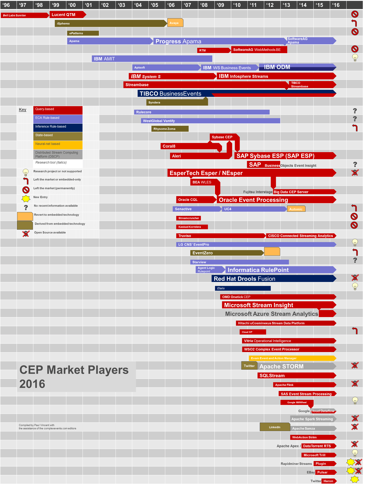

# Fazit
Das Datenvolumen steigt und mit ihm das Interesse an dem Bereich Event Processing auch wenn Event Processing schon auf mehr als 50 Jahre zurückgeht. 
In Unternehmen werden immer mehr Daten verarbeitet und auch das WWW trägt zu einer Fülle von Daten bei.
Die Nutzung von Event Processing nimmt rapide zu, da es die Möglichkeit bietet, Daten in Echtzeit zu verarbeiten und vor allem auf diese zu reagieren.
Zumeist ist Complex Event Processing in vorhandenen Produkten enthalten. Große Banken und Finanzdienstleister nutzen jedoch zumeist Front-Office-Systeme für den Kapitalmarkt, in die sie eine eigene Complex Event Processing Logik einbetten.
Die folgende Abbildung 6 aus dem Jahr 2016, voraussichtlich nicht mal ganz vollständig, zeigt die enorme Anzahl der Markt Player im Complex Event Processing Bereich. 

 
 Abbildung 6: Überblick CEP Market Player 2016 [Vinc16]
 
Complex Event Processing führt, hingegen zu herkömmlichen Datenbankmanagementsystemen Daten auf einer gespeicherten Abfrage aus und nicht eine Abfrage auf gespeicherten Daten. 
Daten die für einen Anfrage nicht relevant sind, können somit sofort verworfen werden. 
Aufgrund dieses Unterschieds kann Complex Event Processing auf einen unendlichen Datenstrom angewendet werden und Eingaben können direkt verarbeitet werden. Aufgrund dieses Aspektes, führt Complex Event Processing zur Echtzeitanalyse von Daten und bietet somit einen entscheidenden Vorteil im Hinblick auf die Zunft mit einem Umgang des weiter stetig wachsenden Datenvolumens. 

