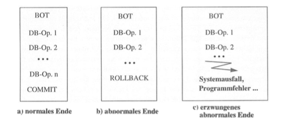

#2 Transaktionen und das ACID-Prinzip

Das ACID-Prinzip gilt als klassisches Transaktionskonzept, welches auf Atomarität, Konsistenz, Isolation und Dauerhaftigkeit setzt und dazu dient, ein, trotz gleichzeitiger Zugriffe mehrerer Benutzer und möglicher Fehlersituationen, konfliktfreies Arbeiten mit einem Datenbanksystem zu ermöglichen (vgl. Meier / Kaufmann, 2016, S. 136; Härder / Rahm, 1999, S. 391).
Als Transaktion verstehen A. Kemper und A. Eickler (2009, S. 279) aus Sicht des Datenbankbenutzers eine Arbeitseinheit, die eine bestimmt Funktion erfüllt. Aus Sicht des Datenbankverwaltungssystems ist sie eine Folge von Datenverarbeitungsbefehlen, deren Operationen wie z.B. lesen, verändern, einfügen oder löschen ununterbrechbar und konsistenzerhaltend ausgeführt werden. Alle Datenbankoperationen einer Transaktion sollen als Einheit ohne Einfluss durch andere Transaktionen in einem Mehrbenutzersystem fehlerfrei ausgeführt werden.
Um dem System erkenntlich zu machen, welche Operationen als Einheit auszuführen sind, sind vom Benutzer Transaktionsgrenzen durch die Operationen BEGIN OF TRANSACTION (BOT), COMMIT und ROLLBACK[^1] anzugeben. Den Beginn einer Transaktion kennzeichnet der Befehl BEGIN OF TRANSACTION. Eine Ausnahme ist in der Sprache SQL-92 zu finden, bei der eine Transaktion implizit bei Ausführung der ersten Anweisung begonnen wird. Eine erfolgreich beendete Transaktion, bei der alle Änderungen in die Datenbasis festgeschrieben werden, wird durch COMMIT eingeleitet. Soll eine Transaktion z.B. aufgrund von erkannten Eingabefehlern abgebrochen und Effekte der Transaktion rückgängig gemacht werden, ist dies durch den Befehl ROLLBACK zu kennzeichnen. (vgl. Härder / Rahm, 1999, S.395)
Letztendlich kann die Ausführung einer Transaktion, wie in Abbildung 1 dargestellt, auf drei verschieden Weisen enden. Eine erfolgreich durch COMMIT abgeschlossene Transaktion (Abb. 1a) stellt den Normalfall dar (vgl. Härder / Rahm, 1999, S.396). Bei einem erfolglosen Abschluss ist zwischen dem vom Benutzer, also der Transaktion selbst, veranlassten Abbruch (Abb. 1b) und dem durch einen Fehler erzwungenen Abbruch (Abb. 1c) zu unterscheiden (vgl. Härder / Rahm, 1999, S.396). Im Falle eines von der aktiven Transaktion bewirkten Abbruchs ist der Grund dafür aus Sicht der Transaktionsverwaltung nicht von Bedeutung (vgl. Kemper / Eickler, 2009, S. 282). Ein erzwungener Abbruch kann verschiedene Ursachen wie einen Systemausfall oder einen Programmfehler haben. Kommt es zu einem Abbruch, muss sichergestellt werden, dass die Datenbasis wieder in den Zustand zurückgesetzt wird, der vor der Ausführung der ersten Datenbankoperation existierte (vgl. Kemper / Eickler, 2009, S. 282).

*Abbildung 1: Möglichkeiten für den Abschluss einer Transaktion (Härder / Rahm, 1999, S. 396)*

##2.1 Die ACID-Eigenschaften

*Atomarität (engl. atomicity)*
Eine Transaktion arbeitet nach dem „Alles-oder-Nichts"-Prinzip, sodass entweder alle Operationen einer Transaktion ausgeführt werden und Auswirkungen auf die Datenbasis haben oder keine (vgl. Kemper/ Eickler, 2009, S. 136). Eine Transaktion ist ununterbrechbar. Sie stellt eine Einheit dar, die nicht weiter zerlegbar ist, sodass Zwischenstände einer Transaktion für konkurrierende Transaktionen nicht zugänglich sind (vgl. Kemper/ Eickler, 2009, S. 136; Meier / Kaufmann, 2016, S. 136). Kommt es durch einen auftretenden Fehler zum Abbruch einer Transaktion, werden bereits erfolgte Änderungen vollständig zurückgesetzt (vgl. Härder / Rahm, 1999, S. 393).

*Konsistenz (engl. consistency)*
Eine Transaktion garantiert Datenbankkonsistenz. Sie überführt eine Datenbank von einem konsistenten Zustand in einen anderen (vgl. Härder / Rahm, 1999, S. 393). Ein konsistenter Zustand einer Datenbank liegt vor, wenn vorhandene Daten widerspruchsfrei sind, d.h. alle vordefinierten Konsistenzbedingungen erfüllt werden (vgl. Zehnder, 1998, S. 243). Eine Einhaltung der Bedingungen wird überwacht und Datenänderungen rückgängig gemacht, wenn bei Transaktionsende eine Verletzung vorliegt. Während bei Beendigung einer Transaktion widerspruchsfreie Daten vorliegen müssen, sind während der Ausführung inkonsistente Zustände möglich bzw. können sie sogar notwendig sein (vgl. Härder / Rahm, 1999, S. 393).

*Isolation (engl. isolation)*
Die Eigenschaft Isolation fordert, dass eine Transaktion von dazu parallellaufenden Transaktionen "logisch gesehen" so ausgeführt werden muss, als wäre sie die einzige aktive Transaktion, sodass Datenmodifikationen anderer Transaktionen für sie nicht sichtbar sind (vgl. Kemper / Eickler, 2009, S. 283). Auf diese Weise wird verhindert, dass sie sich gegenseitig beeinflussen oder es durch den Zugriff auf gemeinsame Datenbestände zu Konflikten kommt (vgl. Schill / Springer, 2012, S.108). 

*Dauerhaftigkeit (engl. durability)*
Dauerhaftigkeit besagt, dass eine Datenänderung einer erfolgreich beendeten Transaktion persistent ist, d.h. dauerhaft in der Datenbank vorhanden bleibt (vgl. Härder / Rahm, 1999, S. 394). Sie ist vor Fehlern wie einem Systemabsturz geschützt und kann nur von einer neuen Transaktion verändert werden (vgl. Meier / Kaufmann, 2016, S. 137). 

##2.2 Anwendungsbeispiel 

Nachfolgend soll die Bedeutung der Eigenschaften anhand eines Beispiels einer Bankanwendung verdeutlicht werden. Dazu wird folgender Sachverhalt angenommen: Von Konto A soll ein Geldbetrag von 50€ nach Konto B überwiesen werden. Dies stellt somit eine Transaktion mit den folgenden elementaren Operationen dar:

>1. Lese der Kontostand von A in die Variable a: read( A, a);
>2. Reduziere den Kontostand um 50€: a := a - 50;
>3. Schreibe den neuen Kontostand in die Datenbasis: write( A, a);
>4. Lese den Kontostand von B in die Variable b: read( B, b);
>5. Erhöhe den Kontostand um 50€: b:= b+ 50;
>6. Schreibe den neuen Kontostand in die Datenbasis: write( B, b); 
>(Kemper / Eickler, 2009, S. 279 f.)

Anhand dieses Beispiels wird leicht anschaulich, dass entweder alle Operationen der Transaktion ausgeführt werden dürfen oder keine. Andernfalls könnte es dazu kommen, dass das Geld zwar von Konto A abgebucht, aber dem Konto B nicht gutgeschrieben wird. Folglich muss die Transaktion *atomar* ausgeführt werden. (vgl. Kemper / Eickler, 2009, S. 280)

Angenommen, beide Konten gehören unterschiedlichen Kunden und es gilt die Konsistenzbedingung, dass der Dispositionskredit D nicht überschritten werden darf. So kann es bei der Reduzierung von A um 50€ zur Konsistenzverletzung kommen, da der entsprechende Dispositionskredit überschritten wurde. Die Transaktion endet mit einem inkonsistenten Zustand und die Überweisung wird abgelehnt. Die *Konsistenz* muss gewährleistet und Bedingungen überprüft werden. (vgl. Kemper / Eickler, 2009, S. 280)

Angenommen, es gäbe die Forderung nach *Isolation* nicht und die hier beschrieben Überweisungstransaktion von Konto A nach Konto B (T1) wird parallel zu einer Transaktion (T2) ausgeführt, bei der von Konto B ein Gelbetrag von 100€ abgehoben wird. Greifen nun beide Transaktionen auf den aktuellen Kontostand zu und T2 endet kurz bevor T1 abgeschlossen wird, so würde T1 fälschlicherweise den von T2 neu errechneten und festgeschriebenen Kontostand überschreiben. Die Änderungen der Abhebungstransaktion T2 gingen in diesem Fall verloren. Folglich muss die Forderung nach *Isolation* gelten, um einen solchen Fehler zu vermeiden.

Einleuchtend sollte sein, dass das Festschreiben der durch die Überweisung bedingten Änderungen der Kontostände, auch nach einer Störung (z.B. einem Systemausfall) noch erhalten sein muss. Gilt die Überweisung z.B. zur Rechnungsbegleichung, könnte ansonsten fälschlicherweise angenommen werden, dass der Kunde noch nicht gezahlt hat, obwohl dies eigentlich der Fall ist. Folglich muss eine Transaktion *dauerhaft* sein.

##2.3 Abzuleitende Anforderungen

Eine Einhaltung der ACID-Eigenschaften wird von der Transaktionsverwaltung des Datenbanksystems kontrolliert und hierfür notwendige Komponenten wie der Mehrbenutzersynchronisation und der Recovery bereitgestellt. 
Eine Mehrbenutzersynchronisation regelt die Ausführung parallelablaufender Transaktionen und schließt eine gegenseitige Beeinflussung der Transaktion aus. Sie ist demnach insbesondere erforderlich, um das Prinzip der Isolation zu gewährleisten. Weiterhin werden Konsistenzverletzungen, die Folge einer unkontrollierten Nebenläufigkeit sein könnten, durch die Mehrbenutzersynchronisation verhindert. 
Wesentliche Aufgabe der Recovery-Komponente ist die Fehlerbehandlung zur Gewährleistung von Atomarität und Dauerhaftigkeit. Einerseits muss sichergestellt werden, dass erfolgreich beendete Transaktionen auch nach einem Fehler in ihrer Wirkung erhalten bleiben und andererseits noch aktive Transaktionen bei einem Abbruch in ihrer Wirkung zurückgesetzt werden. (vgl. Kemper / Eickler, 2009, S. 279 - 284)

[^1]:In anderer Literatur auch als ABORT bezeichnet. 