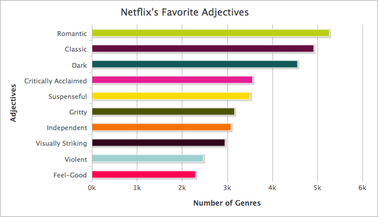
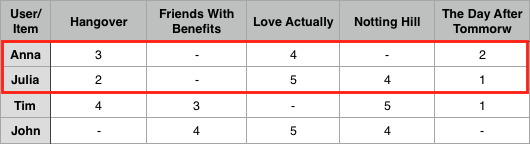

## 3.1 Netflix ##

In diesem Kapitel beschäftigen wir uns mit dem amerikanischen Unternehmen „Netflix, Inc“ (im Folgenden Netflix genannt). Netflix wurde 1997 von Reed Hastings und Marc Randolphs in Los Gatos in Kalifornien gegründet. Zunächst agierte Netflix als Online-Videothek und hat DVD's und Blu-ray's an die Abonnenten verschickt. Seit 2007 ist Netflix ein Video-on-Demand-Anbieter und bietet seinen Abonnenten die Möglichkeit, Filme und Serien zu streamen. Seit 2011 beschäftigt sich Netflix auch mit der Produktion von eigenen Serien.    

### 3.1.1 Datenerhebung ###

Netflix weiß von jedem Nutzer, was er schaut, wann er schaut, wie lange er etwas schaut, an welcher Stelle aufgehört wurde, zu schauen und wie er auf den Film oder die Serie aufmerksam geworden ist.  
Diese riesige Menge an Daten wird von Netflix gespeichert und anschließend von Algorithmen beobachtet. Laut des Artikels „How Netflix Reverse Engineered Hollywood“ des amerikanischen Magazins „The Atlantic“ beschäftigt Netflix allein 800 Ingenieure, die sich nur mit diesem Algorithmus beschäftigen.[^cf8]  
„The Atlantic“ hat recherchiert, wie die Algorithmen funktionieren. Auf die Funktionsweise des Algorithmus gehen wir im nächsten Abschnitt „Speicherung / Algorithmus“ näher ein.  
Das Herzstück von Netflix ist sein Empfehlungsmechanismus mit dem Namen CineMatch. Um diesen Mechanismus noch weiter zu verbessern, wurde 2006 von Netflix-Chef Reed Hastings der Wettbewerb „The Netflix Prize“ zur Verbesserung des Algorithmus, ausgeschrieben, so Xavier Amatriain und Justin Basilico im Artikel „Netflix Recommendations: Beyond the 5 stars (Part 1)“.[^cf9] Er versprach 1 Million Dollar für diejenigen, die es schaffen würden, den Algorithmus um 10 Prozent zu verbessern. Letztendlich gewann ein Team, das eine Verbesserung des Algorithmus um 8,43% geschafft hatte. Das Team hat 2000 Stunden damit verbracht, um einen Kombination aus 107 Algorithmen zu präsentieren.
Um den Algorithmus einsetzen zu können, mussten allerdings einige Anpassungen auf Seiten von Netflix vorgenommen werden. So konnte beispielsweise der ursprüngliche Algorithmus nicht mehr als 100 Millionen Bewertungen händeln, wobei zu dem Zeitpunkt bereits 5 Milliarden Bewertungen vorhanden waren. Somit kam der Algorithmus nie wirklich zum Einsatz. In 2012 wurden bereits 75% der Filme und Serien aufgrund des Empfehlungssystems geschaut.  
  
### 3.1.2 Speicherung / Algorithmus ###

Netflix hat ein riesiges Repertoire an „personalisierten Genres“. Personalisierte Genres wären zum Beispiel Genres wie „Golden Globe Award-winning Understated Comedies“ oder „African-American Crime Documentaries“. Personalisiert sind sie deswegen, weil sie aus den Nutzerverhalten der Abonnenten automatisch generiert werden. In Anbetracht der Tatsache, dass Netflix mehr als 85 Millionen Abonnenten hat[^cf10], kann man sich vorstellen, wie riesig dieses Repertoire an personalisierten Genres ist.
In einem Artikel von „The Atlantic“ beschreibt der Autor Alexis C. Madrigal seine Recherchearbeiten zum Algorithmus von Netflix.
Er hat herausgefunden, dass Netflix im Januar 2014 76.897 Genres besitzt, um Filmtypen zu beschreiben. Zum heutigen Zeitpunkt sind es fast 93.000.[^cf11] 
„The Atlantic“ hat außerdem herausgefunden, dass Netflix jeden einzelnen denkbaren Film und jede Serie auf dutzende Eigenschaften analysiert hat und sich somit eine enorme Datenbasis aufgebaut hat. Dies gelang ihnen, indem sie Menschen engagieren, die Filme schauen und diese mit unterschiedlichsten Metadaten beschreiben. Diese ausgebildeten Filmschauer bewerten unter anderem das Romantiklevel, wie blutrünstig ein Film ist, den Moralstatus der Charaktere sowie auch erzählerische Daten, wie beispielsweise die Schlüssigkeit der Handlung. Diese Eigenschaften werden mit den Gewohnheiten der Netflix-User kombiniert, woraus ein großer Wettbewerbsvorteil für Netflix entsteht. In folgender Grafik sieht man beispielsweise die zehn häufigst verwendeten Adjektive für die Beschreibung von Filmen und Serien:

Quelle [How Netflix Reverse Engineered Hollywood - The Atlantic](http://www.theatlantic.com/technology/archive/2014/01/how-netflix-reverse-engineered-hollywood/282679/)[^cf12]

Durch den beschriebenen Algorithmus hat Netflix eine neue Form des Empfehlens geschaffen. Im folgenden beschreiben wir zwei unterschiedliche Filtermethoden für Empfehlungssysteme. In seiner Diplomarbeit beschreibt Benedikt Hebeisen zwei verschiedene Filtermethoden für Empfehlungssysteme.[^cf13] Auf diese zwei Methoden - das kollaborative Filtern, sowie das inhaltsbasierte Filtern - gehen wir im Folgenden genauer ein.  

#### 3.1.2.1 Kollaboratives Filtern ####

Die am häufigsten verbreitete Filtermethode für Empfehlungssysteme ist laut Hebeisen heutzutage das kollaborative Filtern. Ein kollaboratives System ist ein lernendes System, welches eine vorhandene Datenbasis nutzt. Anhand dieser Datenbasis sollen Verhaltensmuster von Nutzereingaben zu erkennen sein und es soll versucht werden, eine Verbindung zwischen eingegebenen und bereits vorhandenen Daten herzustellen (User-to-User). Es werden also Empfehlungen auf Basis von Bewertungen anderer Nutzer gegeben. Das Interessenprofil eines Nutzers soll auf das Interessenprofil eines anderen Nutzers übertragen werden. Die Evaluierung kann über zwei Methoden erfolgen: Einerseits werden konkrete Bewertungen einer bestimmten Sache (zum Beispiel eines Filmes) mit einer Skala klassifiziert. Andererseits können Daten über das implizite Verhalten des Nutzers genutzt werden. Hierbei wird zum Beispiel berücksichtigt, wie lange ein Nutzer etwas angeschaut hat oder was angeschaut wurde.
Beim kollaborativen Filtern wird davon ausgegangen, dass man ein statistischer Nachbar ist, wenn man ähnliche Bewertungen abgegeben hat und dass etwas für einen Nutzer relevant oder interessant ist, wenn es auch für den statistischen Nachbarn interessant war.
Wenn Anna zum Beispiel Film 1 mit 3 Sternen, Film 3 mit 4 Sternen und Film 5 mit 2 Sternen bewertet hat und Julia Film 1 mit 2 Sternen, Film 3 mit 5 Sternen, Film 4 mit 4 Sternen und Film 5 mit 1 Stern bewertet hat, dann scheinen die beiden Benutzer Anna und Julia ähnlich zu sein. Anna kann also nach der kollaborativen Filtertechnik der Film 4 vorgeschlagen werden, den sie ja noch nicht gesehen hat, da ihre statistische Nachbarin Julia diesen Film interessant fand, beziehungsweise ausreichend gut bewertet hat.

  

Bei dem kollaborativen Empfehlungssystem wurde versucht vorherzusagen, wie viele Sterne ein Nutzer einem Film geben wird. Je mehr Filme ein Nutzer bewertet hat, desto einfacher lässt sich eine Tendenz über den Filmgeschmack des Nutzers evaluieren und desto präzieser werden die Vorhersagen.  
Das Hauptproblem von kollaborativen Empfehlungssystemen ist dementsprechend das Fehlen einer Datenbasis. Neue Nutzer haben noch keine Bewertungen abgegeben und haben somit auch keine statistischen Nachbarn. Selbes gilt auch für Objekte, die einem System neu hinzugefügt werden. Wird also beispielsweise ein Film neu hinzugefügt, hat er zu Beginn keine Bewertungen und kann somit nicht bei der Technik des kollaborativen Filterns berücksichtigt werden.  

#### 3.1.2.2 Inhaltsbasiertes Filtern ####

Eine andere Filtermethode ist das inhaltsbasierte Filtern. Hier werden anhand der Ähnlichkeiten von Objekten mit Nutzerprofilen Empfehlungen generiert. Die Objekte werden hierbei durch ihre Inhalte oder durch Eigenschaften und Metadaten beschrieben. Anders als beim kollaborativen Filtern wird hier nicht versucht, eine Verbindung zwischen mehreren Nutzern herzustellen, sondern es wird versucht, eine Verbindung zwischen mehreren Objekten herzustellen (Item-to-Item). Ein Nutzerprofil beinhaltet Interessen über Objekt-Attribute, die zum einen durch direkte Eingabe oder durch implizites Nutzungsverhalten (zum Beispiel der Analyse der Tätigkeiten des Nutzers) gesammelt werden. Empfehlungen werden ausgesprochen, wenn eine nahe Verbindung zwischen Nutzerpräferenzen und Objekteigenschaft besteht.
Netflix nutzt eher das inhaltsbasierte Filtern. In die Empfehlungen fließen aber auch Bewertungen von Freunden, wie beim kollaborativen Filtern, ein.

Im folgenden Kapitel wird darauf eingegangen, wie die riesige Menge an gespeicherten Daten analysiert wird.  

### 3.1.3 Analyse der Daten ###

Um Schlussfolgerungen aus den Datenerhebungen zu ziehen, muss zuerst eine gewisse Menge an Daten zur Analyse bereit stehen. Erst wenn genug Menschen beispielsweise an einer bestimmten Stelle Pause gedrückt oder vorgespult haben, kann man anfangen, Schlussfolgerungen aus diesem Verhalten zu ziehen. Wenn ständig an der gleichen Stelle Pause gedrückt wird, könnte die Handlung zu langwierig oder langweilig geworden sein um das Interesse der Zuschauer zu halten. Es könnte auch sein, dass der Plot zu kompliziert wurde. Wenn genug Nutzer nach der Pause nie weiter schauen, könnte die Annahme getroffen werden, dass die Sendung schlecht ist. Natürlich sind das aber alles nur Annahmen. Trotz der gigantischen gesammelten Datenmenge kann Netflix nicht mit 100%iger Sicherheit sagen, was das Verhalten der User bedeutet.
Aufgezeichnet werden alle erdenklichen Daten, von Standort des Nutzers, Gerät des Nutzers, Uhrzeit am Nutzungsort, Dauer der Nutzung, in welcher Sprache geschaut wird, ob eine ganze Folge/ein ganzer Film geschaut wird oder ob abgebrochen wird, wann und wie lange pausiert wird, ob vorgespult wird, wann gestoppt wird und was geschaut wird, gespeichert. Außerdem werden die Ratings, die Likes, die geteilten Inhalte sowie die Interaktionen, wie Scrollen, Sucheingaben und das Hinzufügen zu Listen gespeichert.
Zum einen weiß Netflix durch die Analyse dieser Daten, welche Schauspieler und welche Genres bevorzugt werden. Zum anderen kann so aber auch herausgefunden werden, ob am Wochenende eher Serien oder eher Filme geschaut werden. Dies wird dann bei den nächsten Empfehlungen berücksichtigt und es wird mehr von den favorisierten Formaten vorgeschlagen.  

### 3.1.4 Nutzung der Daten ###

Laut des Artikels „How Netflix is turning viewers into puppets“ auf www.salon.com arbeitet Netflix seit 2012 daran, insofern Nutzen aus ihrer Big Data Kapazität zu ziehen, als dass sie versuchen damit ihre Programmauswahl zu beeinflussen. Netflix kauft und produziert  Serien aufgrund ihrer Analyseergebnisse.[^cf14]
Das Pilot-Projekt dieser Strategie ist die Serie „House of Cards“. „House of Cards“ war ursprünglich eine britische Miniserie, die 1990 auf dem britischen Kanal BBC ausgestrahlt wurde. Die Serie bestand aus nur vier Episoden und handelt von einem Politiker, der zusammen mit seiner Ehefrau Rachepläne ausübt, nachdem er vom Premierminister hintergangen wurde. Aufgrund der Big Data-Analyse von Netflix wurde die Entscheidung getroffen, eine Neuauflage der britischen Serie „House of Cards“ zu produzieren.
Den Analyseergebnissen konnte man entnehmen, dass dieselben Personen, die das britische Original von „House of Cards“ liebten, ebenfalls Filme lieben, bei denen Kevin Spacey mitspielt oder die unter der Regie von David Fincher produziert wurden.
Die Argumente waren also:

- Die britische Version von „House of Cards“ hatte ein großes Publikum
- „The Social Network“, bei dem David Fincher Regie geführt hat, hatte ein großes Publikum
- Nutzer, die die britische Version von „House of Cards“ geschaut haben, schauten oft auch Filme mit Kevin Spacey und/oder Filme, die unter der Regie von David Fincher entstanden sind.

Somit sollte das Remake der Serie, die für 13 Episoden 100 Millionen Dollar gekostet hat, für Netflix ein Kinderspiel werden.
Verglichen zu traditionellen Studios, die außer den verkauften Tickets und DVDs kein Feedback ihrer Kunden bekommen, ist Netflix, was das Feedback und die Analyse angeht, absolut im Vorteil. Netflix kann viel schneller reagieren als ihre traditionelle Konkurrenz. Netflix muss vor der Produktion eines Films oder einer Serie nicht mehr ahnen, was die Nutzer sehen wollen, sondern stützt sich auf ihre Analysen. Sie können die Daten sogar bis auf die Postleitzahl herunterbrechen und herausfinden, welche Shows mit welchen Schauspielern die Nutzer in bestimmten Regionen am liebsten sehen.
Die traditionellen Studios haben einen großen Nachteil. Einer der größten Posten bei den Kosten einer Filmproduktion ist das Marketing. Es gibt keine Möglichkeit herauszufinden, welche der Marketingstrategien erfolgreich waren und welche nicht und ob es das Marketing überhaupt etwas bringt. Theoretisch können Millionen ins Marketing fließen und der Film kann trotzdem erfolglos bleiben.
Der Vorteil von Netflix ist also, dass seine Nutzer durch ihr Nutzungsverhalten entscheiden, was produziert wird und was nicht. Ebenso legen sie fest, welche Schauspieler sie sehen wollen. Netflix hat es geschafft, eine Brücke zwischen Nutzern und Produzenten zu bauen. Das Team, das entscheidet was produziert wird, kann sich so ganz einfach an den Daten der Nutzer orientieren.

### 3.1.5 Visualisierung ###

Die Darstellung einzelner Sendungen hängt nicht vom Zufall ab, meinen die Autoren Chris Alvino und Justin Basilico des Artikels „Learning a Personalized Homepage“.[^cf15] Ganz im Gegenteil: Die Platzierung und Auswahl der richtigen Sendungen für die einzelnen Zeilen ist ein wichtiger Teil des Personalisierungsansatzes von Netflix. Es muss also herausgefunden werden, welche Zeilen am relevantesten für jeden einzelnen Nutzer sind, sowie mit welchen Sendungen die Zeilen gefüllt werden sollen. Außerdem muss entschieden werden, an welcher Stelle der limitierten Startseite jede Zeile platziert wird, sodass die Auswahl des nächsten Videos möglichst intuitiv geschehen wird.
Hierfür nutzt Neflix das maschinelle Lernen. Die Maschine lernt, historische Informationen zu nutzen. Historische Informationen wären zum Beispiel:  

+ welche Homepages wurden bereits einmal für die Mitglieder erstellt
+ wie interagieren die Mitglieder
+ was schauen die Mitglieder tatsächlich gerade an
+ was spielen sie überhaupt ab

Es gibt offensichtlich einige Herausforderungen für das Anlernen des Modells für maschinelles Lernen. Die Trainingsdaten für den Algorithmus müssen sehr bedacht ausgewählt werden. Die Herausforderung ist auch, wie die Zuordnung im Modell erlaubt ist. Wenn ein Nutzer ein Video aus einer bestimmten Zeile in der Vergangenheit abgespielt hat, heißt es nicht, dass der Nutzer dieses Video ebenfalls ausgewählt hätte, wenn es in einer anderen Zeile an erster Stelle gestanden hätte. Es könnte die Benennung der Zeile und nicht die Position in der Zeile ausschlaggebend für das Abspielen gewesen sein.
Um diese Herausforderungen zu bewältigen, ist es wichtig, eine gute Metrik auszuwählen. Von hoher Wichtigkeit für die Seitengenerierung ist, wie die Qualität der Seiten, die durch einen Algorithmus erzeugt wurden, zu bewerten ist. Jede mögliche Verbesserung des Algorithmus wird sofort online in einem A/B-Test geprüft. Netflix möchte in der Lage sein, die wertvollen A/B-Testressourcen auf Algorithmen anzuwenden, von denen angenommen wird, dass sie die Qualität der Seiten verbessern könnten. Die Parameter der Algorithmen sollten vor dem A/B-Test abgestimmt werden. Dazu können historische Daten verwendet werden, um hypothetische Seiten aus dem neuen algorithmischen Ansatz zu generieren.
Für die Entwicklung von Qualitätsmetriken auf Seitenebene hat sich Netflix von in der Informationsrückgewinnung bereits etablierten Ranking-Metriken inspirieren lassen. Sie haben als Beispiel eine Metrik für eine eindimensionale Liste genommen und daraus eine neue Metrik erstellt, die in einem zweidimensionalen Layout funktioniert.
Als Beispiel geben Sie die Metrik „Recall@n“ an. Diese misst die Anzahl der relevanten Items in den Top n geteilt durch die Gesamtanzahl der relevanten Items. Netflix hat diese Metrik in zwei Dimensionen erweitert zu „Recall@m-by-n“. So kann die Anzahl der relevanten Items der ersten m Zeilen und n Spalten auf der Seite geteilt durch die Gesamtanzahl der relevanten Items gezählt werden. „Recall@3-by-4“ kann also die Qualität der Videos, die im sichtbaren Bereich eines Geräts angezeigt werden, das nur 3 Zeilen mit jeweils 4 Videos zur Zeit anzeigen kann, repräsentieren. Eine nette Eigenschaft von Recalls, die auf diese Weise definiert werden, ist, dass es automatisch Sonderfälle, wie doppelte Videos oder kurze Zeilen behandeln kann. Außerdem könnte man einen der Werte, also n oder m fixieren und die jeweils anderen durchtauschen, um zu berechnen, wie sich der Recall im sichtbaren Bereich erhöhen würde, wenn der Nutzer die Seite nach unten scrollen würde. Solch definierte Metriken kann Netflix nutzen, um Änderungen an jedem der algorithmischen Ansatz, die für die Generierung der Seite genutzt werden, oder jede der eingegebenen Daten, zu bewerten. 
Laut des Artikels „To Be Continued: Helping you find shows to continue watching on Netflix“, geschrieben von Hossein Taghavi, Ashok Chandrashekar, Linas Baltrunas und Justin Basilico auf dem Netflix eigenen Blog, ist das große Ziel des Empfehlungssystem von Netflix, die perfekte Serie oder den perfekten Film für jeden Nutzer zu kennen und diesen direkt beim Start von Netflix zu starten.[^cf16]
Wenn ein Nutzer Netflix öffnet, möchte er entweder eine ganz neue, für ihn unbekannte Sendung entdecken oder die nächste Folge einer bereits bekannten Serie sehen, beziehungsweise einen angefangenen Film zu Ende schauen. Netflix unterscheidet, ob sich ein Nutzer im "Weiterschauen-Modus" oder im "Entdeckungs-Modus" befindet. Wenn Netflix vorhersagen kann, dass der Nutzer beim Öffnen gerade eine Serie oder einen Film weiter schauen möchte, so würde es Sinn machen, diese/n an präsenter Stelle auf der Startseite zu platzieren.  
Grundsätzlich fokussiert Netflix sich hier auf die Zeile „Weiterschauen“. Ein nicht unerheblicher Anteil der Streaming-Zeit erfolgt aufgrund der Platzierung der Serie oder des Films in dieser Zeile. Wie die Zeile auf der Seite platziert wurde, hing von einigen Regeln ab, die wiederum vom der Plattform abhängig waren. Laut des Blog-Artikels will Netflix dies nun über die Plattformen hinweg vereinheitlichen um die Nutzererfahrung der "Weiterschauen"-Zeile anhand folgender zweier Dimensionen zu verbessern:  

+ Verbesserung der Platzierung der Zeile: Sie soll höher platziert werden, wenn ein Nutzer im "Weiterschauen-Modus" ist. Sie soll tiefer platziert werden, wenn ein Nutzer eher nach einem neuen Titel sucht, sich also im „Entdeckungs-Modus“ befindet.  
+ Verbesserung der Reihenfolge der zuletzt angeschauten Sendungen in der Zeile in Abhängigkeit der Wahrscheinlichkeit, dass sie beim nächsten Aufruf von Netflix angeschaut/weitergeschaut werden.
Herauszufinden, wie hoch die Wahrscheinlichkeit ist, dass sich ein Nutzer gerade im „Weiterschauen-Modus“ befindet, versucht Netflix über die Definition unterschiedlicher Aktivitätsmuster. Ein Nutzer ist möglicherweise gewillt, eine Sendung fortzusetzen, wenn er:  

+ schon viele Folgen einer Serie geschaut hat, diese aber noch nicht komplett zu Ende geschaut hat
+ vor Kurzem einen Film angefangen hat
+ eine Show vermehrt zu einer bestimmten Zeit am Tag oder über das aktuelle Gerät geschaut hat

Im „Entdeckungs-Modus“ befindet sich der Nutzer eher, wenn er:  

+ gerade einen Film zu Ende oder alle Staffeln und Episoden einer Serie geschaut hat
+ in letzter Zeit nichts mehr geschaut hat
+ sich neu bei Netflix angemeldet hat

Diese Hypothesen haben Netflix laut oben genanntem Artikel dazu motiviert, ein maschinenlernendes Modell zu bauen, welches obige Muster identifiziert und nutzt, um eine bessere „Weiterschauen“-Zeile zu generieren.
Um ein Empfehlungsmodell für die „Weiterschauen“-Zeile zu kreieren, braucht man zunächst Merkmale, die Muster aus dem Verhalten der Nutzer erkennen. Diese sollen dabei helfen, eine Vorhersage zu treffen, wann ein Nutzer eine Serie oder einen Film weitersehen möchte. Diese Merkmale werden als Input für das Erstellen des maschinellen Lern-Modells genutzt. Die wichtigsten Merkmale können dann später nach einigen Testläufen optimiert und ausgewählt werden. Die Autoren des Blog-Artikels haben drei mögliche Ideen für das Erstellen des Weiterschauen-Modells berücksichtigt, darunter:  

+ Eigenschaften auf Mitgliedsebene:
    + Daten über das Abonnement des Mitglieds, wie zum Beispiel die Dauer des Abonnements, das Land der Registrierung und die Sprachpräferenzen
    + Wie aktiv das Mitglied in letzter Zeit war
    + Die letzten Bewertungen des Mitglieds sowie Präferenzen in Genres
+ Eigenschaften über eine Sendung sowie die Interaktion des Nutzers mit dieser:
    + Wie lange ist es her, dass eine Sendung zu dem Katalog hinzugefügt, bzw. vom Mitglied geschaut wurde
    + Wie viel der Sendung hat das Mitglied geschaut
    + Metadaten über die Sendung, wie zum Beispiel Typ, Genre, Anzahl der Episoden ( Beispielsweise werden Kindersendungen öfter wiederholt geschaut).
    + Beliebtheit und Relevanz der Sendung für das Mitglied
    + Wie oft das Mitglied die Sendung weiter geschaut hat
+ Kontextbezogene Eigenschaften:
    + Aktuelle Uhrzeit sowie Wochentag
    + Standort
    + Genutztes Gerät des Mitglieds

Für die optimale Darstellung der „Weiterschauen“-Zeile gibt es zwei Aufgaben: Sortierung der Ergebnisse innerhalb der Zeile sowie die Platzierung der Ergebnisse an eine sinnvolle Stelle auf der Startseite des Mitglieds. Für die Sortierung der Ergebnisse innerhalb der „Weiterschauen“-Zeile hat Netflix ein Modell trainiert, das Sessions nutzt, in denen das Mitglied eine zuvor angesehene Sendung weiterschaut. In jeder Session lernt das Modell zwischen den Sendungen, die wiederholt werden, zu unterscheiden und ordnet diese in der vorhergesagten Wahrscheinlichkeit an. Um die „Weiterschauen“-Zeile sinnvoll, beziehungsweise an einer geeigneten Stelle auf der Startseite des Mitglieds zu platzieren, möchte Netflix die Wahrscheinlichkeit abschätzen, ob sich das Mitglied gerade im „Weiterschauen-Modus“ oder aber im „Entdeckungs-Modus“ befindet, so die Autoren des Blog-Artikels. Aufgrund dieser Wahrscheinlichkeit könnten mehrere Ansätze verfolgt werden. Ein einfacher Ansatz wäre, dass es nur zwei Möglichkeiten gibt, die Zeile zu platzieren: oben auf der Seite oder weiter unten auf der Seite.
Durch Anwendung eines Schwellenwertes auf die vorhergesehene Wahrscheinlichkeit kann Netflix entscheiden, in welcher dieser beiden möglichen Positionen die Zeile platziert wird.