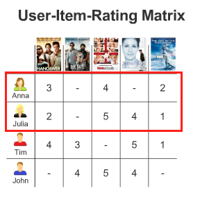

1. Datenerhebung

Netflix weiß von jedem Nutzer, was er schaut, wann er schaut, wie lange er etwas schaut, an welcher Stelle aufgehört wurde, zu schauen und wie er auf den Film oder die Serie aufmerksam geworden ist.

Diese riesige Menge an Daten wird von Algorithmen beobachtet. Laut dem amerikanischen Magazin The Atlantic beschäftigt Netflix allein 800 Ingenieure, die sich nur mit diesem Algorithmus beschäftigen.

The Atlantic hat recherchiert, wie die Algorithmen funktionieren. Auf die Funktionsweise des Algorithmus gehe ich im nächsten Abschnitt *Speicherung / Algorithmus* näher ein.

Das Herzstück von Netflix ist sein Empfehlungsmechanismus. Dieser basiert auf dem Algorithmus, der Cinematch genannt wird. Um diesen Mechanismus noch weiter zu verbessern, wurde 2006 von Netflix-Chef Reed Hastings ein Wettbewerb “The Netflix Prize” zur Verbesserung des Algorithmus, ausgeschrieben. Er versprach demjenigen, der es schaffen würde, den Algorithmus um 10 Prozent zu verbessern, 1 Million Dollar. (http://techblog.netflix.com/2012/04/netflix-recommendations-beyond-5-stars.html)

Letztendlich gewann ein Team, das eine Verbesserung von 8,43% geschafft hat. Das Team habe 2000 Stunden Arbeit damit verbracht, um einen Kombination aus 107 Algorithmen zu präsentieren.
Um den Algorithmus einsetzen zu können, mussten einige Anpassungen vorgenommen werden. So konnte beispielweise der ursprüngliche Algorithmus nicht mehr als 100 Millionen Bewertungen händeln, wobei zu dem Zeitpunkt bereits 5 Milliarden Bewertungen vorhanden waren.
In 2012 wurden bereits 75% der Filme und Serien aufgrund des Empfehlungssystems geschaut.

2. Speicherung / Algorithmus

In Anbetracht der Tatsache, dass Netflix mehr als 85 Millionen Abonnenten hat (Stand von Oktober 2016 laut http://www.wiwo.de/unternehmen/it/netflix-in-deutschland-mehr-abonnenten-als-einwohner/14702184.html), wird klar, dass sie ein riesiges Repertoire an “personalisierten Genres” haben.

In dem Artikel *How Netflix Reverse Engineered Hollywood* vom 02.01.2014 beschreibt das Magazin *The Atlantic* ihre Recherchearbeiten zum Algorithmus von Netflix.
Sie haben herausgefunden, dass Netflix zu diesem Zeitpunkt 76.897 Genres besitzt, um Filmtypen zu beschreiben. Zum heutigen Zeitpunkt sind es fast 93.000 (https://docs.google.com/spreadsheets/d/1eISFvq42Sll10xekyV-XQdwoG7_gjZpreNG40Pz8G0k/edit#gid=2125244376).

Zu den neuesten zählen Genres wie “Golden Globe Award-winning Understated Comedies” und “Critically-acclaimed Biographical Drug Documentaries”.

*The Atlantic* hat herausgefunden, dass Netflix jeden einzelnen denkbaren Film und jede Serie analysiert hat und sich somit eine enorme Datenbasis aufgebaut hat.
Dies gelang Ihnen, indem sie Menschen engagiert haben, die Filme schauen und diese mit unterschiedlichsten Metadaten beschreiben. Dazu gehören der Romantiklevel, wie blutrünstig ein Film ist und erzählerische Daten, wie zum Beispiel die Schlüssigkeit der Handlung.
Die ausgebildeten Filmeschauer bewerten dutzende von Eigenschaften, darunter auch den Moralstatus der Charaktere. Diese Eigenschaften werden mit den Gewohnheiten der Netflix User kombiniert, woraus ein großer Wettbewerbsvorteil für Netflix entsteht.

  

Durch den Alghorithmus hat Netflix eine neue Form des Empfehlens geschaffen.

Früher liefen Empfehlungen laut Atlantic überwiegend nach dem kollaborativen Empfehlungssystems ab. Für das kollaborative Filtern werden auch andere Benutzer berücksichtigt. Wenn zum Beispiel Anna Film 1 mit 3 Sternen, Film 3 mit 4 Sternen und Film 5 mit 2 Sternen bewertet hat und Julia Film 1 mit 2 Sternen, Film 3 mit 5 Sternen, Film 4 mit 4 Sternen und Film 5 mit 1 Stern bewertet hat, dann scheinen die beiden Benutzer Anna und Julia ähnlich zu sein und Anna kann der Film 4 vorgeschlagen werden, den sie noch nicht gesehen hat.

  

Bei dem kollaborativen Empfehlungssystem wurde versucht vorherzusagen, wie viele Sterne man einem Film geben würde. Dafür musste man möglichst viele Filme bewerten, um daraus überhaupt eine Tendenz und ein Profil des Nutzers erstellen zu können.

Eine Aussage im Atlantic Artikel besagt, dass Netflix ein System gebaut habe, welches wirklich nur mit einem in der Technologie-Welt vergleichbar ist, und zwar dem NewsFeed von Facebook.

3. Visualisierung/Analyse der Daten

Um Schlussfolgerungen aus Datenerhebungen zu ziehen, muss zuerst eine gewisse Menge an Daten zur Analyse bereit stehen.
Erst wenn genug Menschen beispielsweise an einer bestimmten Stelle Pause gedrückt oder vorgespult haben, kann man anfangen, Schlussfolgerungen aus diesem Verhalten zu ziehen.
Wenn ständig an der gleichen Stelle Pause gedrückt wird, könnte die Handlung zu langwierig oder langweilig geworden sein um das Interesse der Zuschauer zu halten. Es könnte auch sein, dass der Plot zu kompliziert wurde. Wenn genug Nutzer nach der Pause nie weiter schauen, könnte die Annahme getroffen werden, dass die Sendung schlecht ist.
Natürlich sind das alles aber nur Annahmen. Trotz der gigantischen gesammelten Datenmenge kann Netflix nicht mit 100%iger Sicherheit sagen, was dieses Verhalten der User bedeutet.

4. Nutzung der Daten

Laut Salon arbeitet Netflix seit 2012 daran, insofern Nutzen aus ihrer Big Date Kapazität zu ziehen, als dass sie versuchen damit ihre Programmauswahl zu beeinflussen. Konkret bedeutet es, dass sie Serien aufgrund ihrere Analyseergebnisse kaufen oder produzieren.
Das Pilot-Projekt dieser Strategie ist die Serie *House Of Cards*. *House Of Cards* war ursprünglich eine britische Miniserie, die 1990 auf dem britischen Kanal BBC ausgestrahlt wurde. Die Serie bestand nur aus vier Episoden und handelt von einem Politiker, der zusammen mit seiner Ehefrau Rachepläne ausübt, nachdem er vom Premierminister hintergangen wurde.

Aufgrund der Big Data-Analyse von Netflix wurde die Entscheidung getroffen, eine Neuauflage der britischen Serie *House Of Cards* zu produzieren.
Den Analyseergebnissen konnte man entnehmen, dass dieselben Personen, die das britische Original von *House Of Cards* liebten, ebenfalls Filme lieben, bei denen Kevin Spacey mitspielt oder die unter der Regie von David Fincher entstanden sind.

Die Argumente waren also:
- Die britische Version von *House of Cards* hatte ein großes Publikum,
- *The Social Network*, bei dem David Fincher Regie geführt hat, hatte ein großes Publikum,
- Nutzer, die die britische Version von *House Of Cards* geschaut haben, schauten oft auch Filme mit Kevin Spacey und/oder Filem, die unter der Regie von David Fincher entstanden sind.

Somit sollte das Remake der Serie, die für 13 Episoden 100 Millionen Dollar gekostet hat, ein Kinderspiel werden.

Verglichen zu traditionellen Studios, die außer den verkauften Tickets und DVDs kein Feedback ihrer Kunden bekommen, ist Netflix, was das Feedback und die Analyse angeht, Welten voraus. Netflix muss vor der Produktion eines Film oder einer Serie nicht mehr ahnen, was die Nutzer sehen wollen, sondern stützt sich auf ihre Analysen. Sie können die Daten sogar bis auf die Postleitzahl herunterbrechen und herausfinden, welche Shows mit welchen Schauspielern die Nutzer gerne sehen.

Die traditionellen Studios haben einen großen Nachteil. Einer der größten Posten bei den Kosten einer Filmproduktion ist das Marketing. Es gibt aber keine Möglichkeit herauszufinden, welche der Marketingstragien erfolreich waren und welche nicht und ob es das Marketing überhaupt etwas bringt. Es können auch Millionen ins Marketing fließen und der Film wird trotzdem ein Flop.

Netflix hat es geschafft, eine Brücke zwischen Nutzern und Produzenten zu bauen. Das Team, das entscheidet, was produziert wird, kann sich ganz einfach an den Daten der Nutzer orientieren.

