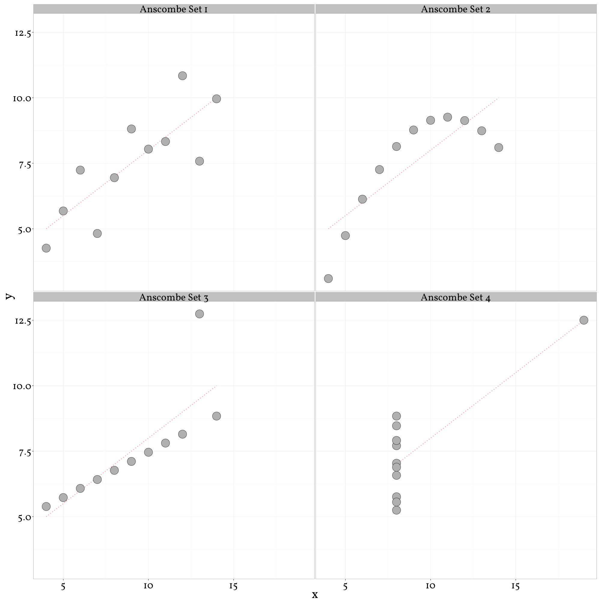

## 3.2 Cambridge Analytica ##

Zum Grauen vieler zog zu Beginn des Dezembers 2016 ein Artikel mit dem Titel „Ich habe nur gezeigt, dass es die Bombe gibt“[^cf8] seine Runde durch die verschiedensten sozialen Medien. In ihm wird erläutert, wie die psychologische Methode des Abgleichens von Facebook Daten mit Psychometrik Umfragen, entworfen von Michal Kosinski et. Al., im großen Stil mit öffentlichen und zugänglichen oder erwerbbaren Daten von der Firma [„Cambridge Analytica“ (CA)](https://cambridgeanalytica.org/) genutzt wurden, um Donald Trump zum Sieg über Hillary Clinton in den Präsidentschaftswahlen der U.S.A. von 2016 zu verhelfen. Diese Methode soll es ermöglicht haben, Personen so genau zu kategorisieren, dass Werbespots auf ihre persönlichen Ängste, Wünsche und politische Haltungen zurechtgeschnitten werden konnten. Der extrovertierte Unterstützer der National Rifle Association (NRA) bekommt Werbung für den Erhalt von Werten, die seit Generationen von Vater zu Sohn weitergegeben wurden, wohingegen die introvertierte Mutter durch Angst vor Terroristen zum Wählen des Kandidaten animiert werden soll. Ob dies wirklich eins zu eins so statt fand soll an dieser Stelle bezweifelt werden. Es gibt einige Tatsachen, die dagegen sprechen. So ist ein Artikel, dessen gesamte Beweisführung sich auf die Aussagen von zwei Personen stützt, von denen eine noch ein großes Interesse daran hat, genau so wahrgenommen zu werden, wenig fundiert. Ebenfalls trifft der Artikel einen bestimmten Nerv, schlägt genau in die richtige Kerbe zum richtigen Zeitpunkt. Nach einem langen und schmutzigen US-Wahlkampf, gewinnt __der, von dem es die wenigsten geglaubt hätten__. Da ist es nur recht und billig einen Sündenbock zu finden. Nicht soziale Spannungen, die wir uns nicht vorstellen können, waren es, es muss eine neue, bisher unbekannte Technologie _(vielleicht eine künstliche Intelligenz?)_ gewesen sein und irgendwie spielen unsere Daten, die Facebook über uns sammelt, da mit. Siehe WDR Blog[^cf9], Spiegel Online[^cf10], wired.com[^cf11], bloomberg.com[^cf12] oder spektrum.de[^cf13].   
Dennoch erweckt dies so sehr die Aufmerksamkeit der Autoren, dass hier einmal die Methoden und der Technologie Stack dieser Firma so weit es geht unter die Lupe genommen werden soll. Ebenfalls möchten wir auf die Möglichkeiten oder Gefahren, das liegt im Auge des Betrachters, die mit zielgerichteter Wahlwerbung vor uns stehen, aufmerksam machen. Als weiterführende Literatur empfehlen wir die Artikel „Algorithmen Allmächtig? Freiheit in den Zeiten der Statistik“[^cf14], und „Parteien in Deutschland haben noch keine Position zu Wähler-Targeting“[^cf15].    
### 3.2.1 Die Dienstleistung ###

Nach eigenen Aussagen kann die Firma Cambrige Analytica hinzugezogen werden um auf eine neue Weise Kontakt zu seinem Publikum aufzunehmen. Auf ihrer Website versprechen sie bis zu 5000 Datenpunkte pro Person (derzeit nur US Bürger) zu sammeln und deren Verhalten aufgrund von verschiedenen Modellen vorauszusagen. 

> _5,000 data points per person_  
> We collect up to 5,000 data points on over 220 million Americans, and use more than 100 data variables to model target audience groups and predict the behavior of like-minded people.[^cf16]

Laut Angaben von Alexander Nix (CEO CA) auf dem 2016 Concordia Summit, werden demographische Daten, Verbraucherdaten und Daten aus dem Bereich Lifestyle von Unternehmen geliefert wie [acxiom](http://www.acxiom.com/), [infogroup](http://www.infogroup.com/), [Experian](http://www.experian.com/), [data trust](http://thedatatrust.com/), [Facebook](https://www.facebook.com/), [L2](http://www.l2political.com/), [Aristotle](http://aristotle.com/), GOP, MRI , [Nielsen](http://www.nielsen.com/), [Magellan strategies](http://magellanstrategies.com/) mit psychographischen Daten verbunden.[^cf17] Mit diesen Informationen sollen in unserem Fall Wähler gezielt angesprochen worden sein. In dem Artikel, der unsere Recherche angestossen hat, wird von personalisierter Wahlwerbung gesprochen, die bei der „Vote Leave“ Kampagne für den Ausstieg von Großbritannien aus der Europäischen Union, bei der Präsidentschaftswahl 2016 in den Vereinigen Staaten von Amerika, zuerst für Ted Cruz und dann für Donald Trump, eingesetzt wurde.  
### 3.2.2 Der Technologie Stack ###

Natürlich lässt eine Firma wie Cambridge Analytica sich nicht direkt in die Karten schauen. Daher mussten wir einen anderen Weg finden, um eine Idee zu bekommen, mit welchen Technologien bei CA gearbeitet wird. Unser Ansatz ist, dass  aus den aktuellen Stellenangeboten der Firma eine ungefähre Schätzung möglich ist, welche Technologien dort in den Alltagsgebrauch gehören. Zum aktuellen Zeitpunkt wurden dort zwei Stellen ausgeschrieben, aus denen wir Schlüsse ziehen konnten. Es gab ein Stellenangebot für Data Engineers und eines für Data Scientists auf ihrer Seite. [^cf18] Bei Datenbanken werden Erfahrungen und Fähigkeiten im Umgang mit MySQL und aus dem Sektor der NoSQL Datenbanken, MongoDB erwünscht. MySQL ist eine Variante der „Structured Query Language“, die um 1995 von der Firma MySQL AB entworfen und unter einer GNU General Public License veröffentlicht wurde. NoSQL steht nicht für die Verneinung von SQL Datenbanken, sondern für „Not Only SQL“. Damit werden unterschiedliche Typen von Datenbanken bezeichnet, wie zum Beispiel die von CA gewünschte MongoDB. Im Bereich Big Data scheinen die Frameworks Spark und Hadoop zum Einsatz zu kommen und die gewünschten Sprachen sind Python, Java oder Scala und entsprechende objektorientierte Programmierparadigmen. Des Weiteren natürlich der Umgang mit Versionsverwaltungssystemen. Anhand dieser Punkte werden wir versuchen die verwendeten Technologien zu betrachten.     
#### 3.2.2.1 Speicherung ####

Wenn die Aussagen der Firma Cambridge Analytica über die von ihnen gesammelten Datenmengen der Bewohner der Vereinigten Staaten von Amerika stimmen, ist es offensichtlich, dass eine einzelne relationale Datenbank nicht ausreicht um diese 5000 Datenpunkte zu speichern. Diese Daten können aus unterschiedlichsten Typen bestehen, man spricht auch von einer Datenvielfalt in diesem Zusammenhang. Es können Bilddaten, Text-, Video-, oder Audioinformationen sein, die von bereits geordneten Informationen in einer Tabelle bis hin zu dem „Twitter-Stream“ einer Person gehen können. Hier kommt das Hadoop Distributed File System (HDFS) zum Einsatz.  
Hadoop ist ein in Java geschriebenes Open Source  Projekt, welches von Googles proprietären Google File System (GFS) und dem „MapReduce“ Framework inspiriert wurde. Mit diesem System können sehr große Datensätze zuverlässig gespeichert werden und mit hoher Bandbreite an Anwendungen, sogenannte HDFS Clients, übertragen werden. Die HDFS Architektur besteht aus einem einzelnen NameNode, vielen DataNodes und dem HDFS Client. Der NameNode organisiert die Anfragen und die Ablage von Daten durch die Clients auf den DataNodes. Damit kann der NameNode als Eintrittspunkt betrachtet werden. Die DataNodes sind Kindelemente in diesem Netzwerk. Die Clients, auch EdgeNodes genannt, sind Softwareanwendungen, die von aussen auf die Daten zugreifen oder Prozesse anstoßen.[^cf19] Das HDFS wurde absichtlich so entworfen, dass es auf günstiger Hardware laufen kann. Dies hat den Vorteil einer kostengünstigen Skalierung. Ebenfalls ist beim Design des Systems von vornherein mit in Rechnung genommen, dass bei einem System, in dem viele hundert oder tausende Computer eingebunden sind, Ausfälle zur Regel gehören und nicht die Ausnahme sind. Aus diesem Grund werden Daten, die in Blöcken organisiert sind, standardmäßig repliziert. Ein weiterer Grundgedanke des Systems ist, dass das Bewegen von Daten, gerade bei großen Mengen im gigabyte oder terabyte Bereich, wie sie in Big Data auftreten können, sehr kostenintensiv ist. Das Bewegen von Berechnungen hingegen nicht. Daher bietet das HDFS die Möglichkeit, die Clients näher an die Daten heran zu bringen.[^cf20] Das Hadoop MapReduce Framework wurde entworfen, um Speicherungs- und Berechnungsaufgaben über viele tausend Server zu verteilen und bei Bedarf zu skalieren (Eine genaue Erklärung von MapReduce folgt im nächsten Kapitel). Als Randnotiz sei zu bemerken, dass Hadoop mittlerweile in einer erweiterten Version 2 existiert. Diese läuft unter dem Namen YARN und trennt das „MapReduce“ Verfahren von dem Dateisystem.[^cf21] Hadoop liefert bereits das MapReduce-Verfahren mit. Im Fall von CA wird jedoch ein weiteres Framework benutzt, da MapReduce nicht für die iterativen Prozesse des maschinellen Lernens geeignet ist.
Auch die Analyse kann nicht auf einer einzigen Maschine stattfinden. Damit setzten wir uns im folgende Kapitel „Analyse“ auseinander.  
  
#### 3.2.2.2 Analyse ####

Das Hadoop System ist die Infrastruktur zum handhaben dieser Datenmengen. Zur Analyse dieser Daten könnte dann, wie ebenfalls aus den Anforderungen der Stellenbeschreibung hervorgeht, das Apache Spark Framework verwendet werden. Mit Spark können Daten aus vielen verschiedenen Quellen verarbeitet werden. Zum Beispiel auch aus dem HDFS, aber auch aus NoSQL-Datenbanksystemen oder relationalen Datenbanken. Mit Spark können Daten aus dem HDFS schneller verarbeitet werden und es existieren flexiblere Alternativen zum Hadoop „MapReduce“ Verfahren.

„MapReduce“ ist ein Verfahren, welches von Google für große Datenmengen entworfen wurde. Dieses Verfahren kann in zwei Abschnitte unterteilt werden. Der erste Abschnitt ist „Map“. Daten werden über einen Cluster von Rechner verteilt und nach einer bestimmten Funktion abgearbeitet. Der zweite Teil ist der „Reduce“ Abschnitt. Die einzelnen Teile des Clusters liefern nur einen Wert zurück.[^cf22] 

Um MapReduce besser zu verstehen, folgt ein kurzes Beispiel in JavaScript mit einfachen Daten. Als erstes müssen wir einen Datensatz zur Verfügung stellen.

```js
const animals = [
    ['elefant', 'mice', 'cat', 'dog', 'unicorn', 'elefant', 'unicorn', 'cat', 'unicorn'],
    ['elefant', 'horse', 'cat', 'fish', 'mice', 'fish'],
    ['pony', 'sloth', 'frog', 'fish', 'pony']
];
```

In unserem Fall haben wir ein multidimensionales Array, mit dem Namen `animals`. Die einzelnen Datensätze in diesem Array wären im HDFS auf mehreren DataNodes verteilt. 
Es folgt die Funktion `map`. Hier wird jedem Element in einem Array ein Wert 1 zugeordnet und als neuer Datensatz, bestehend aus einem doppeltem Key Value Paar, in ein neues Ergebnis Array geschrieben. Diese Sammlung an Ergebnissen wird zurückgegeben. 

```js
function map (arr) {
  let result = [];
  arr.forEach(function(element, index, array) {
    result.push({animal: element, count: 1});
  });
  return result;
}
```

Als nächstes werfen wir einen Blick auf unsere `reduce` Funktion. Hier muss jedes einzelne Objekt inspiziert und mit allen anderen Elementen im Array verglichen werden. Ist es noch nicht in der Ergebnismenge enthalten, wird ein neuer Eintrag erstellt. Ist es bereits enthalten, wird der entsprechende Zähler inkrementiert. In diesem speziellem Fall nutzen wir ein temporäres Objekt, um wiederkehrende Einträge vergleichen zu können. Die zweite Schleife `for(let key in obj)…` ist nur dazu da, um die Daten wieder in das gleiche Format aufzubereiten, in dem sie auch eingetroffen sind.     

```js
function reduce (arr) {
  let result = [];
  let obj = {};
  for(let i = 0; i < arr.length; i++) {
    if(obj.hasOwnProperty(arr[i].animal) !== true) {
      obj[arr[i].animal] = arr[i].count;
    }else{
      obj[arr[i].animal]++;
    }
  }
  for(let key in obj) {
    if(obj.hasOwnProperty(key)) {
      result.push({animal: key, count: obj[key]});
    }
  }
  return result;
}
```

Nun fehlt noch die ausführende Funktion `main`. Hier wird zuerst die `map` Funktion auf den rohen Datensatz angewandt und dann das Reduktionsverfahren eingeleitet. Wir erhalten nach der ersten Reduktion wiederum drei Datensätze, die uns das Vorkommen von den unterschiedlichen Tieren in unseren drei Ausgangs-Datensätzen zeigen. Danach fassen wir alle drei Ergebnisse zusammen und wenden nochmals die `reduce` Funktion an, um aus allen drei Sätzen einen gemeinsamen zu machen.   

```js
function main() {
  let mapped = [];
  animals.forEach(function (e) {
    mapped.push(map(e));
  });

  let reduced = [];
  mapped.forEach(function(e) {
    reduced.push(reduce(e));
  });

  let all = [];
  reduced.forEach(function(ele) {
    ele.forEach(function(e) {
      all.push(e);
    });
  });
  let result = [];
  result.push(reduce(all));
  console.log(result);
}
main();
```

Das Ergebnis ist ein Datensatz, der uns genau zeigt, wie oft welches Tier in allen Datensätzen vorkommt.  

```js
[ [ { animal: 'elefant', count: 3 },
    { animal: 'mice', count: 2 },
    { animal: 'cat', count: 3 },
    { animal: 'dog', count: 1 },
    { animal: 'unicorn', count: 3 },
    { animal: 'horse', count: 1 },
    { animal: 'fish', count: 3 },
    { animal: 'pony', count: 2 },
    { animal: 'sloth', count: 1 },
    { animal: 'frog', count: 1 } ] ]
```

Spark kommt gebündelt mit einer Bibliothek für maschinelles Lernen (MLib), was immer iterative Prozesses bedeutet, hat eine REPL (Read Eval Print Listen) Schnittstelle und kann ähnlich wie R oder Python explorativ für statistische Aufgaben verwendet werden.[^cf23] Seit Anfang 2014 gilt Spark als Top Level Project bei der Apache Foundation[^cf24]. Dieses Framework ist noch sehr jung und kann Hadoop oder YARN (Hadoop 2) noch nicht ersetzen, wird aber als zukunftsträchtiges Projekt angesehen.  
Wenn Datenmengen bearbeitet werden sollen, die auf einer einzigen Maschine existieren und verarbeitet werden können, kommt auch gerne die Programmiersprache Python, in ihren interaktiven Umgebungen wie iPython[^cf25] oder Jupyter[^cf26], mit Paketen wie scikit-learn[^cf27] oder pandas[^cf28], zum Einsatz. Pandas zum Bearbeiten von Datenstrukturen und scikit-learn zum Analysieren von Daten. Weitere übliche Module sind Matplotlib[^cf29] für die Ausgabe als Plot, um die Ergebnisse auch sichtbar zu machen. Dies ist ein oft unterschätzter Anteil an Arbeit. Aus Tabellen und Zahlenkolonnen lässt sich nur schlecht ein Verhalten von Werten ablesen. Als einfaches Beispiel hierzu kann das Anscombe Quartett betrachtet werden.[^cf30]

    +------+------+------+------+-------+------+-------+------+
    |  x1  |  x2  |  x3  |  x4  |  y1   |  y2  |  y3   |  y4  |
    +======+======+======+======+=======+======+=======+======+
    |  10  |  10  |  10  |  8   | 8.04  | 9.14 | 7.46  | 6.58 |
    +------+------+------+------+-------+------+-------+------+
    |  8   |  8   |  8   |  8   | 6.95  | 8.14 | 6.77  | 5.76 |
    +------+------+------+------+-------+------+-------+------+
    |  13  |  13  |  13  |  8   | 7.58  | 8.74 | 12.74 | 7.71 |
    +------+------+------+------+-------+------+-------+------+
    |  9   |  9   |  9   |  8   | 8.81  | 8.77 | 7.11  | 8.84 |
    +------+------+------+------+-------+------+-------+------+
    |  11  |  11  |  11  |  8   | 8.33  | 9.26 | 7.81  | 8.47 |
    +------+------+------+------+-------+------+-------+------+
    |  14  |  14  |  14  |  8   | 9.96  | 8.1  | 8.84  | 7.04 |
    +------+------+------+------+-------+------+-------+------+
    |  6   |  6   |  6   |  8   | 7.24  | 6.13 | 6.08  | 5.25 |
    +------+------+------+------+-------+------+-------+------+
    |  4   |  4   |  4   |  19  | 4.26  | 3.1  | 5.39  | 12.5 |
    +------+------+------+------+-------+------+-------+------+
    |  12  |  12  |  12  |  8   | 10.84 | 9.13 | 8.15  | 5.56 |
    +------+------+------+------+-------+------+-------+------+
    |  7   |  7   |  7   |  8   | 4.82  | 7.26 | 6.42  | 7.91 |
    +------+------+------+------+-------+------+-------+------+
    |  5   |  5   |  5   |  8   | 5.68  | 4.74 | 5.73  | 6.89 |
    +------+------+------+------+-------+------+-------+------+

  

Aus der oben stehenden Tabelle lassen sich wenig bis gar keine Schlüsse auf das Verhalten der Werte schließen. Durch die Visualisierung der Werte kann schnell ein Muster oder eine Abweichung festgestellt werden.    