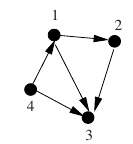
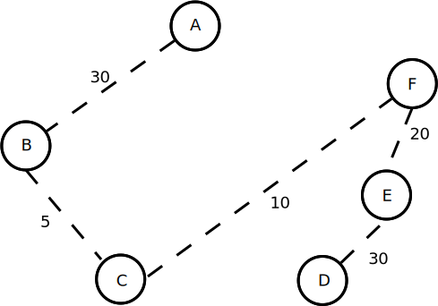
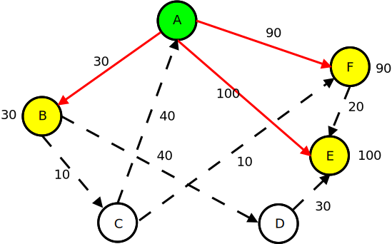
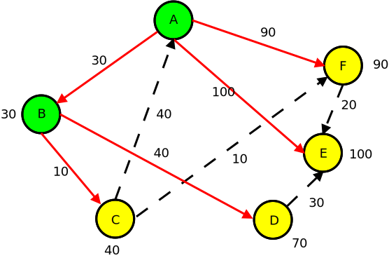
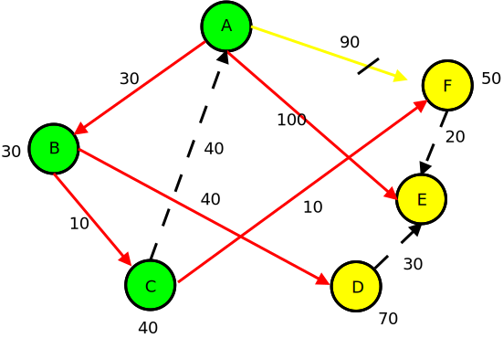
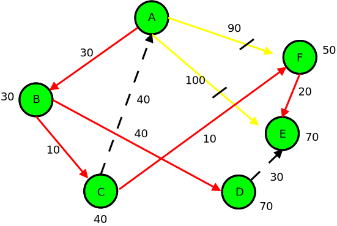

## Grundlagen
Im folgenden Kapitel werden die Grundlagen von Graphen und ausgewählten Graphalgorithmen dargelegt. Dazu werden zunächst die Grundlagen von Graphen erläutert.

### Datenbanksysteme
Es existieren diverse unterschiedliche Datenbanksysteme, deren wichtigste Gattungen im Folgenden kurz erläutert werden. Ein Datenbankmanagementsystem (DBMS) ist aus der heutigen Welt nicht mehr wegzudenken. Es fallen täglich neue Daten an, die gespeichert und häufig auch ausgewertet werden müssen. Das Datenbankmanagementsystem stellt einen einfachen Zugriff auf diese Daten bereit und sorgt für die Umgehung von diversen Problemen, die sich aus der Verarbeitung von großen Datenmengen durch viele Personen ergeben können. (Vgl. Kemper2015 S. 22ff)

* Das DBMS vermeidet Redundanzen und Inkonsistenzen. Als Beispiel können die Mitarbeiter einer Firma und deren tägliche Arbeit betrachtet werden. Die Stammdaten eines jeden Mitarbeiters sollen nur ein einziges Mal gespeichert werden, so dass keine Redundanzen entstehen, aus denen sich Inkonsistenzen ergeben können. Dennoch soll an Daten, die von einem Benutzer erzeugt wurden, eine Verknüpfung vorhanden sein, die den Benutzer als den Urheber oder den Bearbeiter ausgibt. 
* Die beschränkten Zugriffsmöglichkeiten von Dateien werden überwunden. Bei der Arbeit mit Dateien können keine Verknüpfungen zwischen den darin enthaltenen Daten aufgebaut werden. Durch die homogene Datenhaltung und ein einheitliches Datenmodell, kann das DBMS aber solche Verknüpfungen herstellen, so dass Anwendungen und Benutzer die relevanten Daten abfragen können.
* Die Synchronisierung im Mehrbenutzersystem ist essentiell. Dateisysteme bieten keine oder nur sehr eingeschränkte Möglichkeiten für parallele Bearbeitungen von Dateien. Es kann leicht passieren, dass Benutzer die Änderungen von anderen Benutzern überschreiben. Das DBMS sorgt hingegen für die Synchronisierung dieser Änderungen, so dass alle Daten erhalten bleiben.
* Die Vermeidung von Integritätsverletzungen ist eine wichtige Aufgabe von DBMS. Kemper nennt als Beispiel das Universitätswesen, in dem eine Integritätsbedingung sein könnte, dass ein Student zunächst alle Pflichtmodule abgeschlossen haben muss, bevor er zur Abschlussprüfung zugelassen wird. Das DBMS stellt sicher, dass diese Anmeldung nur erfolgen kann, wenn diese Vorbedingung erfüllt ist, andernfalls schlägt die Operation fehl und wird nicht durchgeführt. Es wird also sichergestellt, dass die Datenbank sich immer in einem konsistenten Zustand befindet.
* Nicht jeder Anwender soll und darf auf alle Daten zugreifen können. Das DBMS stellt mittels Benutzer- und Rechtemanagement sicher, dass die Berechtigungen eingehalten werden. Die Granularität der Rechtekonfiguration ist dabei aber abhängig vom eingesetzten Produkt. Einige DBMS können lediglich die Rechte pro Tabelle festlegen, wobei es auch weitere gibt, die auch die feingranulare Konfiguration von Rechten pro Spalten zulassen.
* Mittels der Verwendung von Datenbanken können die Entwicklungskosten gesenkt werden, da die Anwendungsentwickler für die Datenhaltung nicht bei jedem Projekt die Grundlagen neu entwickeln müssen, sondern sich auf die Funktion der Datenbank verlassen können.

#### Graph-Datenbanken
Graph Datenbankmanagementsysteme, oder kurz Graph-Datenbanken sind Systeme, mit denen die klassischen CRUD Operationen (Create, Update, Delete) auf Graphen ausgeführt werden können. Verbindungen sind in einer Graph-Datenbank first-class citizens des Datenmodells. Die Daten werden typischerweise in den Knoten mit Attributen gespeichert und die Verknüpfungen mittels Kanten erstellt. Jene Kannten können annotiert und ihnen damit eine Art wie z.B. "befreundet mit" zugewiesen werden.

#### Relationale Datenbanksysteme
Die relationalen Datenbankmanagementsysteme (RDBMS) sind die wohl bekannteste Datenbank-Gattung und aus der heutigen Welt nicht mehr wegzudenken. Die strukturierten Daten aus Geschäftsprozessen sind dort zeilenorientiert gespeichert. Verbindungen zwischen Datensätzen werden durch Relationen abgebildet. Diese sind in der Regel Schlüssel, die auf andere Datensätze zeigen, sogenannte Fremdschlüssel (Foreign Keys). Die bekanntesten Produkte dieser Gattung sind die Oracle Database, IBM DB2, Microsoft SQL Server oder MySQL. (Vgl. Boeswetter2010)

#### NoSQL Datenbanken
Der Begriff NoSQL Datenbanken lässt sich nicht so klar abgrenzen wie relationale Datenbanksysteme. Das Prefix "No" wird allgemein mit "not only" übersetzt. Besondere Prägung erfuhr der Begriff durch zwei Konferenzen im Jahr 2009. Ziel dieser Konferenzen und der daraus entstandenen Datenbanken war die Überwindung von Beschränkungen, die sich aus relationalen Datenbanksystemen ergaben. Durch das Aufkommen von großen Web-Unternehmen mit riesigen Datenbanken, wurde über verteilte und nicht-relationale Datenbanken diskutiert. Die umzusetzenden Anforderungen waren Flexibilität, Skalierbarkeit und Performanz. Vorreiter waren Implementierungen von Bigtable, Map-Reduce und Dynamo. (Vgl. LeVoJens2016 S. 207f.)

### Gerichtete Graphen
Bei einem gerichteten Graphen, oder auch Digraph (engl. directed graph) haben die Kanten eine Orientierung. Somit wird ersichtlich, ob die Kante vom Knoten u zu Knoten v, oder von Knoten v zu Knoten u gerichtet ist. Vereinfacht gesagt und auf den Straßenverkehr übertragen, handelt es sich um eine Einbahnstraße. Diese Verknüpfung wird mittels eines Tupels dargestellt. Ist sowohl eine Verknüpfung von Knoten a zu b und von b zu a nötig, so können zwei Kanten angelegt werden. (Vgl. Steger2002 S. 84f)

Die folgende Abbildung zeigt einen beispielhaften gerichteten Graphen.



### Weg
Ein Weg der Länge l des Graphen G = (V, E) [V = Vertex, E = Edges] entspricht einer Folge W von Knoten aus der Menge V. Es sind somit zwei aufeinanderfolgende Knoten durch eine Kante miteinander verbunden. (Vgl. Steger2002 S. 55)

### Pfad
Ein Pfad im Graphen G ist eine Spezialisierung des Weges, in dem alle Knoten paarweise verschieden sind. Die Folge (a, b, c) ist sowohl ein Weg, als auch ein Pfad. Die Folge (a, b, c, e, a) hingegen ist lediglich ein Weg, aber kein Pfad, weil die Knoten nicht paarweise verschieden sind. (Vgl. Steger2002 S. 55)

### Kreisfreie Graphen
Ein kreisfreier Graph ist ein Spezialfall eines Graphen. In einem solchen Graphen existiert kein Kreis als Teilgraph. "Einen zusammenhängenden kreisfreien Graphen nennt man auch Baum" (Steger2002 S. 57). Durch kreisfreie Graphen werden einige Algorithmen deutlich vereinfacht, wie in den folgenden Kapiteln noch gezeigt wird.

### Graphalgorithmen

#### Tiefensuche
Die Tiefensuche stellt eine Möglichkeit dar einen Graphen zu durchlaufen. Wie der Name bereits suggeriert, läuft die Tiefensuche erst möglichst tief in den Graphen hinein, bevor weitere Knoten durchlaufen werden. Tiefensuchen verwenden einen Stack, also eine LIFO-Warteschlange (Last-in-first-out), auf dem Knoten zur weiteren Verarbeitung abgelegt werden. 

#### Breitensuche
Im Gegensatz zur Tiefensuche wird bei der Breitensuche zunächst jede Ebene eines Graphen in der Breite durchlaufen und erst nachdem dies vollständig passiert ist, wird weiter in die Tiefe gegangen. Beginnend von der Wurzel werden also zunächst alle Knoten der Ebene 1, dann der Ebene 2 usw. verarbeitet. Die bereits besuchten Knoten werden markiert. Sollte auf einen bereits markierten Knoten getroffen werden, weil dieser z.B. über mehrere Wege zu erreichen ist, so wird dieser Knoten nicht mehr verarbeitet. 

#### Minimale Spannbäume
Bei einem minimalen Spannbaum handelt es sich bei einem gewichteten Graphen G um einen Baum T mit minimalem Gesamtgewicht. Mittels dem Algorithmus von Kruskal kann ein solcher Spannbaum erstellt werden. Dazu werden zunächst die Gewichtungen der Kanten aufsteigend sortiert. Anschließend werden die Kanten vom sortierten Stapel genommen und wieder im Graphen eingefügt, solange sich dadurch kein Kreis ergibt. 

Die nachfolgende Abbildung zeigt zunächst den Ausgangsgraphen mit den gewichteten Kanten.


Nach Anwendung des Algorithmus von Kruskal folgt daraus der folgende minimale Spannbaum.




#### Kürzeste Wege Algorithmen
Algorithmen für die Berechnung von kürzesten Wegen werden beispielsweise in der Routenplanung eingesetzt. Das Straßennetz wird dabei als gerichteter Graph modelliert, bei dem die Knoten die Kreuzungen symbolisieren und die Kanten die Straßen. Zusätzlich sind die Kanten mit Gewichten versehen, die die Kosten für den Weg vom Anfangs- zum Endknoten angeben. Um nun einen Weg von A nach B effizient berechnen zu können, werden Algorithmen benötigt, die dies innerhalb einer geringen Laufzeit durchführen können. Das Straßennetz Deutschlands besteht aus ca. 5 Millionen Kreuzungen und 6,2 Millionen Straßen. Die Berechnung von allen Permutationen würde selbst mit den schnellsten Rechnern noch mehrere tausend Jahre benötigen (Vgl. KruNol2009 S. 1). 

Es existieren 3 unterschiedliche Typen des kürzesten Wege Problems. Beim SPP (Single Pair Shortest Path Problem) soll ein kürzester Weg von a nach b im Graphen gefunden werden. Beim SSP (Single Source Shortest Path Problem) werden die kürzesten Wege vom Knoten a zu allen anderen Knoten des Graphen berechnet. Der APSP (All Pairs Shortest Path Problem) bildet schließlich den dritten Typ zur Berechnung des kürzeste Wege Problems. Dabei wird für jedes Paar u,v des Graphen der kürzeste Weg bestimmt. (Vgl. KruNol2009 S. 167 f.)

##### Dijkstra
Ein bekannter Algorithmus zur Berechnung des SSP, also der Berechnung der kürzesten Pfade von einem Knoten zu allen anderen Knoten des Graphen, ist der Dijkstra Algorithmus. Dieser arbeitet mit einer Menge aus "permanent markierten" Ecken, also für Ecken, für die bereits die Berechnung der Distanz erfolgt ist. (Vgl. KruNol2009 S. 175)

Die nachfolgenden Graphen verdeutlichen dabei den Ablauf, ausgehend von Knoten A. 


In der nachfolgenden Abbildung beginnt der Algorithmus seine Arbeit. Der Knoten A wird in die permanente Markierung aufgenommen, in diesem Fall grün symbolisiert. Außerdem werden die Distanzen von A ausgehend für B, E und F berechnet. 



Der Knoten mit dem Minimum, in diesem Fall B wird zu der permanenten Markierung hinzugefügt. Die von B ausgehenden Kanten werden verfolgt und die Distanzen notiert.



Es wird wiederum das Minimum selektiert und der Knoten C in die permanente Markierung aufgenommen. Anschließend werden von C ausgehend alle von dort erreichbaren Distanzen berechnet und bei Bedarf aktualisiert. Der Distanz-Wert des zuvor direkt von A erreichbaren Knoten F wird aktualisiert, da dieser nun mit der Gewichtung 50 über A-B-C-F erreicht werden kann.



Das bekannte Verfahren wird erneut angewendet und die Berechnung ist nun vollständig und abgeschlossen.


 

### Verfügbare Graph-Datenbanken
Die folgenden Kapitel zeigen kurz die bekanntesten Graphdatenbanken auf. Darüber hinaus existieren aber noch viele weitere Graphdatenbanken, die an dieser Stelle aber nicht alle genannt werden sollen. 

#### Neo4j
Neo4j ist vermutlich die bekannteste Graphdatenbank. Sie ist in Java implementiert und erschien im Jahr 2007. Der Quellcode ist Open-Source und u.a. unter der GPL v3 lizensiert. Die Firma hinter Neo4j, die Neo Technology mit Sitz in Malmö (Schweden) bietet darüber hinaus kostenpflichtige Zusatzmodule an, die z.B. Hochverfügbarkeit nachrüsten. Die Datenbank wurde von Anfang an als Graphdatenbank ausgelegt und speichert die Daten somit strukturiert in Graphen und nicht in Tabellen. 

#### ArangoDB
ArangoDB wird von der gleichnamigen deutschen Firma entwickelt. Anders als die weiteren aufgeführten Datenbanken wurde ArangoDB in C++ entwickelt. Es handelt sich um eine multi-modell Datenbank, die sowohl dokumentenorientiert, als auch key/value und graphorientiert arbeitet. 

#### OrientDB
OrientDB ist eine in Java geschriebene dokumentenorientierte Datenbank, die zusätzlich Funktionalitäten von Graphdatenbanken anbietet. Die Daten werden als einzelne Dokumente gespeichert und können mittels Kanten miteinander verbunden werden, so dass ein Graph von Dokumenten entsteht.

#### Apache Giraph
Apache Giraph basiert auf einem Paper von Google zu der eigenen Software Pregel und wurde ursprünglich von Yahoo im Jahr 2010 entwickelt. Später wurde es an die Apache Foundation übergeben, wo es im Mai 2012 ein eigenständiges Projekt wurde. Die Umsetzung erfolgte in Java und basiert auf Hadoop, wodurch es insbesondere gut geeignet für die Auswertung großer Datenmengen ist.  


### Relationale Verfahren
#### Nested Sets
Mit der Einführung relationaler Datenbanken durch Codd wurden formale Restriktionen für die darin enthaltenen Daten formuliert. Eine davon ist die Unabhängigkeit der enthaltenen Tupel. In modernen Anwendungen lässt sich diese Einschränkung aber nicht einhalten. (Vgl. Wong1994 S. 31) 

Mittels Nested Sets lassen sich in Listen gespeicherte Daten zu Hierarchien einordnen. Der Begriff lässt sich mit "verschachtelte Mengen" übersetzen, was die technische Umsetzung bereits recht gut veranschaulicht. Die Tupel werden geschachtelt gespeichert, indem jeder Datensatz einen linken und einen rechten Wert zusätzlich erhält. Der Wurzelknoten hat als linken Wert grundsätzlich den Wert 1. Der rechte Wert ergibt sich aus der Anzahl an Kindelementen unterhalb der Wurzel. Als Beispiel soll die folgende kleine Hierarchie dienen:

1. Wurzel
    1. Navigation 1
        1. Navigation 1#1
        2. Navigation 1#2
    1. Navigation 2

Die Datenbanktabelle soll in diesem Fall ganz einfach gestaltet sein (Indizes etc. wurden aus diesem Grund weggelassen):
```
CREATE TABLE navigation (
    id          INT(10)      UNSIGNED NOT NULL AUTO_INCREMENT,
    label       VARCHAR(255) NOT NULL,
    treeleft    INT(10)      UNSIGNED NOT NULL,
    treeright   INT(10)      UNSIGNED NOT NULL,
    PRIMARY KEY (id)
);
```

Die Tabelle navigation enthält neben der id als Primärschlüssel, dem label als darzustellender Text auch die Felder treeleft und treeright als linken und rechten Wert für die Nested Set Speicherung. Der linke und rechte Wert klammert die Kindelemente ein. Für das obige Beispiel ergibt sich daraus die folgende Liste:

| id | label         | treeleft | treeright |
|---|----------------|----------|-----------|
| 1 | Wurzel         | 1        | 10        |
| 2 | Navigation 1   | 2        | 7         |
| 3 | Navigation 1#1 | 3        | 4         |
| 4 | Navigation 1#2 | 5        | 6         |
| 5 | Navigation 2   | 8        | 9         |

Zunächst wurde die Wurzel mit dem linken Wert 1 eingefügt. Der rechte Wert ist zunächst 2, weil die Wurzel das einzige Element ist. Anschließend wird das Element "Navigation 1" eingefügt. Dazu muss zunächst Platz für dieses Element im Wurzel-Element geschaffen werden. Dazu wird der rechte Wert von allen Elementen um 2 erhöht, dessen rechter Wert größer gleich dem linken Wert des einzufügenden Elements ist. Außerdem müssen alle linken Werte um 2 erhöht werden, wo der aktuelle linke Wert größer als der neue linke Wert ist. Weil der Baum aktuell nur aus dem Wurzelelement besteht, wird lediglich der rechte Wert der Wurzel um 2 auf 4 erhöht. Nun wird das Element "Navigation 2" mit dem linken Wert 2 und dem rechten Wert 3 eingefügt. Als nächstes soll das Element "Navigation 1#1" als Kind von "Navigation 1" eingefügt werden. Der linke Wert ist 3 und der rechte Wert ist 4, nachdem die beiden anderen Elemente entsprechend der eben genannten Regeln angepasst wurden. Die Wurzel hat den rechten Wert 6 und "Navigation 1" hat den rechten Wert 5. Eine Anpassung der linken Werte erfolgt nicht. Das Verfahren wird entsprechend fortgeführt, bis die oben gezeigte Tabelle vollständig aufgebaut ist. Die Verfahren für das Verschieben oder Löschen von Elementen soll an dieser Stelle nicht weiter ausgeführt werden.

Es ist ersichtlich, dass Operationen auf Bäumen mit Nested Set eine gewisse Komplexität bilden. Insbesondere bei großen Datenmengen können Einfüge-, Änderungs- oder Löschoperationen zu Performance-Problemen führen, da im schlimmsten Fall die linken und rechten Werte von allen Elementen (der linke Wert der Wurzel ausgeschlossen) angepasst werden müssen. Dies führt zu einer hohen IO-Belastung des Datenbank-Servers. Weiterhin muss beachtet werden, dass parallele Änderungen am Baum zu Inkonsistenzen führen können. Änderungen müssen aus diesem Grund mittels Locking oder durch die Nutzung von Transaktionen abgesichert werden. (Vgl. Klempert) 

