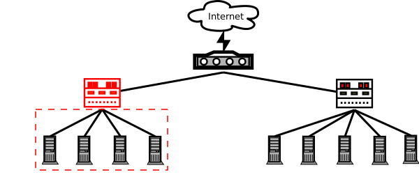
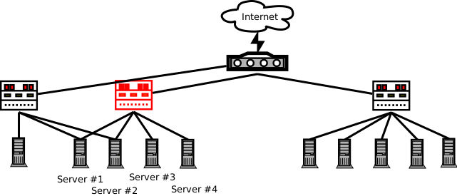

## Use Cases für Graph-Datenbanken

### Einsatzzweck von minimalen Spannbäumen
Durch minimale Spannbäume können z.B. die Kosten für die Verbindung von unterschiedlichen Standorten verringert werden. Es gibt z.B. n-viele Standorte, die miteinander verbunden werden müssen. Die Ermittlung des minimalen Spannbaums würde nun die Verbindungen zwischen allen Standorten mit den geringsten Kosten bedeuten. Eine eingebaute Funktionalität gibt es dafür in neo4j nicht und auch lässt sich dies nicht mit eingebauten Funktionen aus einer relationalen Datenbank ermitteln. 

### Berechnung der Länge eines Pfades
In manchen Anwendungsfällen muss die Länge eines Pfades ermittelt werden, z.B. über wieviele Personen ist Person A mit Person B befreundet. Oder in einer Netzwerktopologie könnten die maximalen und minimalen Hops von Server A zu Server XYZ berechnet werden.  

#### Lösung mit relationaler Datenbank
Bei der Umsetzung mittels Nested Set lässt sich die Länge eines Pfades, bzw. die Tiefe eines Baumes berechnen, indem ein ``JOIN`` auf die eigentliche Tabelle gebildet, nach der Knoten-ID gruppiert und dann die Eltern-Knoten gezählt werden. Ein Beispiel Statement verdeutlicht die folgende Query:
```
SELECT navigation.title, (COUNT(parent.title) - 1) AS depth
FROM navigation
JOIN navigation AS parent
WHERE navigation.lft BETWEEN parent.lft AND parent.rgt
GROUP BY navigation.id
ORDER BY navigation.lft
```

#### Lösung mit Graph-Datenbanken
In neo4j existiert die skalare length() Funktion, die die Länge eines Pfades zurückliefert. Es handelt sich dabei nicht um eine Variante mit dem Ziel den längsten oder kürzesten Weg zwischen Knoten zu ermitteln. Es wird ausschließlich die Länge eines Pfades zwischen Knoten berechnet. 

### Routenberechnung
Die Paradedisziplin für Graphen stellt sicher die Routenberechnung dar. Es soll der kürzeste Weg von Standort A zu Standort B ermittelt werden. Dazu liegt ein gewichteter Graph vor, in dem dieser kürzeste Weg gefunden werden soll.

#### Lösung mit relationaler Datenbank
Die Technologie ist dafür ungeeignet.

#### Lösung mit Graph-Datenbanken
Die Graph-Datenbank neo4j bietet für den SPP-Anwendungsfall (Single Pair Shortest Path) die Funktion shortestPath, die den kürzesten Pfad zwischen zwei Knoten findet. Der Dokumentation von neo4j folgend, wird dabei der Dijkstra Algorithmus verwendet, wenngleich dieser eigentlich für das SSP-Problem eingesetzt wird.

#### Vorteile
Es lassen sich effizient Routen zwischen 2 Knoten berechnen, was mit relationalen Ansätzen praktisch nicht umsetzbar ist.

### Abfrage von Hierarchien
In Anwendungen kommt regelmäßig der Wunsch auf Hierarchien abzubilden. Dies kann z.B. die Notwendigkeit für die Darstellung von Ordnerstrukturen sein, die Umsetzung von Diskussionsforen mit Antworten auf andere Beiträge, oder die Erstellung einer Webseiten-Navigation. In relationalen Datenbanksystemen ist dies häufig nur über das Konzept der Nested-Sets möglich, welches in den Grundlagen erläutert wurde, oder in einigen Produkten auch über Rekursion. 

#### Lösung mit relationaler Datenbank
Die generellste Lösung, die auf Grund der geringen Anforderungen in praktisch jedem relationalen Datenbanksystem umsetzbar ist, ist die Verwendung von Nested Sets. Eine weitere und einfachere Variante ist die Nutzung von hierarchischen Datenbank-Queries, die allerdings vom Datenbanksystem unterstützt werden müssen, was nicht bei allen der Fall ist. Das DBMS von Oracle zum Beispiel unterstützt die Nutzung von hierarchischen Queries mittels des `CONNECT BY` Ausdrucks. 

#### Lösung mit Graph-Datenbanken
Graph-Datenbanken speichern grundsätzlich stets Graphen und eine Hierarchie ist eine spezielle Form eines Graphen. Somit werden hierarchisch abgelegte Daten auch bei der Abfrage wieder als solche ausgegeben. Außerdem können mittels Filter-Kriterien Auswahlen vorgenommen und die Daten dadurch eingeschränkt werden.

#### Vorteile
Bei relationalen Datenbanken muss jede Anfrage für die Nutzung der Hierarchien angepasst werden, wohingegen bei Graph-Datenbanken diese Hierarchie direkt vorhanden ist.

### Freund Beziehungen in sozialen Netzwerken
In sozialen Netzwerken wie Facebook, Xing oder LinkedIn können sich Benutzer miteinander verbinden. Diese Verbindungen können als ungerichteter Graph angesehen werden, da es keinerlei Hierarchie innerhalb der Beziehung gibt. Die Verbindung geht zwar zunächst von einem Benutzer aus, der dem zweiten Benutzer eine Anfrage für die Verbindung zustellt, aber nach der Bestätigung wird keine Hierarchie benötigt. Nun besteht ein häufiger Anwendungsfall darin, dass bei der Anzeige eines Benutzerprofils, mit dem bislang keine Verbindung besteht, die kürzeste Verbindung zwischen dem betrachtenden Benutzer und dem betrachteten Benutzer über Dritte angezeigt wird. Die maximale Anzahl an Zwischenschritten wird dabei in der Regel begrenzt, z.B. auf fünf Schritte. (Vgl. WebRob)

#### Lösung mit relationaler Datenbank
Die Verknüpfung von Benutzern wird über eine eigenständige Entität abgebildet. Ferner werden die Benutzer z.B. über die Entität "user" repräsentiert. Die Verknüpfungen bildet nun die Entität "relation", mindestens mit den Attributen "fromuser" und "touser". Um zu prüfen, ob der Benutzer A mit dem Benutzer B verknüpft ist, müsste eine Abfrage mit 2 Joins durchgeführt werden, da die Implementierung nicht wissen kann, ob die Verbindung ursprünglich von Benutzer A oder von Benutzer B ausging. Eine Möglichkeit zur Vermeidung dieser doppelten Joins wäre die doppelte Hinterlegung der Verbindungen. Wie bereits im Kapitel über gerichtete Graphen beschrieben, kann eine Verbindung von A und B über zwei gerichtete Kanten (eine Kanten von A nach B und eine weitere von B nach A) abgebildet werden. Solch eine Umsetzung würde allerdings die Datenmenge verdoppeln und könnte theoretisch zu inkonsistenten Daten führen. Würde die Verbindung von A nach B gelöscht, aber die Verbindung von B nach A nicht, so wäre B nur noch mit A "befreundet", aber nicht mehr umgekehrt. 
Das Auffinden von Verbindungen über n Zwischenschritte kann wiederum über Joins erfolgen, wobei für jeden Zwischenschritt spezifische Joins erstellt werden müssen, was bei der Abfrage von bis zu 5 Ebenen bereits eine große Anzahl an Joins umfasst. Die Datenbank-Queries würden dadurch sehr lang, wenngleich dies natürlich zur Vereinfachung in eine Function ausgelagert werden könnte. Außerdem werden über solch eine Abfrage u.U. große Datenmengen involviert, die die Performance einbrechen lassen. Laut Spiegel kennt bei Facebook statistisch gesehen sogar jeder jeden über nur 3,5 Ecken (Vgl. Weber2016). Darauf aufbauend kann festgestellt werden, dass eine Abfrage von Verbindungen von A zu B über maximal 5 Ecken statistisch gesehen den gesamten Datenbestand umfasst. Bei mehreren Millionen Mitgliedern, oder bei Facebook sogar über 1 Milliarde Mitgliedern, würde eine solche Datenbank-Query viel zu lange benötigen, um bei jedem Profilaufruf berechnet zu werden. Die Funktionalität wäre beim Einsatz eines relationalen Datenbanksystems nicht umsetzbar. 

#### Lösung mit Graph-Datenbank
Graphdatenbanken sind genau für den o.g. Anwendungsfall entwickelt, so dass deren Lösung im Vergleich zur relationalen Variante deutlich einfacher funktioniert. Das gesamte Netzwerk mit seinen Freundschaften wird als Graph dargestellt. Jede Person repräsentiert einen Knoten und die Verbindungen zwischen den Knoten zeigen die Verbindung zwischen diesen Personen an. Der Algorithmus muss nun den kürzesten Weg zwischen dem Knoten A und dem Knoten B ermitteln. Dabei handelt es sich um das Single Pair Shortest Path Problem (SPP), welches z.B. in Neo4j effizient mit der Funktion "shortestPath" gelöst werden kann. Ein Beispielcode für Neo4j würde z.B. folgendermaßen aussehen:
```
MATCH (personA:Person),(personB:Person),
p = shortestPath((personA)-[*..5]-(personB)) 
WHERE id(personA) = 815 AND id(personB) = 12345
RETURN p
```
Die Where-Clause verhält sich gleich zu SQL, so dass diese die Einschränkung auf die Benutzer A und B vornimmt. Die personA hat die id 815 und die personB die 12345. Der relevante Teil zur Ermittlung des kürzesten Pfades stellt die zweite Zeile mit dem Ausdruck "shortestPath((personA)-[*..5]-(personB)) " dar. An dieser Stelle wird der kürzeste Weg unter der Berücksichtigung von maximal 5 Zwischenschritten gefunden. 

### Betrugs Erkennung
Der zunehmende Online-Handel im letzten Jahrzehnt und der damit einhergehende Anstieg an Online-Transaktionen über Bezahldienstleister wie PayPal etc. hat auch die Anzahl an Betrugsversuchen drastisch erhöht. Die Anbieter müssen solche Betrügereien möglichst effektiv erkennen, um den dadurch entstehenden Image-Verlust und auch den finanziellen Schaden in Grenzen zu halten. 

Ein Anwendungsfall verdeutlicht, dass die Umsetzung mittels einer Graph-Datenbank über die Sicht auf einzelne Datensätze wie bei einer relationalen Datenbank hinausgeht und vielmehr die Verknüpfungen betrachtet. Eine Online-Transaktion besteht aus einigen Attributen wie einer eindeutigen ID (oder Transaktionsnummer), einer IP-Adresse, einer GEO Position und den Kreditkarten-Informationen. Diese Daten können in Verbindung gebracht werden, so dass mögliche Betrugsversuche entdeckt und im besten Fall auch unterbunden werden können, ohne zu viele Fehlalarme (false positives) zu generieren. Das Durchführen von Transaktionen mit verschiedenen Kreditkarten von einer IP-Adresse aus, sowie in einem gewissen Zeitintervall wäre ein solches Betrugs-Indiz. Ein weiteres Indiz könnte die Nutzung einer Kreditkarte innerhalb kurzer Zeit von Standorten aus sein, die in solch kurzen Zeitspannen nicht zu erreichen sind. (Vgl. WebRob) 

#### Lösung mit relationaler Datenbank
Auf die bereits durchgeführten Finanz-Transaktionen, die relational gespeichert werden, können Select-Statements ausgeführt werden, so dass die vorher aufgestellten Regeln überprüft werden. Dadurch ist eine Betrugs Erkennung basierend auf den vorher aufgestellten Regeln möglich. Sollten Betrugsfälle aber dennoch passieren, so ist die Nachverfolgung nur schwer möglich, weil die Transaktionen nicht als Graph gespeichert sind und somit ein Traversieren Datenbank-seitig nahezu unmöglich macht.

#### Lösung mit Graph-Datenbank
Mit den Transaktionen werden in zusätzlichen Knoten z.B. die IP-Adresse der Durchführung gespeichert. Soll erneut eine Transaktion vorgenommen werden, so kann sehr schnell ermittelt werden, ob dies von der gleichen IP-Adresse oder einer anderen erfolgen soll und ob dies plausibel ist. Ferner kann bei erfolgreichen Betrugsfällen, die sich wohl nie gänzlich vermeiden lassen, mittels Traversion durch den Baum das Geld und die Geldflüsse gut nachvollzogen werden. Es wird eine Ursprungs-Transaktion ermittelt und von dort aus wird der Betrag weiter verfolgt, wie dieser mit weiteren Transaktionen bewegt wird. 


#### Vorteile
Die Betrugserkennung muss innerhalb kürzester Zeit durchführbar sein, weil inzwischen viele Transaktionen online abgewickelt werden. PayPal meldet für das 4. Quartal 2016 alleine 1,8 Milliarden Transaktionen durchgeführt zu haben (https://investor.paypal-corp.com/secfiling.cfm?filingID=1633917-17-22&CIK=1633917). Daraus ergeben sich im Durchschnitt 226 Transaktionen pro Sekunde. Der Kunde möchte allerdings nicht lange auf den Bezahlvorgang warten und PayPal und andere Bezahldienstleister haben ein starkes Interesse daran, den Betrug so gering wie möglich zu halten. Auch für PayPal stellten die Schäden durch Betrug zu Beginn des Unternehmens eine existenzielle Herausforderung dar. Nach Levchin, einem der Mitbegründer von PayPal verlor die Firma zum Teil pro Monat 10 Millionen Dollar durch Betrug (Livi2010, S. 21). Schließlich begann PayPal Software zu entwickeln, die versuchten Betrug zum Teil erkennen und im Fall, in dem dieser nicht verhindert werden konnte, besser analysierbar zu machen. Nach Aussage von Levchin handelte es sich dabei teils um ein "Visualisierungswerkzeug, teils [um] ein Graph Balancing Tool" (S. 24), um die Geldflüsse besser nachvollziehen und Ermittlungen aufnehmen zu können. 

### Echtzeit Empfehlungen (Recommentation Engine)
Der Online-Handel lebt von Empfehlungen, die sich auf der einen Seite aus den eigenen Interessen und Käufen und auf der anderen Seite aus den Interessen und Käufen anderer Nutzer ergeben. Aus der Menge der eigenen Interessen und Käufe wird die Schnittmenge der Interessen und Käufe von anderen Benutzern gebildet, so dass Benutzer ermittelt werden können, die die gleichen Interessen haben bzw. die gleichen Produkte gekauft haben. Diese Benutzer haben sich aber in der Regel noch weitere Produkte angesehen bzw. gekauft, die auch für weitere Benutzer von Interesse sein könnten. Der Online-Handel erhofft sich nun aus der Einblendung von solchen Empfehlungen erhöhte Umsätze. Durch relevante Empfehlungen, die möglichst in Echtzeit berechnet und angezeigt werden sollen, wird der Umsatz gesteigert. Sollten die Empfehlungen allerdings nicht zum Benutzer passen, so werden diese schnell ignoriert, da sie als nicht relevant wahrgenommen werden. 

Zur Vereinfachung soll der Anwendungsfall modelliert werden, dass ein Benutzer sich ein Produkt in einem Online-Shop ansieht und er Empfehlungen angezeigt bekommt, was ihn in diesem Fall ebenfalls noch interessieren könnte. (Vgl. WebRob)

#### Lösung mit relationaler Datenbank
Die Anwendung besteht aus den Entitäten Product, User und UserProductView. Die Entität User enthält alle Benutzerinformationen des Online-Shops, die Entität Product enthält die Produktinformationen und die Entität UserProductView enthält schließlich die Informationen wann sich welcher Benutzer welches Produkt angesehen hat. Mittels ```JOIN``` könnte nun ermittelt werden, welche Benutzer sich ebenfalls das Produkt angesehen haben und welche weiteren Produkte ihre Aufmerksamkeit geweckt haben. Problematisch ist, dass der zeitliche Zusammenhang beachtet werden muss. Es ist irrelevant, ob sich die Benutzer 5 Tage später noch Produkt x angesehen haben, weil der zeitliche Zusammenhang nicht mehr gegeben ist. Aus dem Grund soll angenommen werden, dass lediglich die Produktaufrufe gewertet werden, die 3 Stunden vor oder nach dem Produktaufruf stattgefunden haben. Bei den 3 Stunden handelt es sich um einen willkürlichen Wert, der in diesem Fall gewählt wurde.

``
SELECT
  COUNT(upvouter.product_id) AS cnt,
  product_id
FROM
  userproductview AS upvouter
  JOIN
  (SELECT
     upv.visittime,
     upv.user_id
   FROM
     userproductview AS upv
   WHERE
     upv.product_id = 1 AND upv.user_id != 1) AS innerupv
    ON innerupv.user_id = upvouter.user_id
       AND upvouter.visittime BETWEEN SUBTIME(innerupv.visittime, '03:00:00')
       AND ADDTIME(innerupv.visittime, '03:00:00')
  WHERE upvouter.product_id != 1
GROUP BY product_id
ORDER BY cnt DESC
LIMIT 0, 20
`` 

Das Statement ist bereits recht umfangreich, dabei sind Besonderheiten wie die zeitliche Nähe und das Überwiegen von Produkten, die sich schon lange im Bestand befinden noch gar nicht berücksichtigt. Das würde bedeuten, dass bereits lange im Bestand enthaltene Produkte auch bei weniger Aufrufen in der letzten Zeit gegenüber recht neuen Produkten, die zwar inzwischen häufiger aufgerufen werden, aber dennoch absolut noch lange nicht soviel Aufrufe haben, wie die älteren, nicht angezeigt würden. 

#### Lösung mit Graph-Datenbank
Die Produkt-Aufrufe der Kunden werden in einer Art Klickpfad gespeichert, so dass ersichtlich ist, von welchem Produkt der Benutzer zu welchem anderen Produkt gewechselt ist und wann dies passiert ist. Das derzeit betrachtete Produkt besitzt als Datenrepräsentanz einen Knoten mit vielen ausgehenden Verbindungen zu weiteren Produkten. Es werden nun die Produkte ausgewählt und angezeigt, die die meisten Verbindungen vom aktuellen Produkt aus haben. Dabei kann auch eine Gewichtung vorgenommen werden, wobei die Relevanz nach fortschreitendem Alter der Verbindung abnimmt. Eine Verknüpfung, die bereits 3 Jahre alt ist würde somit nicht mehr als so relevant angesehen wie eine, die erst gestern hinzugefügt wurde.

#### Vorteile
Die Join-Verbindungen der relationalen Umsetzung würden bei großen Datenmengen immer langsamer werden. Beim Einsatz von Graphen kann hingegen relativ einfach betrachtet werden, wieviele Verbindungen zu anderen Produkten verweisen und die Produkte mit den meisten Verbindungen werden als Empfehlung angezeigt.


### Netzwerk und IT-Betrieb
Netzwerke in großen Insitutionen sind in der Regel hierarchisch aufgebaut und können somit gut als Graph gespeichert und dargestellt werden. Durch diese Darstellung können Single-Point-of-Failures einfach erkannt und dann bei Bedarf beseitigt werden. Außerdem kann bei Ausfällen schnell ermittelt werden, welche Dienste und Netzsegmente betroffen sind. Ein Dienstleister, der gewisse Services für seine Kunden zur Verfügung stellt, könnte unmittelbar die Kunden identifizieren, die von dem Ausfall betroffen sind. (Vgl. WebRob)

Um die betroffenen Systeme beim Ausfall eines Switches festzustellen, muss der Teilgraph ermittelt werden. Die nachfolgende Abbildung verdeutlicht den ausgefallen Switch (rot markiert) und den davon betroffenen Teilgraphen.



Komplizierter wird allerdings die Ermittlung der betroffenen Systeme, wenn Systeme redundant über mehrere Switche angebunden sind, wie die nachfolgende Abbildung zeigt.



In diesem Fall sind nur noch die Server 3 und 4 vom Ausfall des rot markierten Switches betroffen. 

#### Lösung mit relationaler Datenbank
Die Abbildung 2 lässt sich mit Nested Sets gar nicht mehr umsetzen, da es sich um ineinander verschachtelte Graphen handelt. Auch die rekursive Implementierung ist nicht mehr möglich, da die Server 1 und 2 jeweils 2 Elternverbindungen haben. Durch die Rekursion lässt sich aber lediglich ein Elternelement definieren. 


#### Lösung mit Graph-Datenbank
Mittels Graphen kann schnell ermittelt werden, welche Server nicht mehr zu erreichen sind. Dies kann auf mehrere Arten erfolgen. Ohne redundante Auslegung der Anbindung fällt der gesamte Teilgraph unterhalb des ausgefallenen Switches weg. Alle Server, die dort stehen, sind nicht mehr erreichbar. Mit redundanter Anbindung führt dieses Vorgehen nicht zum Ziel, weil einige Server über alternative Routen erreicht werden können. Es könnte für jeden Server im ausgefallenen Teilgraphen der Weg zum nächstgelegenen nicht ausgefallenen Netzabschnitt berechnet werden, im obigen Beispiel zum Router. Ist dieser Weg vorhanden, so ist der Server noch erreichbar, sonst nicht. 

#### Vorteile
Mit geringem Aufwand lässt sich genau ermitteln, welche Server von einem Ausfall eines Switches betroffen sind. Dies kann z.B. auch für den Versand von Informationen vor Wartungsarbeiten benutzt werden, so dass Kunden individuell auf Wartungsfenster aufmerksam gemacht werden können.


### Identitäts- und Zugangs-Kontrolle
Es wird als Anwendungsfall von neo4j ein Szenario beschrieben, in dem der norwegische Telekommunikations-Konzern Telenor Norway ein Zugangs-Kontrollsystem, basierend auf einer relationalen Datenbank, gegen ein System basierend auf einer Graph-Datenbank, in diesem Fall neo4j ausgetauscht hat. Der Telekommunikations-Konzern hat seinen Geschäfts-Kunden die Möglichkeit gegeben, die Produkte und Verträge seiner Mitarbeiter selber über eine Web-Anwendung zu verwalten. Dabei musste stets die Zugriffskontrolle im Auge behalten werden. Administratoren bei den betreffenden Geschäfts-Kunden wurden Rechte zugewiesen, mit denen sie Dienste von Teilen der Organisation ändern konnten. Dazu war ein komplexes Rechtemangement nötig, welches schlussendlich Millionen von Benutzern Rechte zur Verwaltung von mehreren Millionen Produkten verschaffte. Weil sowohl die Produkte, als auch die Organisationen hierarchisch aufgebaut sind, wurden zur Abfrage in beiden Fällen rekursive ```JOINs``` verwendet. (Vgl. Nixon2015)

#### Lösung mit relationaler Datenbank
Der Anwendungsfall nutzte zunächst über viele Jahre rekursive ```JOINs```, allerdings hat sich die Performance als problematisch dargestellt. Aus dem Grund wurde die Anwendung neu konzipiert und mittels Graph-Datenbank umgesetzt. Es ist davon auszugehen, dass dieser Anwendungsfall mittels relationaler Datenbank nicht in adäquater Weise zu realisieren ist.

#### Lösung mit Graph-Datenbank
Die Berechtigungen werden als Graph dargestellt. Zunächst werden alle Unternehmen, die Kunden bei Telenor sind, als Knoten repräsentiert. Mit diesen Unternehmen sind deren Angestellte verknüpft. Jeder Angestellte benutzt wiederum Produkte von Telenor wie Festnetz-Anschlüsse, Fax-Geräte oder Handys. Somit ist die Kundenseite modelliert. Die Kunden können ihre Struktur mit einem Self-Service selber verwalten, wozu Administratoren definiert wurden. Diese Administratoren werden Gruppen zugeordnet, die definierten Rollen entsprechen. Über diese gesamte Struktur kann anschließend gesteuert werden, welche Administratoren Zugriff auf welche Kundendaten und Verträge haben um diese zu ändern. 


#### Vorteile
Der Anbieter Telenor empfand die Umstellung auf eine Graph-Datenbank als richtigen Schritt. Die Performance-Probleme wurden gelöst und die Anwendung ist wieder gut benutzbar.

### Ungewöhnliche Use Cases
Die Autoren Andreas Kollegger und Michael Bachman, Mitarbeiter der auf Neo4j Consulting spezialisierten Firma GraphAware Ltd. beschreiben in einem Artikel einen etwas ungewöhnlichen Anwendungsfall für die Nutzung von Graph Datenbanken. Bei der Verbrechensaufklärung liegen häufig nur wenige Indizien vor, die dann auf Verbindungen untersucht und in einen Gesamtkontext gestellt werden müssen. Graph-Datenbanken seien aus drei Hauptgründen für diesen Einsatzzweck gut geeignet. Erstens sei die Abfrage von Daten mittels der Abfragesprache Cypher query language von Neo4j einfach und verfügbare Visualisierungstools würden auch für Nicht-Entwickler einen einfachen Zugriff auf die Daten ermöglichen. Der Zweite Vorteil sei die schnelle Analyse von verbundenen Daten. Insbesondere in kritischen Situationen wie Terrorangriffen müssten die Daten schnell zur Verfügung stehen, so dass sie die Einsatzkräfte unterstützen können. Zuletzt würden Graph-Datenbanken dabei Hilfestellung anbieten, die "unbekannten Unbekannten" ("unknown unknowns") zu finden. Vereinfacht gesagt können Graphen helfen, Verbindungen zu finden, dessen Existenz vorher unbekannt war und somit konnte danach auch gar nicht gesucht werden. 
Das konkret beschriebene Szenario sieht vor, dass eine Straftat aufgeklärt werden muss, wobei lediglich eine Kreditkarten-Transaktion und ein Kfz-Kennzeichen bekannt sind. Zwischen diesen beiden Komponenten muss nun eine Verbindung gefunden werden. Liegen sämtliche Transaktionen etc. in einem Baum vor, so kann der Weg zwischen diesen Komponenten, die in Form von Knoten repräsentiert sind, gefunden werden und gibt somit weitere Hinweise preis, die für weitere Ermittlungen genutzt werden können. Es kann also eine mögliche Verknüpfung zwischen zwei völlig unabhängigen Komponenten hergestellt werden. (Vgl. KolBac2016)

