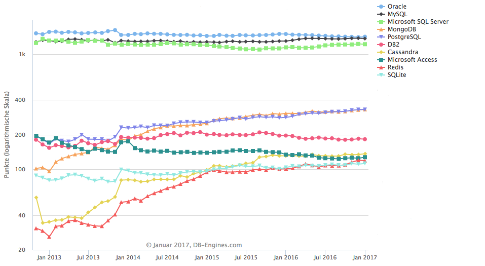
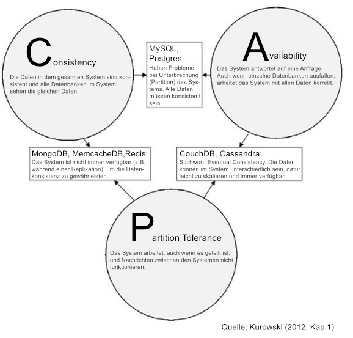
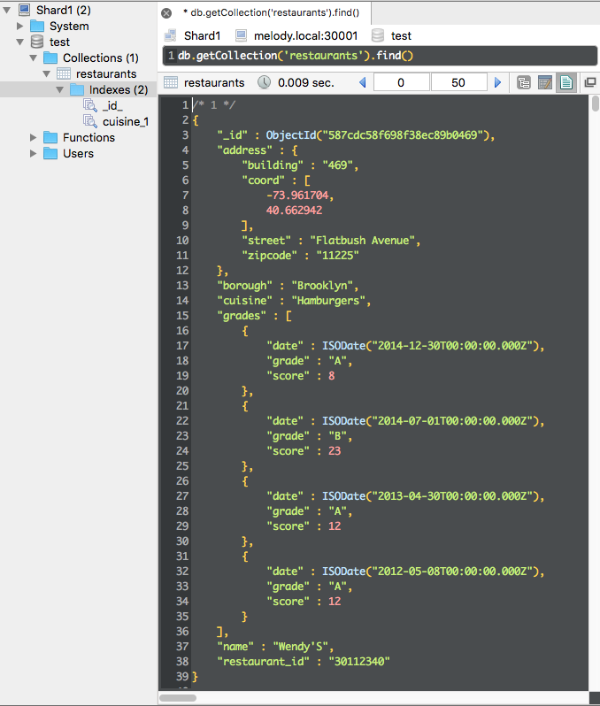

# 7 Anhang

## 7.1 Abbildungen

### Ranking-Diagramm DB-Engines.com



Abb. 7.1.1: Ranking-Diagramm (09.01.2017): [http://db-engines.com/de/ranking_trend](http://db-engines.com/de/ranking_trend)


#### CAP-Theorem



Abb. 7.1.2: CAP-Theorem

#### Ausgabe eines Dokuments in Robomongo



Abb. 7.1.3: Screenshot Robomongo (Programm unter: [https://robomongo.org/](https://robomongo.org/))


##  7.2 Konsolenausgaben

#### Statusabfrage Replica Set

```javascript
rsTest:PRIMARY> rs.status()
{
	"set" : "rsTest",
	"date" : ISODate("2017-01-13T13:28:04.306Z"),
	"myState" : 1,
	"term" : NumberLong(1),
	"heartbeatIntervalMillis" : NumberLong(2000),
	"optimes" : {
		"lastCommittedOpTime" : {
			"ts" : Timestamp(1484314074, 1),
			"t" : NumberLong(1)
		},
		"appliedOpTime" : {
			"ts" : Timestamp(1484314074, 1),
			"t" : NumberLong(1)
		},
		"durableOpTime" : {
			"ts" : Timestamp(1484314074, 1),
			"t" : NumberLong(1)
		}
	},
	"members" : [
		{
			"_id" : 0,
			"name" : "melody.local:40000",
			"health" : 1,
			"state" : 1,
			"stateStr" : "PRIMARY",
			"uptime" : 2300,
			"optime" : {
				"ts" : Timestamp(1484314074, 1),
				"t" : NumberLong(1)
			},
			"optimeDate" : ISODate("2017-01-13T13:27:54Z"),
			"electionTime" : Timestamp(1484313434, 1),
			"electionDate" : ISODate("2017-01-13T13:17:14Z"),
			"configVersion" : 3,
			"self" : true
		},
		{
			"_id" : 1,
			"name" : "melody.local:40001",
			"health" : 1,
			"state" : 2,
			"stateStr" : "SECONDARY",
			"uptime" : 246,
			"optime" : {
				"ts" : Timestamp(1484314074, 1),
				"t" : NumberLong(1)
			},
			"optimeDurable" : {
				"ts" : Timestamp(1484314074, 1),
				"t" : NumberLong(1)
			},
			"optimeDate" : ISODate("2017-01-13T13:27:54Z"),
			"optimeDurableDate" : ISODate("2017-01-13T13:27:54Z"),
			"lastHeartbeat" : ISODate("2017-01-13T13:28:02.381Z"),
			"lastHeartbeatRecv" : ISODate("2017-01-13T13:28:03.439Z"),
			"pingMs" : NumberLong(0),
			"syncingTo" : "melody.local:40000",
			"configVersion" : 3
		},
		{
			"_id" : 2,
			"name" : "melody.local:40002",
			"health" : 1,
			"state" : 2,
			"stateStr" : "SECONDARY",
			"uptime" : 238,
			"optime" : {
				"ts" : Timestamp(1484314074, 1),
				"t" : NumberLong(1)
			},
			"optimeDurable" : {
				"ts" : Timestamp(1484314074, 1),
				"t" : NumberLong(1)
			},
			"optimeDate" : ISODate("2017-01-13T13:27:54Z"),
			"optimeDurableDate" : ISODate("2017-01-13T13:27:54Z"),
			"lastHeartbeat" : ISODate("2017-01-13T13:28:02.381Z"),
			"lastHeartbeatRecv" : ISODate("2017-01-13T13:28:03.834Z"),
			"pingMs" : NumberLong(0),
			"syncingTo" : "melody.local:40001",
			"configVersion" : 3
		}
	],
	"ok" : 1
}
rsTest:PRIMARY> 
```

#### Konfigurationsabfrage Replica Set

```javascript
rsTest:PRIMARY> rs.conf()
{
	"_id" : "rsTest",
	"version" : 3,
	"protocolVersion" : NumberLong(1),
	"members" : [
		{
			"_id" : 0,
			"host" : "melody.local:40000",
			"arbiterOnly" : false,
			"buildIndexes" : true,
			"hidden" : false,
			"priority" : 1,
			"tags" : {
				
			},
			"slaveDelay" : NumberLong(0),
			"votes" : 1
		},
		{
			"_id" : 1,
			"host" : "melody.local:40001",
			"arbiterOnly" : false,
			"buildIndexes" : true,
			"hidden" : false,
			"priority" : 1,
			"tags" : {
				
			},
			"slaveDelay" : NumberLong(0),
			"votes" : 1
		},
		{
			"_id" : 2,
			"host" : "melody.local:40002",
			"arbiterOnly" : false,
			"buildIndexes" : true,
			"hidden" : false,
			"priority" : 1,
			"tags" : {
				
			},
			"slaveDelay" : NumberLong(0),
			"votes" : 1
		}
	],
	"settings" : {
		"chainingAllowed" : true,
		"heartbeatIntervalMillis" : 2000,
		"heartbeatTimeoutSecs" : 10,
		"electionTimeoutMillis" : 10000,
		"catchUpTimeoutMillis" : 2000,
		"getLastErrorModes" : {
			
		},
		"getLastErrorDefaults" : {
			"w" : 1,
			"wtimeout" : 0
		},
		"replicaSetId" : ObjectId("5878d3594b9274c246b57916")
	}
}
rsTest:PRIMARY> 

```

#### Log-Eintrag Neuwahlen   
(gekürzt, ohne Zeitstempel, Server 40001)

```plain
Connecting to melody.local:40000
Failed to connect to melody.local:40000 - HostUnreachable: Connection refused
Error in heartbeat request to melody.local:40000; HostUnreachable: Connection refused
Starting an election, since we've seen no PRIMARY in the past 10000ms
conducting a dry run election to see if we could be elected
VoteRequester(term 1 dry run) failed to receive response from melody.local:40000: HostUnreachable: Connection refused
VoteRequester(term 1 dry run) received a yes vote from melody.local:40002; response message: { term: 1, voteGranted: true, reason: "", ok: 1.0 }
dry election run succeeded, running for election
VoteRequester(term 2) received a yes vote from melody.local:40002; response message: { term: 2, voteGranted: true, reason: "", ok: 1.0 }
election succeeded, assuming primary role in term 2 
transition to PRIMARY
My optime is most up-to-date, skipping catch-up and completing transition to primary.
Failed to connect to melody.local:40000 - HostUnreachable: Connection refused
Successfully connected to melody.local:40002
transition to primary complete; database writes are now permitted
```


#### Status nach Einrichten des Clusters

```javascript
mongos> sh.status()
--- Sharding Status --- 
  sharding version: {
	"_id" : 1,
	"minCompatibleVersion" : 5,
	"currentVersion" : 6,
	"clusterId" : ObjectId("587ce1788377ce5583c3f99d")
}
  shards:
	{  "_id" : "shard2Repl",  "host" : "shard2Repl/melody.local:30101,melody.local:30102",  "state" : 1 }
	{  "_id" : "shardRepl",  "host" : "shardRepl/melody.local:30001,melody.local:30002",  "state" : 1 }
  active mongoses:
	"3.4.0" : 1
 autosplit:
	Currently enabled: yes
  balancer:
	Currently enabled:  yes
	Currently running:  no
		Balancer lock taken at Mon Jan 16 2017 16:06:32 GMT+0100 (CET) by ConfigServer:Balancer
	Failed balancer rounds in last 5 attempts:  0
	Migration Results for the last 24 hours: 
		No recent migrations
  databases:
	{  "_id" : "test",  "primary" : "shardRepl",  "partitioned" : false }

mongos> 

```

#### Status nach Einrichten des Shardings

```javascript
mongos> sh.status()
--- Sharding Status --- 
  sharding version: {
	"_id" : 1,
	"minCompatibleVersion" : 5,
	"currentVersion" : 6,
	"clusterId" : ObjectId("587ce1788377ce5583c3f99d")
}
  shards:
	{  "_id" : "shard2Repl",  "host" : "shard2Repl/melody.local:30101,melody.local:30102",  "state" : 1 }
	{  "_id" : "shardRepl",  "host" : "shardRepl/melody.local:30001,melody.local:30002",  "state" : 1 }
  active mongoses:
	"3.4.0" : 1
 autosplit:
	Currently enabled: yes
  balancer:
	Currently enabled:  yes
	Currently running:  no
		Balancer lock taken at Mon Jan 16 2017 16:06:32 GMT+0100 (CET) by ConfigServer:Balancer
	Failed balancer rounds in last 5 attempts:  0
	Migration Results for the last 24 hours: 
		3 : Success
  databases:
	{  "_id" : "test",  "primary" : "shardRepl",  "partitioned" : true }
		test.restaurants
			shard key: { "cuisine" : 1 }
			unique: false
			balancing: true
			chunks:
				shard2Repl	3
				shardRepl	3
			{ "cuisine" : { "$minKey" : 1 } } -->> { "cuisine" : "American" } on : shard2Repl Timestamp(2, 0) 
			{ "cuisine" : "American" } -->> { "cuisine" : "Chinese" } on : shard2Repl Timestamp(3, 0) 
			{ "cuisine" : "Chinese" } -->> { "cuisine" : "Indian" } on : shard2Repl Timestamp(4, 0) 
			{ "cuisine" : "Indian" } -->> { "cuisine" : "Other" } on : shardRepl Timestamp(4, 1) 
			{ "cuisine" : "Other" } -->> { "cuisine" : "Thai" } on : shardRepl Timestamp(1, 4) 
			{ "cuisine" : "Thai" } -->> { "cuisine" : { "$maxKey" : 1 } } on : shardRepl Timestamp(1, 5) 

mongos> 

```

***

[kap8]:  ./08_quellen.md "Quellen"

Nächstes Kapitel: [8. Quellen][kap8]
