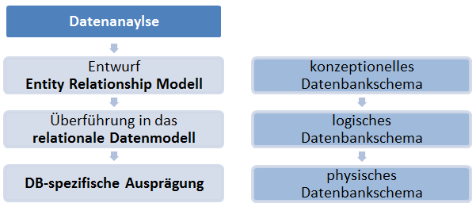
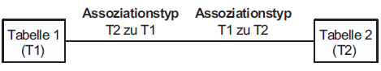
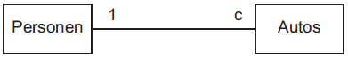
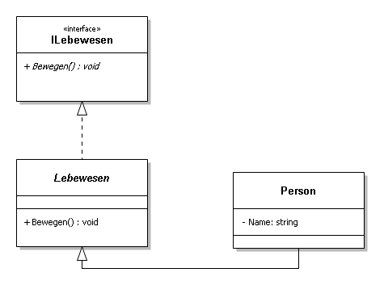

# 2. Grundlagen

Dieses Kapitel behandelt die grundlegenden Konzepte drei verschiedener Datenbanksysteme.
Zu Beginn werden die RDBMS betrachtet, da diese aktuell am verbreitesten sind und die anderen Datenbanksysteme damit im weiteren verglichen werden.
In Kapitel 2.2 werden die objektorientierten Datenbanken vorgestellt und in 2.3 die Dokumentdatenbanken.

## 2.1 Relationale Datenbankmanagementsysteme

Das Unterkapitel 2.1 soll grundlegende Informationen zur Organisation und Speicherung von Daten nach dem relationalen Ansatz darlegen. Dazu werden das Entity Relationship- und das relationale Modell betrachtet. Es werden somit ausschließlich diejenigen Aspekte thematisiert, die eine Einflussnahme auf die Modellierung der Datenrepräsentation haben. Konkret bezieht sich dieses Kapitel auf die konzeptionelle und logische Ebene der Datenabbildung durch das RDBMS.    

Die Modellierung der Daten für eine relationale Abbildung erfolgt in drei Schritten. Diese bestehen aus der Datenanalyse, dem Entwurf des Entity Relationship-Modell und den Transfer in das relationale Modell. Das physische Modell dient der Beschreibung der Transition des konzeptionellen Datenmodells auf die Datenbankebene. Schlussendlich liegt das relationale Datenmodell in die DB-spezifische Ausprägung vor. (vgl. @schropp2004DBProjekt S. 6) Die Abbildung 1 stellt den Ablauf der Modellierungsschritte dar und ordnet den jeweiligen allgemeingültigen Ebenenbegriff des Datenbankmodells zu.



### 2.1.1	Das Entity Relationship Modell

Das Entity Relationship-Modell (ERM) ist die initiale Abbildung der zu modellierenden Daten und deren Abhängigkeiten oder Zugehörigkeiten untereinander. Im Kontext des ER-Modells werden die Termini  

  *	Entität
  *	Entitätsmenge

eingeführt. „Unter Entität (engl. entity) versteht man ein bestimmtes, d.h. von anderen wohlunterscheidbares Objekt der realen Welt oder unserer Vorstellung. Dabei kann es sich um ein Individuum, um einen Gegenstand, um einen abstrakten Begriff oder um ein Ereignis handeln (@meier2016nosql S. 20)". Dementgegen definiert sich der Begriff Entitätsmenge wie folgt: „Entitäten des gleichen Typs werden zu Entitätsmengen zusammengefasst und durch Merkmale weiter charakterisiert (@meier2016nosql S. 20)“.

Um eine Entität in der Entitätsmenge identifizieren zu können, ist ein Merkmal oder Merkmalskombination zu bestimmen, welches als Identifikationsschlüssel fungiert. Der dazu bestimmte Schlüssel muss das Kriterium der Eindeutigkeit erfüllen. Sobald ein Identitätsschlüssel für eine Entitätsmenge zwei Entitäten zugeordnet werden kann, besteht keine Eindeutigkeit.

Das ER-Modell sieht für Entitäten ferner auch das Konzept der Generalisierung und Aggregation vor, indem Daten vom Detail ausgehend abstrahiert werden oder durch Submengenbildung als Spezialisierungen gelten können. Die Generalisierung umfasst als Begrifflichkeit mehrere Formen:

  *	Überlappende Subentitätsmengen
  *	Überlappend-vollständige Subentitätsmengen
  *	Disjunkte Subentitätsmengen
  * Disjunkt-vollständige Subentitätsmengen

Diese Formen der Mengendarstellung müssen von der Transformation zum relationalen Modell berücksichtigt werden. (vgl. @meier2016nosql S. 33)

Zwischen den Entitätsmengen können unterschiedliche Beziehungen (engl. relationships) existieren. Die Beziehungen bilden eine Beziehungsmenge, die wiederum durch Merkmale näher charakterisiert werden können. Beziehungen werden durch Assoziationen näher beschrieben, die wiederum durch Assoziationstypen spezifiziert werden. Die nachstehenden Assoziationstypen sind im ER-Modell definiert:

  * einfache Assoziation (genau ein Tupel)
  * konditionelle Assoziationen (kein oder genau ein Tupel)
  * multiple Assoziationen (mindestens ein Tupel)
  * multiple-konditionelle Assoziationen (beliebig viele Tupel)

Die o.g. Assoziationstypen ermöglichen unterschiedliche Arten von Beziehungen. Grundsätzlich existiert zu jeder Assoziation eine Gegenassoziation. Man spricht von einer Beziehung, wenn zwei Assoziationen miteinander kombiniert werden. Es können hierarchische, konditionelle oder netzwerkförmige Beziehungen definiert werden. Über Entitätsblockdiagramme werden die Beziehungen visualisiert. Die Abbildung 2 und Abbildung 3 sind Beispiele für die Blockdiagramme. (vgl. @steiner2006rdbs S. 19)





Das ER-Modell beschreibt die Beziehung der Entitäten untereinander auf einer konzeptionellen Ebene. Die konkrete Umsetzung in einem RDBMS ist dadurch noch nicht erfolgt, da im konzeptionellen ER-Modell z.B. noch keine einzelnen Attribute berücksichtigt werden. Dazu muss das konzeptionelle Modell letztendlich in ein physikalisches Modell umgewandelt werden. Der Zwischenschritt erfolgt über das logische Modell, der relationalen Umsetzung des logischen Datenmodells, in diesem Fall vom ER-Modell ausgehend.

Je nach Beziehungstyp der Entitäten muss die logische Entsprechung als Relationen in der Form von Tabellen im physischen Datenmodell realisiert werden. Beispielsweise müssen n-m-Beziehungen über eine Zwischentabelle abgebildet werden, da sonst eine redundanzfreie Speicherung von Daten in der Detailtabelle nicht umsetzbar wäre. Das physische Datenmodell setzt die Relationen gemäß der Syntax des DBMS um. (vgl. @steiner2006rdbs S. 15)

### 2.1.2	Das Relationale Datenmodell

Relationale Datenbankmanagementsysteme wurden im Jahr 1970 von Edgar Frank Codd entwickelt (vgl. @meier2016nosql S. 133). Dieses Konzept zur Verwaltung und Speicherung von Daten ist bis heute weit verbreitet (siehe Kapitel 5). Relationale Datenbanken wurden vom ursprünglichen Konzept aus erweitert, indem beispielsweise neue Formen der Datenorganisation im XML-Format oder andere Betriebsaspekte wie einer Cloud-Infrastruktur für eine Datenspeicherung integriert werden. Der Fokus der anschließenden Betrachtung soll sich lediglich auf das grundlegende relationale Modell beschränken, um zu verdeutlichen, wie Informationen in einem RDBMS gespeichert werden.

Das relationale Modell setzt sich aus Objekten, Operationen und Regeln zusammen. Zu den Objekten zählen beispielsweise Domains (Wertebereiche), Relationen (Tabellen), Attribute (Spalten), Tupel (Datensätze), Primary-Keys (Primärschlüssel) oder Foreign-Keys (Fremdschlüssel). Zentrale Regeln im Kontext des relationalen Modells sind die Entitätenintegrität und die referenzielle Integrität. Zu den Operationen gehören beispielsweise Restrictionens, Projections, Unions oder Joins. (vgl. @unterstein2012rdbms S. 30)

Wie der Name des Modells bereits vermuten lässt, sieht es als Kernprinzip eine Speicherung von Informationen in Relationen (Tabellen) vor. Dieses Modell beruht auf mathematischen Grundprinzipien der Mengenlehre. So kann eine Relation als eine Teilmenge beschreiben werden. Eine Relation besteht aus Indizes die als Attribute bezeichnet werden. Diese besitzen wiederum Namen, um das mentale Modell des Menschen zu unterstützen. Diese Mengen können aus unterschiedlichen Elementen bestehen. Beispielhaft seien an dieser Stelle Zahlen, Zeichenketten oder Datumsangaben genannt. Hierbei wird der Begriff der Domäne verwendet. Eine Domäne ist der Wertebereich, aus dem Attribute ihre Werte beziehen können. Um die Daten in eine repräsentative und verständliche  Form zu bringen, werden Relationen in einer tabellarischen Form dargestellt. (vgl. @unterstein2012rdbms S. 30)

| TITEL | AUTOR | GENRE  | ISBN | DATUM |
| ------------- |-------------| -----| -----| -----|
| Frequenz | Lincoln Child | Belletristik | 978-3805250955 | 22.07.2016 |
| Der Schwarm | Frank Schätzing | Belletristik | 978-3596164530 | 01.11.2005 |
| Die Zwölf | Justin Cronin | Belletristik | 978-3442469352 | 21.04.2014 |
| Die Spiegelstadt | Justin Cronin | Belletristik | 978-3442311804 | 31.10.2016 |

Tabelle 1:  Die Relation Buch

Die Attribute/Spaltennamen der in der Tabelle 1 abgebildeten Relation Buch heißen TITEL, AUTOR, GENRE, ISBN und DATUM, diese bilden zusammen die Attributmenge der Relation. Eine Zeile ist ein Tupel/Datensatz, ein Attributwert bzw. ein Feld eines Datensatzes beinhaltet einen konkreten Wert. An dieser Stelle wird nochmals deutlich, dass sich eine Relation aus unterschiedlichen Datentypen der Attribute zusammensetzen kann.

Zwischen den Attributen einer Relation können funktionale und voll funktionale Abhängigkeiten existieren. Funktionale Abhängigkeiten liegen vor, wenn Attributwerte der Komponente A die Attributwerte der Komponente B eindeutig bestimmen (der Titel des Buches ist funktional abhängig von der ISBN-Nummer). Voll funktionale Abhängigkeiten liegen vor, wenn zwischen Attributwerten von Komponenten eine funktionale Abhängigkeit existiert (B ist abhängig von A) und wenn C eine echte Teilmenge von A ist und C wiederum funktional B bedingt (B ist abhängig von C).

Das relationale Datenmodell greift die Anforderung einer redundanzfreien Speicherung von Daten auf, indem eine definierte Abfolge von Normalisierungsschritten durchlaufen wird. Jede Normalisierungsform stellt bestimmte Anforderungen an die Beschaffenheit der Daten und deren Abhängigkeiten untereinander, wie im vorherigen Abschnitt angedeutet. Aufgrund der Wichtigkeit der Normalisierung der Daten, werden die Normalformen (NF) aus Gründen der Vollständigkeit mit der jeweils erforderlichen Qualitätsanforderung aufgelistet.(vgl. @meier2016nosql S. 36ff)

  * **1. Normalform (1NF)**
    1. Atomare Wertebereiche
    2. jedes Merkmal bezieht Werte aus einem unstrukturierten Wertebereich bezieht. -> keine Mengen, Aufzählungen oder Wiederholungsgruppen in den einzelnen Merkmalen
  * **2. Normalform (2NF)**
    1. Bedingungen der ersten NF erfüllt
    2. jedes Nichtschlüsselmerkmal von jedem Schlüssel voll funktional abhängig
  * **3. Normalform (3NF)**
    1. Bedingungen der zweiten NF erfüllt
    2. kein Nichtschlüsselmerkmal ist von irgendeinem Schlüssel transitiv abhängig
  * **4. Normalform (4NF)**
    1. keine zwei echte und voneinander verschiedene mehrwertige Abhängigkeiten in ein und derselben Tabelle vorliegen
  * **5. Normalform (5NF)**
    1. wenn Tabelle keine Verbundabhängigkeit aufweist

Zur eindeutigen Identifikation von Tupeln/Datensätzen werden Primary Keys eingesetzt. Die Wahl des Primary Keys wird anhand der Charakteristik der Attribute gewählt. Ein Primary Key sollte eine entsprechende Effizienz besitzen, indem er nur aus wenigen Attributen besteht. Über die eindeutige Identifikation der Tupel mittels eines Primary Keys und den Primary Keys einer zweiten Relation lassen sich die darin abgelegten Informationen in eine Beziehung (Relation) bringen. (vgl. @unterstein2012rdbms S. 30ff)

Wie bereits im Kapitel 2.1.1 erwähnt, können Beziehungen zwischen Entitäten bestehen. Dies gilt  konsequenterweise auch für Relationen, die Beziehungen über die Attributausprägungen realisieren. Das Konstrukt der Primär- und Fremdschlüssel ermöglicht Relationen miteinander zu verknüpfen und um im Fall einer Selektion, auf die Datenbestände der in einer Beziehung stehenden Relationen, zugreifen zu können. Ein Primärschlüssel muss einen Tupel in einer Relation eindeutig identifizieren können. Je nach Charakteristik der Datenabbildung können gewisse Entitäten bereits über ein eindeutiges Schlüsselattribut verfügen. Ein Fremdschlüssel in der Detailrelation bezieht sich auf die Schlüsselwerte des Primärschlüssels. Weiterhin bedingt die Charakteristik des Primärschlüssels gleichermaßen die Charakteristik des Sekundärschlüssels. Sollte der Primärschlüssel eine Kombination aus mehreren Attributen aufweisen, so ist dies auch beim Fremdschlüssel der Fall. Für eine Fremdschlüsselbeziehung wird die Eigenschaft der referenziellen Integrität gefordert. Gemäß dieser Anforderung muss der enthaltende Fremdschlüssel in der Primärtabelle als Primärschlüssel enthalten sein. Die Forderung der Eindeutigkeit für Primärschlüssel gilt nicht für die Fremdschlüssel, da mehre Datensätze einer Fremdtabelle einem Datensatz in einer Primärtabelle zugeordnet sein können. (vgl. @unterstein2012rdbms S. 31)

## 2.2 Objektorientierte Datenbankmanagementsysteme
Bei den objektorientierten Datenbanken handelt es sich um Systeme, welche den Anspruch erheben, die Objekte aus der objektorientierten Programmierung (OOP), mit allen Eigenschaften und Vorteilen die diese besitzen, speichern zu können.
Im folgenden Kapitel 2.2.1 werden zuerst die grundlegenden Konzepten der Objektorientierung beschrieben, da diese Konzepte sich bei den objektorientierten Datenbanken wiederfinden.
In weiteren Verlauf beschreibt das Kapitel 2.2.3 f. die objektorientierten Datenbankmanagementsystemen (im folgenden OODBMS).

### 2.2.1 Objektorientierung
Unter einem **Objekt** wird im allgemeinen eine Einheit verstanden, welche aus Attributen und Methoden besteht.
Dieses versucht ein abstraktes Konstrukt aus der realen Welt in Teilen oder vollständig zu beschreiben.
Das können beispielsweise Personen, Tiere oder Gegenstände sein, aber auch abstrakte Dinge wie die Zugriffsklasse auf ein Dateisystem oder auf eine Datenbank.
Der Bauplan, welche für die Erzeugung der Objekte verwendet wird, wird als **Klasse** bezeichnet.
Im folgenden wird die Klasse mit dem Namen *Person* und den Eigenschaften *Nachname*, *Vorname* und *Alter* beispielhaft verwendet.
Diese beschreibt Personen für einen geeigneten Kontext ausreichend genau.
Sind weitere Eigenschaften oder Methoden nötig so muss die Klasse um solche erweitert werden.
Die Abbildung 4 zeigt die Klasse in der Notation eines UML Klassendiagramms.


<!-- Eigenschaten und Methoden -->
Die konkrete Instanz einer Klasse heisst Objekt.
Dieses kann die Werte zu seinen definierten Eigenschaften aufnehmen, welche für den Nutzungskontext wichtig sind.
Die Charakterisierung eines Objektes erfolgt durch seine **Methoden**.
Methoden beschreiben die Aktionen, welche mit einer Instanz durchgeführt werden können.
Die Person könnte beispielsweise die Aktion *Bewegen* implementieren um eine frei definierbare Bewegung des Objektes zu starten.
Ein Kernkonzept der Objektorientierung ist die **Kapselung**, welches besagt, dass ein direkter Zugriff auf die Attribute eines Objektes nicht möglich ist.
Der Zugriff wird über eigene Methoden bereitgestellt.
In dem verwendeten Beispiel sind das die Get- und Set-Methoden.
Damit können Einschränkungen durchgeführt werden, sodass bestimmte Eigenschaften nur lesbar sind oder nur gesetzt werden können. (vgl. @kuhnel2012visual Kap. 3)

<!-- Abtrakte Klassen, Interfaces und Vererbung -->
Um generische Klassen abbilden zu können gibt es **abstrakte* Klassen**, von denen sich keine Instanz erzeugen lässt.
Eine passende abstrakte Klasse könnte beispielsweise das *Lebewesen* sein, welche allgemein gültige Attribute und Methoden definiert.
Für die Realisierung von Schnittstellen eigenen sich **Interfaces**, welche nur den Kopf von Methoden definieren und die eigentliche Implementierung den Klassen überlassen.
Schnittstellen eigenen sich besonders gut, wenn über die eigenen Systemgrenzen hinweg Daten ausgetauscht werden müssen.
Die Abbildung 5 zeigt die Verwendung der abstrakten Klasse *Lebewesen* mit der Schnittstelle *ILebewesen*.



Hierbei spielt das Prinzip der **Vererbung** eine große Rolle.
Die Klasse *Person* erbt alle Eigenschaften und Methoden von *Lebewesen*.
Dadurch ist es möglich Aktionen und Eigenschaften zu generalisieren.
Durch die Verwendung eines Interfaces verpflichtet sich die abstrakte Klasse *Lebenwesen* dazu, selbst die definierten Methoden zu implementieren.

<!-- Polymorphie und Überladung/Überschreiben von Methoden -->
Daraus ergibt sich ein weiteres Prinzip der Objektorientierung.
Eine erbende Klasse kann die Methoden der übergeordneten Klasse(n) überschreiben und dadurch ein angepasstes Verhalten implementieren.
Beispielsweise bewegt sich ein Mensch auf zwei Beinen, ein Löwe aber auf vier Pfoten.
Daneben gibt es das Prinzip der **Polymorphie**, welches besagt, dass es von einer Methode mit gleichem Namen verschiedene Ausprägungen geben kann.
Diese unterscheiden sich durch ihre Parameter. (vgl. @kuhnel2012visual Kap. 4)

<!-- Objektbeziehungen -->
Neben der Modellierung einzelner Klassen müssen deren Beziehungen untereinander abgebildet werden.
Dabei ergeben sich vier verschiedene Typen von Beziehungen die für die Speicherung in Objektdatenbanken wichtig sind.
Bei 1:1 Beziehungen findet genau eine Referenz von Klasse 1 auf eine Klasse 2 statt.
Ebenfalls hat Klasse 2 nur genau 1 Referenz, nämlich die auf Klasse 1.
Der zweite Typ sind 1:n Beziehungen bei denen die Klasse 1 auf n weitere Klassen verweisen kann.
Beide Typen können ebenfalls bedingt sein, wobei auch eine Referenz auf NULL möglich ist.
Beziehungen lassen sich zusätzlich noch klassifizieren, dazu gehören verhaltensbezogene Beziehungen (Nachrichten oder Funktionsaufrufe) und strukturelle Beziehungen (Einschluss oder Vererbung). (vgl. @poschekdatenbanken S. 12f)

<!--- Client-Server Programmierung ubd Übergang zu OOM --->
Der Einsatz von objektorientierten Programmen ist sehr unterschiedlich.
In Bereichen wie z. B. im Computer Aided Design (CAD) oder Multimedia-Anwendungen werden Objekte mit komplexen Strukturen erzeugt, die persistent gespeichert werden müssen.
Heutzutage werden viele Client-Server basierte Anwendungen entwickelt, die Daten dauerhaft speichern müssen.
Häufig sind hierbei viele Nutzer, die auf ein zentrales System zugreifen, welches die Daten bereitstellt (Client-Server Prinzip).
Dazu werden in den meisten Fällen relationale Datenbankmanagementsysteme wie MySQL[^msql], MariaDB[^mariadb], PostgreSQL[^psql], Microsoft SQL Server, usw. eingesetzt.
Häufig findet die Realisierung der Anwendung in einer objektorientierten Programmiersprache wie Java, C# oder PHP statt.
Dadurch entsteht ein Problem welches unter dem Begriff Objektrelationales Mapping (ORM) zusammengefasst wird und das im folgenden Kapitel genauer beschrieben wird.

### 2.2.2 Objektrelationales Mapping und Objektdatenbanken
Eines der größeren Probleme als Benutzer einer objektorientierten Sprache ist, dass die verwendeten Objekte in eine relationalen Datenbank nicht adequat persistent gespeichert werden, da eine relationale Datenbank nur einen eigenen Pool aus Datentypen besitzt (siehe Kapitel 2.1.2).
Dieses Problem lässt sich durch mehrere Ansätze kompensieren:

  * Verzicht auf die Verwendung von Objekten in der Programmierung, was nicht dem objektorientierten Paradigma entsprechen.
  * Konvertierung der Objekte zu relationalen Daten beim Speichern und Konvertierung der relationalen Daten zu Objekten beim Lesen.
  Diese Variante hat den Nachteil, dass viel Performance in die Umwandlung der Daten investiert werden muss.
  Der Vorteil ist, dass die Daten weiterhin in einer relationalen Datenbank liegen und somit bekannte Verfahren zum Lesen und Schreiben und der Konsistenz angewendet werden.
  * Verzicht auf die Speicherung der Daten in einer relationalen Datenbank.
  Als geeignete Alternative bieten sich hier objektorientierte Datenbanken an, die jegliche Art von Objekten speichern können.

Um ein solches Mapping mit möglichst wenig Aufwand durchführen zu können, gibt es in den verschiedenen Programmiersprachen Frameworks, welche die meiste Arbeit (Generierung der SQL Statements, Umwandeln des Datenstroms in Objekte, usw.) durchführen.
Im Bereich Java ist das die Java-Persistance-API[^jpi], auf der ein Framework wie Hibernate[^hib] aufsetzen kann, im Bereich C# existiert nativ das Entity Framework[^ef] für MSSQL Datenbanken oder im Bereich der Android Entwicklung das Framework SugarORM[^sugar].

Eine bessere Lösung ist jedoch die Speicherung der verwendeten Objekte direkt in der Datenbank.
In diesem Fall findet kein Verlust der Performance durch das Mapping der Daten statt, des weiteren lassen sich Informationen wie Vererbung oder Verknüpfungen zwischen den Objekten wesentlich besser hinterlegen.

Bei der Verwendung eines OODBMS erfolgt der Zugriff auf die Daten in gleicher Weise, als würden diese im Speicher des Betriebsystems liegen.
Dadurch werden weitere Layer wie Open Database Connectivity (ODBC), ActiveX Data Objects (ADO) oder Java Database Connectivity (JDBC) nicht benötigt.
Die CURD-Abfragen (Create, Update, Read, Delete) können über Methoden direkt auf die Datenbank ausgeführt werden.
Lediglich für das Suchen bestimmter Objekte nach Kriterien in den Attributen muss eine eigene Sprache bereitgestellt werden.
Ein sehr generischer Ansatz hierfür ist beispielsweise die Verwendung von Lambda Expressions, welche in C# zu LINQ to Objects[^linq] geführt haben.
Werden Objekte aus der Datenbank geholt, können diese im Modus Transient oder Mirror sein.
Als Transient sind diese von der Datenbank entbunden, Änderungen wirken sich nur auf das Objekt im Speicher des Systems aus.
Im Mirror Modus wirken sich Änderungen direkt auf das Objekt im Speicher und in der Datenbank aus. (vgl. @obasanjo2003exploration S. 2)


### 2.2.3 Anforderungen an ein objektorientierte Datenbank
Ein OODBMS muss verschiedene Anforderungen abdecken um den Programmierer die bisher beschriebenen Vorteile zu bieten.

Die gespeicherten Objekte sollten nahezu ununterscheidbar von denen in der verwendeten Programmiersprache sein.
Daher müssen Anforderungen nach Vererbung, Polymorphie, Schnittstellen oder Objektreferenzen von dem OODBMS ebenfalls mit abgedeckt werden (vgl. Kapitel 2.1).

Jedes Objekt muss unter einer eindeutigen ID, der Objekt ID (OID) gespeichert werden, welche vom OODBS vorgegeben bzw. generiert wird.
Anforderungen an die OID sind:
  * Unabhängigkeit gegenüber den Daten in dem Objekt, ändern sich die Daten im Objekt bleibt die OID gleich.
  * Objekte mit unterschiedlichen OIDs und gleichen Eigenschaften sind möglich. (z. B. eine Klasse mit den Attributen Nachname und Vorname von der zwei gleiche Instanzen existieren)
  * Es dient der Auffindbarkeit
  * Es dient als eindeutigen Identifizierung eins Objekts innerhalb einer Datenbank
  * Über die OIDs ist es möglich Referenzen zwischen Objekten innerhalb der Datenbank zu hinterlegen
  * Eine Referenz kann sich nur auf ein anderes Element oder auf eine Menge anderer Elementen beziehen

Die Erzeugung der OID kann auf verschiedene Arten und Weisen vergeben werden:
  1. Erzeugung aus der physischen Adresse, bzw. dem Pointer. Der Nachteil dieser Variante ist, dass eine Bindung an den physischen Speicherplatz entsteht.
  2. Eine Name, der meist aus einem geeigneten Namensraum stammt, welcher üblicherweise vom Nutzer vergeben wird. Hierbei ist es oft schwierig über viele Attribute eindeutige Werte zu vergeben.
  3. Einen Surrogate oder Identifier Attribut. Diese haben den Nachteil, dass sie nicht wie normale Attribute behandelt werden können.

Neben der OID wird der Zustand eines Objektes als weitere Information mit gespeichert. (vgl. @poschekdatenbanken S. 9)

Bei der Verwendung von Referenzen kann es, wie bei den relationalen Datenbanken, zu Integritätsproblemen kommen, wenn ein Objekt, auf welches noch referenziert wird, aus der Datenbank entfernt wird.
Einige Datenbanksysteme können Referenzen über Attribute setzen, sodass das eine Eigenschaft des Objektes x auf y zeigt ohne das weiter bestimmt werden muss, wie die Referenz berechnet wird.
Die Berechnung erfolgt über eine direkte Referenz auf das Objekt (Pointer) oder wird über gleichartige Attribute bestimmt.
Ob dies erlaubt ist und wie damit verfahren wird, hängt von der Implementierung des OODBMS ab.
Das OODBMS muss Mechanismen bereitstellen, um diese Probleme zu adressieren.

Eine OODBMS muss ebenfalls die ACID Prinzipien (Atomar, Konsistenz, Isolation und Haltbarkeit) gewährleisten.
Für die Abfrage der Daten muss ggf. eine eigene Sprache bereitgestellt werden.
Weitere Anforderungen wie Transaktionen, das Speichern und Abrufen großer Datenmengen, Erkennen von Deadlocks, Erzeugen von Backups sowie die Möglichkeit diese wieder einzuspielen muss ein OODBMS ebenfalls leisten.
Das objektorientierten Datenbankmanifest gibt dreizehn Regeln an, welche Anforderungen ein OODBMS erfüllen muss.
Diese Teilen sich in acht Regeln aus dem Bereich der Objektorientierung und fünf aus Datenbankgrundsätzen [vgl. @rutner2002implementing, @obasanjo2003exploration] und werden im folgenden ausführlicher vorgestellt.


  * **Acht Regeln der Objektorientierung**
     1. Objekte lassen sich zu **Klassen und Typen** abstrahieren, um gleichartige Objekttypen zu beschreiben.
     2. Jede Datenbankoperation muss **vollständig** oder gar nicht durchgeführt werden und kann in einer geeigneten Sprache ausgedrückt werden.
     3. Klassen können um weitere Attribute ergänzt werden. Die Möglichkeit der **Erweiterbarkeit** bezieht sich auf alle relevanten Objekte.
     4. **Einfach- und/oder Mehrfachvererbung** ist möglich. Eine Unterklasse kann die geerbte Klasse um eigene Methoden und Attribute erweitern.
     5. Unterschliedliche Klassen, die eine Methode erben, können diese überschreiben und weitere gleichnamige Methoden mit unterschiedlichen Parametern hinzufügen. (**Polymorphie**)
     6. Verwendung von **Datenkapselung** um Details der Implementierung zu verbergen. Der Zugriff auf Eigenschaften erfolgt nur über Methoden (Überlicherweise Get- und Set-Methoden).
     7. Ein OODBMS unterstützt **komplexe Objekte**. Das sind Objekte, deren Attribute nicht nur einfache Datentypen wie String, Integer oder Boolean sein können sondern wiederum aus anderen Objekten bestehen können.
     8. Jedes Objekt hat eine eigene **Objektidentität**, welche unabhängig von den Eigenschaftswerten ist. Eine solche ID wird wie bereits beschrieben als OID bezeichnet.
  * **Fünf Datenbankgrundsätze**
     1. Das OODBMS muss für **Persistenz** sorgen, sodass der Zustand über die gesamte Laufzeit erhalten bleibt. Nur bewusste Änderungen der Daten sind erlaubt.
     2. Der Zugriff auf die Daten muss **mehrbenutzerfähig** sein. Dazu gehören gleichzeitige Zugriffe, ein Transaktionskonzept um Datenbankinkonsistenz zu vermeiden.
     3. Über eine Abfragesprache lassen sich **Ad-hoc Abfragen** durchführen.
     4. Die Verwaltung von **großen Datenbeständen ist möglich**. Dazu gehören die Optimierung von Abfragen oder das Management von Indicies. Diese sollen unabhängig von Benutzerinteraktionen durchgeführt werden.
     5. Das **Wiederherstellen** des Ausgangszustands im Fehlerfall bei nicht abgeschlossenen Transaktionen ist möglich. Ggf. werden diese neu gestartet.

<!--- OOD Modell --->
Ein OODBMS kann in die zwei Teile "Struktur" und "Operation" eingeteilt werden.
Der Strukturbereich beinhaltet die Objekte, deren Zustände, die Klassen, das Schema und die Vererbung.
Im Operationsteil finden sich die Metaklassen, die Funktionen, Methoden, die Vererbung von Methoden sowie die Ausnahmen.

### 2.2.4 Transaktionen und Einsatz eins OODBMS
Die meisten OODBMS unterstützen die Verwendung von Transaktionen.
Wird eine Transaktion gestartet, so wird das betreffende Objekt gesperrt (Read-Write Modell).
Typische Operationen, welche angeboten werden sind:

  * *begin()* um eine Transaktion zu starten
  * *commit()* um eine Transaktion erfolgreich zu beenden
  * *abort()* um eine laufende abzubrechen
  * *checkpoint()* um mehrere Transaktionen miteinander zu synchronisieren
  * *active()* um den Status einer Transaktion abzufragen

<!-- Weitere Wichtige Punkte für den Betrieb eines OODB -->
Neben den oben aufgeführten dreizehn Regeln gibt es weitere Aspekte, die wichtig für den Einsatz eines OODBMS sind.
Dazu gehören Autorisierung, Schemaevaluation und Versionierung.
Der Bereich der Autorisierung beschreibt den Schutz vor unberechtigtem Zugriff.
Dafür werden Zugriffsrechte an Benutzer vergeben, welche Klassen, Objekte oder bestimmte Untermengen von Objekten lesen, schreiben, verändern oder löschen dürfen.

Die Schemaevaluation ist wichtig, wenn Definitionen von Klassen oder Beziehungen angepasst werden müssen.
In diesem Fall dürfen Änderungen nicht das laufende System beeinträchtigen.
Die Änderungen können sich sofort auf alle Objekte auswirken (eager update) oder werden nach und nach verändert (lazy update).
Im zweiten Fall geschieht das meist erst beim erneuten Zugriff auf die Daten.
Werden Objekte verändert, so ist es wichtig die Historie zu verwalten.
Die Darstellung der Versionen kann mittels eines Versionsgraphen erfolgen.
In diesem ist auch gekennzeichnet, welche als die aktuelle Version behandelt wird, also das Objekt, welches bei einer Anfrage in dieser Version zurückgegeben wird.
Eine andere Möglichkeit ist, eine zeitbezogene Versionierung durchzuführen. (z. B. Jede Stunde/Monat etc.)
Werden diese mit einem Gültigkeitsstempel versehen, findet ein Aufräumungsprozess statt. (vgl. @poschekdatenbanken S. 18)

### 2.2.5 Zusammenfassung
Der große Vorteil von Objektdatenbanken ist die Vermeidung des Bruchs, der bei der Speicherung von Daten in relationale Datenbanken entsteht.
Ein weiterer Vorteil ist, dass das benötige *Joinen* von normalisierten Tabellen entfällt.
Drittes Argument für ein OODBMS ist, dass die Objektidentität gesichert ist, da für dessen Verwaltung das Datenbanksystem verantwortlich ist.
Des Weiteren wird die Historie eines Objektes gespeichert, sodass die Wiederherstellung einzelner Objekte leichter ist.

Der größte Nachteil ist der geringe Anteil von Schnittstellen für den Zugriff.
Besonders unter den populären Programmiersprachen wie Java, PHP oder Python fehlen die entsprechenden Frameworks.
Weiterhin gibt es nur wenige Implementierungen von diesem Datenbanktyp.
Beispiel von Objektdatenbanken sind db4o[^db4o], ZooDB[^zoodb] oder mcobject[^mcobject].

## 2.3 Dokumentdatenbanken
Dokumentdatenbanken gehören zum Typ der NoSQL (Not only SQL) Datenbanken.
Der englische Name ist nicht wie zu vermuten *document database*, sondern treffender *document store*, da diese Systeme für die Speicherung von Dokumenten optimiert sind.
Dieser Datenbanktyp bietet den großen Vorteil der Schemafreiheit von *Key-Value Pairs* (Schlüssel/Werte-Paar) mit einer Möglichkeit zur strukturierten Speicherung von Daten.
Bei den Daten handelt es sich um strukturierte Daten in Datensätzen, welche in diesem Kontext als Dokumente bezeichnet werden. (vgl. @meier2016nosql S. 230 ff)

Einsatzbereich sind meist spezielle Web-Dienste, welche horizontal skalierbar sein müssen.
Dabei werden überwiegend verschiedene Rechner als Cluster betrieben, die Verteilung erfolgt über Sharding.
Kurzzeitige Datenbankinkonsistenzen werden in Kauf genommen, da erst eine Verteilung der aktualisierten Daten auf alle Knoten erfolgen muss.
Anwendung finden Dokumentdatenbanken besonders bei Social-Media-Plattformen oder suchintensiven Anwendungen.

Schemafrei bedeutet, dass nicht wie bei relationalen oder objektorientierten Datenbanken das Tabellen- oder Objektschema angegeben werden muss.
Dokumente lassen sich ohne vorherige Definition eines Schemas einfügen.
Dadurch wird auf Vorteile wie referenzielle Integrität oder Normalisierung verzichtet.
Des Weiteren kann eine Dokumentdatenbank keine transaktionale Sicherheit gewährleisten, vielmehr wird nach dem Prinzip der schlussendlichen Konsistenz (eventual consistency) gearbeitet. (vgl. @redmond2012seven S. 317 ff)
Der Vorteil dieses Ansatzes ist eine sehr schnelle Verarbeitung der Daten, da die Replikation erst später erfolgt.

Beispiele für bekannte Dokumentdatenbanken sind CouchDB[^couchdb], RavenDB[^ravendb] oder MongoDB[^mongodb].
Die Datenbank CouchDB wird Beispielsweise bei dem Dokumentenmangementsystem d.3ecm[^d3] von d.velop als Proxy für die relatione Datenbank eingesetzt, um Suchanfragen schneller durchführen zu können.
Der eigentliche Datenbestand liegt hierbei in einer relationalen Microsoft SQL-Server Datenbank vor, die Metainformationen zu den Dokumenten werden für eine schnellere Suchmöglichkeit in der CouchDB vorgehalten.
Durch diese Verknüpfung der beiden Systeme fallen die Nachteile der fehlenden Transaktionssicherheit oder der Normalisierung weg.
Lediglich der Suchindex kann eine Inkonsistent zum vorhanden Datenbestand aufweisen.

### 2.3.1 Dokumente
Der Begriff "Dokument" kann zu Irritationen führen, da hierunter auch andere Dateitypen wie z. B. Multimedia oder Binärdateien fallen. (z. B. Word-Dokument)
Ein Dokument besteht vielmehr aus einem strukturierten Datensatz, welcher beispielsweise in XML[^xml] oder JSON[^json] formatiert ist.

**Beispiel eines JSON Datensatzes**
```JSON
{
    "Nachname": "Tester",
    "Vorname": "Tom",
    "maennlich": true,
    "Hobbys": [ "Schwimmen", "Lesen" ],
    "Alter": 42,
    "Kinder":[
      {
      "Name": "usw..."
      }
    ]
  }
```

Diese interne Struktur ist frei definierbar und kann sich von Dokument zu Dokument unterscheiden.
Ebenfalls möglich ist, dass sich die Art von einem Dokument (JSON) zu einem anderen (XML) unterscheidet.
Grundlegend bestehen diese Daten aus Attributen und zugehörigen Werten.
Die Werte können dabei selbst wieder komplexere Datentypen annehmen.
Wie in dem Beispiel das Attribut *Kinder*, welches eine Liste von weiteren Objekten aufnimmt.
Anders als bei relationalen und objektorientierten Datenbanken sind Referenzen auf andere Dokumente nicht möglich.
Jedes Dokument ist eine in sich geschlossene Einheit.
Neben den Daten eines Dokuments besitzt dieses eine eindeutige ID (Dokument-ID), welche über die gesamte Datenbank hinweg eindeutig ist.
Der Einsatz von XML ist nicht auf Dokumentdatenbanken begrenzt, es existiert eine eigene Klasse von XML-Datenbanken, welche in dieser Ausarbeitung nicht weiter betrachtet werden.

Innerhalb einer Dokumentendatenbank können die Dokumente mittels Listen, Tags, Metadaten oder Hierarchien gruppiert werden.

### 2.3.2 Abfragen der Datenbank
Eine Dokumentdatenbank unterstützt die bekannten CRUD-Anfragen.
Beim Eintragen von Dokumenten kann es spezifiziert sein, dass ein eindeutiger Key mit angegeben werden muss. Alternativ wird dieser Key von dem Datenbanksystem vergeben.
Die Suche nach Dokumenten kann über den Key, nach Schlüsselworten aus dem Value-Bereich oder nach Metadaten erfolgen.
Dafür stellt die Datenbank eine Programmierschnittstelle (z. B. RESTful) bereit, welche von der Programmiersprache verwendet wird.
Die Syntax zur Suche von Einträgen variiert abhängig von den jeweiligen Implementierungen.
Um eine effizientere Suche zu ermöglichen, versucht die Datenbank die Dokumente über Metadaten zu klassifizieren.
Das könnte beispielsweise die Erkennung der fünfstelligen Postleitzahl sein, wonach dann alle Dokumente gruppiert werden.

Die Anfragen an die Datenbank können über das Map/Reduce Verfahren parallel ablaufen und dadurch sehr effizient durchgeführt werden.
Im direkten Vergleich zu SQL steht Map für eine Gruppierung der Daten und Reduce für eine Aggregierung.
Zuerst wird Map ausgeführt, wobei ein Index entsteht.
Der entstehende Index ist ein assoziatives Array, welches aus einem oder mehreren Key-Value Paaren besteht.
Der Vorteil ist, dass dieser Schritt unabhängig von den restlichen Daten ausgeführt wird, sodass dies auf allen Knoten parallel ausgeführt wird.
Die zweite Phase führt dann eine Reduzierung der Ergebnisse durch (Reduce). (vgl. @meier2016nosql S. 231)
Eine ausführliche grafische Beschreibung ist unter https://highlyscalable.wordpress.com/2012/02/01/mapreduce-patterns/ zu finden.
