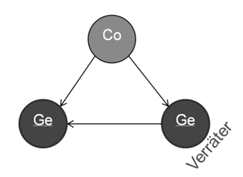
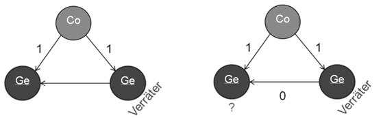

# Byzantinische Generäle

## Byzantinische Fehler 
Die byzantinischen Fehler beziehen sich auf das Verhalten der Teilnehmer des verteilten Systems. Dabei wird angenommen, dass ein Teilnehmer sich beliebig falsch verhalten kann. Dies geht soweit, dass man davon ausgehen muss, dass ein Teilnehmer absichtlich mit falschen Nachrichten versuchen könnte, das gesamte verteilte System zum Ausfall zu bringen oder zu stören. Für die byzantinischen Fehler wird klassisch das Problem der byzantinischen Generäle verwendet um das Problem zu veranschaulichen. 

  
> Abbildung 1: Byzantinitsche Commander und Generäle

Abbildung 1 zeigt den Grundaufbau des byzantinischen Generäle-Problems. Die byzantinische Streitmacht (ein Commander und zwei Generäle) wollen ein feindliches Land erobern. Der Erfolg hängt davon ab, dass alle Generäle sich auf die Entscheidung einigen, die ihnen der Commander mitteilt, also einen Konsens finden. Dabei gibt es zwei mögliche Entscheidungen, „Rückzug“ (Zustand 0) oder „Angriff“ (Zustand 1). Nun kann es jedoch sein, dass sich ein Verräter unter den Beteiligten aufhält und versucht die Eroberung zu verhindern, indem er seinen Partnern unterschiedliche Informationen zustellt und diese somit unterschiedliche Aktionen ausführen, was der Niederlage gleichkommt. 

  
> Abbildung 2: Phasen der Abstimmung zwischen Commander und Generäle

Die Abbildungen 2 zeigt den Ablauf der Kommunikation zwischen den Beteiligten. Zunächst (Abbildung 2) schickt der Commander die Nachricht zum Angriff an seine Generäle. Somit sollten beide Generäle über den Angriff Bescheid wissen. Wenn der Verräter nun aber dem anderen General mitteilt, er hätte vom Commander gehört, dass der Commander einen Rückzug befohlen hat, ist der General in einem nicht definierten Zustand, da er je eine Meldung „Angriff“ und eine Meldung „Rückzug“ bekommen hat und weiß nicht, was er nun tun soll.