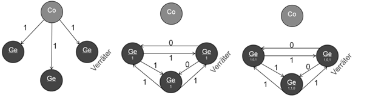
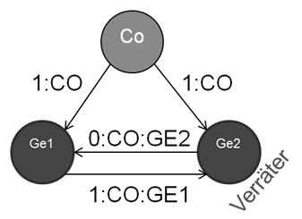
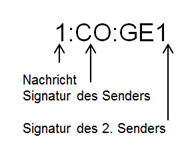

# Lösung für die byzantinischen Generäle

Um das Problem aus dem vorherigen Kapitel zu lösen, stelle ich an dieser Stelle zwei mögliche Lösungen vor. 

## Mehrheitsentscheid

Um zu einem Konsens zu gelangen, gibt es die Möglichkeit, alle eingehenden Konsens-Werte zu sammeln und sich dann für den Wert zu entscheiden, welcher am meisten von anderen Teilnehmern vorgeschlagen worden ist. Wie im Abbildung 2 aus dem vorherigen Kapitel zu sehen ist, hilft dies bei drei Teilnehmern, unter denen sich ein Verräter befindet, nicht. Allerdings ist unter der Annahme, dass die Verräter in der Unterzahl befinden, genauer gesagt, weniger als 1/3 aller Teilnehmer Verräter sind, dennoch möglich, ein Konsens unter den korrekten Teilnehmern zu finden. 

  
> Abbildung 1: Phase 1-3 im Mehrheitsentscheidungsprozess

Wie bereits zuvor schickt der Commander in Phase 1 seinen Vorschlag an alle Teilnehmer (Abbildung 1). Jeder Teilnehmer merkt sich den vorgeschlagenen Wert und schickt diesen Vorschlag weiter, an die anderen Generäle. Da der Verräter versucht, die anderen Teilnehmer in eine unentscheidbare Situation zu bringen, schickt dieser den gegenteiligen Wert an die anderen Generäle (Phase 2, Abbildung 1). Da jeder General alle eingehenden Vorschläge speichert und mitzählt, steht in Phase 3 ein Konsens fest, da jeder General von drei Vorschlägen, mindestens zwei mal den Vorschlag des Commanders gezählt hat, jedoch nur einmal den Gegenteiligen. Damit wird der Vorschlag des Verräters ignoriert und der korrekte Wert als Konsens angenommen.

Bei diesem Vorgehen verschickt man natürlich mehr Nachrichten als im originalen Problem-Beispiel. Für jeden weiteren General steigt das Nachrichtenaufkommen exponentiell, da jeder General zu jedem anderen General seine Information versenden muss. Dies wirkt sich auf die Zeit aus, wie lange es dauert, bis ein Konsens gefunden wird. 

## Nachrichtensignaturen

Eine weitere Möglichkeit um zu einem Konsens des byzantinischen Generäle-Problems zu kommen, besteht darin, alle Nachrichten mit einer Signatur des Absenders zu versehen. Darüber hinaus muss jeder General die Signatur der anderen Generäle und die des Commanders validieren können. 

  
> Abbildung 2: Verfahren mit signierten Nachrichten

  
> Abbildung 3: Nachrichtenaufbau

Zunächst hängt der Commander hinter seine eigentliche Nachricht seine Signatur an. Damit sollte es jedem General möglich sein, den Absender der Nachricht zu ermitteln bzw. zu validieren. Vorausgesetzt wird hier, dass der Verräter keine Nachrichten erzeugen und mit einer Signatur eines anderen Generals oder des Commanders signieren kann. 

Für jede weitere gesendete Nachricht kopiert ein General die originale Nachricht inkl. Signatur des Absenders und hängt seine eigene Signatur an die Nachricht, bevor er sie an einen weiteren General verschickt. 

Abbildung 8 zeigt diesen Aufbau einer Nachricht, welche von einem General an einen weiteren General weiterverschickt wird. 
Somit kann der Empfänger nachprüfen, ob die Nachricht gültig ist, da er selbst eine Nachricht vom Absender der ursprünglichen Nachricht bekommen hat und somit den eigentlichen Inhalt der Nachricht kennt. Wenn der Inhalt abweicht, kann der General den Absender der neuen Nachricht als Verräter enttarnen und seine Entscheidung ignorieren.

Auch in diesem Verfahren müssen sich alle Generäle gegenseitig ihren Vorschlag zusenden. Dies erhöht ebenfalls, wie im vorherigen Kapitel, die Nachrichtenmenge, welche verschickt werden muss.

## Verfahren zur Umgehung des Beweises

Es wurden im Laufe der Zeit mehrere Algorithmen zur Umgehung der Unmöglichkeit der Konsensbildung in verteilten Systemen entwickelt. Dabei werden in jedem Fall Annahmen getroffen, die dafür sorgen, dass das Ursprungsproblem, wie von Fischer, Lynch und Paterson beschrieben, nicht mehr zutrifft. Dafür wird in der Regel der Aspekt der Asynchronität aufgeweicht, indem beispielsweise (bis zu einem gewissen Grad) synchrone Uhren und Time-Outs zur Erkennung abwesender Teilnehmer eingeführt werden. Ebenfalls wird angenommen, dass es nicht zu einer Verfälschung der Kommunikation kommt. Dies lässt sich heutzutage mit Protokollen wie TCP/IP bewerkstelligen. Auch das Fälschen von Nachrichten unter falschem Absender wird hier nicht weiter betrachtet, da dies effektiv von Private/Public-Key Verfahren unterbunden werden kann. Protokolle wie SSL oder TLS verwenden solche Public-Key Verfahren um den Herausgeber einer Nachricht zu verifizieren. Allerdings ist hierbei die Stärke der Signatur zu bedenken, da nicht jeder Signatur-Algorithmus heutzutage noch verwendet werden sollte und z.B. SHA1 oder MD5 als praktisch gebrochen gilt.

Einer der ältesten Algorithmen zur Konsens-Findung in asynchronen Systemen wurde von Michael Ben-Or in „Another advantage of free choice: Completely asynchronous agreement protocols“[Ben01] entwickelt und vorgestellt. 
Ein neuerer Algorithmus ist Paxos und wurde 1990 von Leslie Lamport vorgestellt[Lam01]. Da dieser Algorithmus in einer Reihe heutiger Software eingesetzt wird, wird dieser Algorithmus im Folgenden näher beschrieben.
