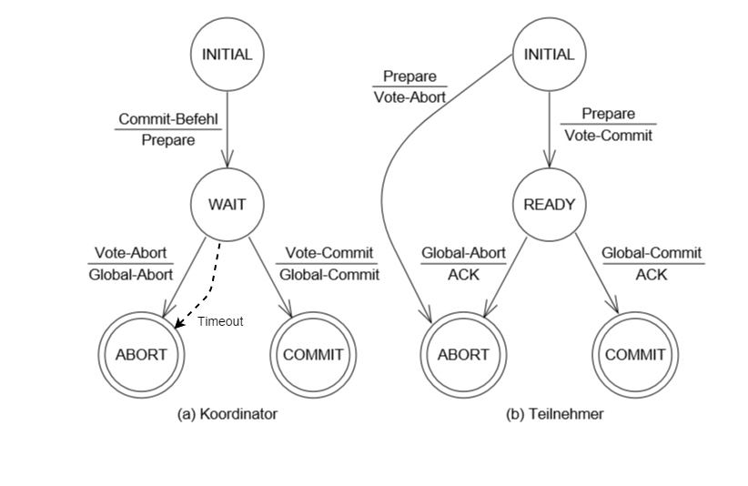
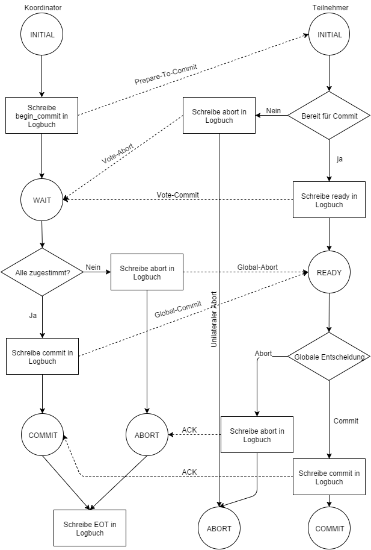

Das Two Phase Commit Protokoll ist ein verteilter Algorithmus um einen einheitlichen Abschluss von verteilten Transaktionen zu gewährleisten. Das Protokoll wurde zuerst 1971 von Nico Garzado implementiert. Durch das Two Phase Commit wird eine gemeinsame globale Entscheidung getroffen und von allen Teilnehmern durchgeführt. Dabei kann die Entscheidung nur ein Abbruch („Abort“) oder eine Durchführung („Commit“) der Transaktion sein. Das Protokoll funktioniert, wie das Three Phase Commit Protokoll ebenfalls, nur mit synchroner Kommunikation aller Knoten.  
  
Das Two Phase Commit Protokoll besteht aus zwei Phasen. Die erste Phase ist die Voting-oder Abstimmungs-Phase, die zweite Phase ist die Entscheidungsphase. Der Koordinator beginnt das Protokoll mit der Voting-Phase, indem dieser an alle Teilnehmer eine „Prepare“ Nachricht verteilt. Diese Nachricht fordert alle Teilnehmer auf, den Commit vorzubereiten und ihre Entscheidung an den Koordinator zu übermitteln. Kann der Teilnehmer den Commit vorbereiten, sodass er die Transaktion abschließen könnte, antwortet der Teilnehmer mit „Ja“. Falls der Teilnehmer die den Commit nicht vorbereiten kann wird mit „Nein“ geantwortet. Teilnehmer, die mit „Ja“ geantwortet haben, müssen unter Umständen die entsprechenden Daten, die durch die Transaktion geändert oder verwendet werden, für andere Operationen sperren, um die Integrität der Daten zu gewährleisten.  
  
Die zweite Phase ist die Entscheidungsphase. Der Koordinator entscheidet auf Basis aller Teilnehmerantworten, ob die Transaktion durchgeführt werden kann, oder nicht. Haben alle Teilnehmer mit „Ja“ geantwortet, ist die globale Entscheidung „Ja“, und die Transaktion kann global durchgeführt werden. Der Koordinator sendet eine „Commit“ Nachricht an alle Teilnehmer, um ihnen die positive globale Entscheidung mitzuteilen. Hat mindestens ein Teilnehmer mit „Nein“ abgestimmt, so ist die globale Entscheidung ebenfalls „Nein“ und der Koordinator sendet „Abort“ an alle Teilnehmer. Je nach globaler Entscheidung wird die Transaktion erfolgreich abgeschlossen, oder abgebrochen.  
  
Alle Teilnehmer beantworten nach dem Abbruch oder Durchführung des Commits mit „Ack“ an den Koordinator. Die Zustandsübergänge des Koordinators und der Teilnehmer sind in Abbildung 1 dargestellt.  
  
Jeder Knoten, der an der verteilten Transaktion beteiligt ist, schreibt den eigenen Status in ein Logbuch, bevor weitere Nachrichten von dem Knoten verteilt werden [Abb. 2]. Damit wird sichergestellt, dass der Knoten im Falle eines Absturzes den eigenen Zustand wiederherstellen kann. Dafür wird ein Recovery Protokoll verwendet.  
Das Nachrichtenaufkommen bei dem normalen Two Phase Commit Protokoll beträgt 4*(n-1). Bei 10 beteiligten Knoten sind somit bereits 36 Nachrichten notwendig, um das Protokoll auszuführen.
  
> Abbildung 1: Zustandsübergänge des Koordinators und Teilnehmer bei 2PC, basierend auf [Ske81]  
  
  
> Abbildung 2: Ablaufdiagramm 2PC, basierend auf [Ray09]  