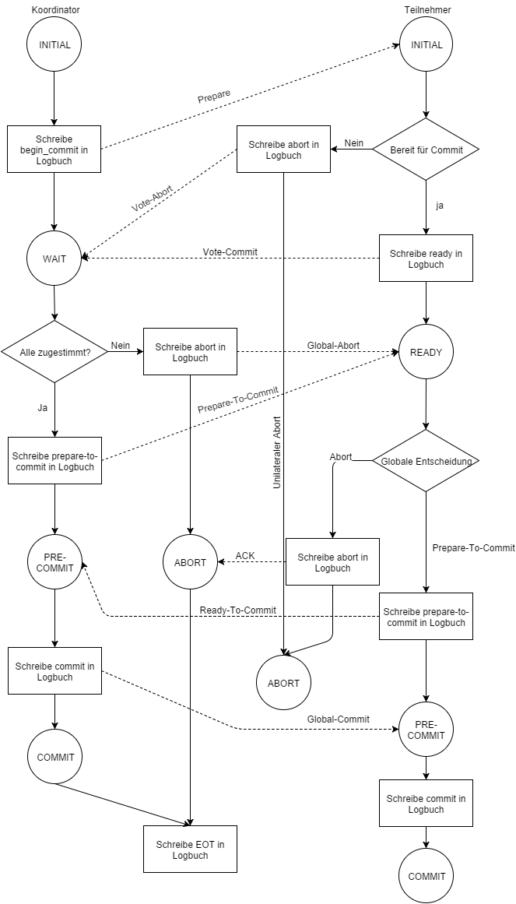
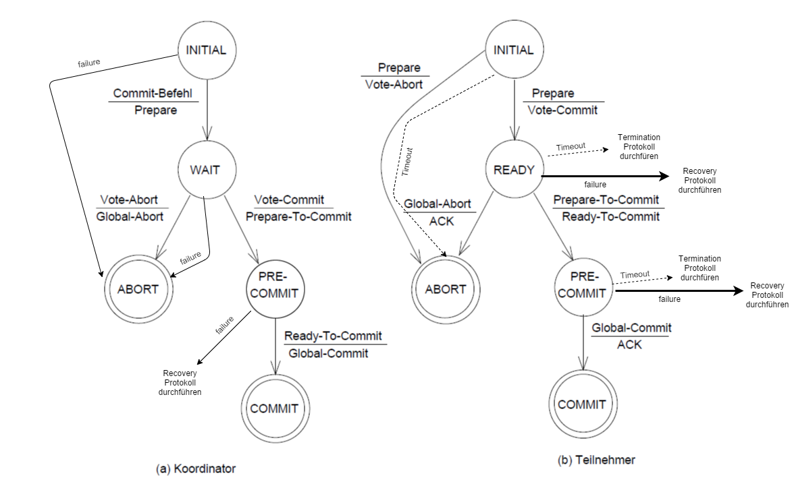

Das Three Phase Commit Protokoll wurde von Dale Skeen 1981 entwickelt, um das Problem der Blockierung bei verteilten Transaktionen zu lösen. Die Idee um eine Blockierung der Knoten zu verhindern wird eine Nicht-Blockier Regel verwendet:  
Wenn sich irgendein Teilnehmer in der Unsicherheitsphase befindet, dann kann kein anderer Teilnehmer sich in dem „Commit“ Zustand befinden.  
  
Das Two Phase Commit Protokoll wird um den „Pre-Commit“ Status erweitert. Damit wird die Entscheidungsphase in zwei Phasen aufgeteilt. Der Commit darf erst durchgeführt werden, wenn alle Teilnehmer über das globale Ergebnis informiert sind [Ske81].  
  
Die erste Phase ist wie bei dem Two Phase Commit die Voting Phase. Der Koordinator schreibt „begin_commit“ in sein Logbuch und sendet danach eine „Prepare“ Nachricht an alle Teilnehmer. Die Teilnehmer bereiten den Commit vor, schreiben ihre Entscheidung „abort“ oder „ready“ in ihr Logbuch und antworten dem Koordinator mit „Vote-Commit“ oder „Vote-Abort“. Hat der Teilnehmer mit „Vote-Abort“ abgestimmt, kann dieser direkt in den „ABORT“ Zustand gehen. Die zweite Phase ist die Pre-Commit Phase. Wenn alle Teilnehmer für den Commit mit „Vote-Commit“ gestimmt haben, schreibt der Koordinator „prepare-to-commit“ in sein Logbuch und verteilt die globale Commit Entscheidung an alle Teilnehmer, wechselt in den „PRE-COMMIT“ Zustand und wartet auf die Antwort der Teilnehmer. Erhalten die Teilnehmer eine „Abort“ Nachricht vom Koordinator, wird „abort“ in das Logbuch geschrieben und der Commit abgebrochen. Bei einer „Prepare-To-Commit“ Nachricht schreiben die Teilnehmer „prepare-to-commit“ in ihr Logbuch, antworten dem Koordinator mit „Ready-To-Commit“ und wechseln in den Status „PRE-COMMIT“. Hat der Koordinator von allen Teilnehmern die „Ready-To-Commit“ Nachricht empfangen, schriebt dieser „commit“ in sein Logbuch und verteilt die „Global-Commit“ Nachricht an die Teilnehmer. Bei Erhalt der „Global-Commit“ Nachricht wissen alle Teilnehmer, dass alle anderen Teilnehmer ebenfalls das globale Ergebnis kennen und können ihrerseits „commit“ in ihr Logbuch schreiben und den Commit durchführen. Damit ist das Three Phase Commit Protokoll abgeschlossen.  
  
Durch den „Pre-Commit“ Zustand ist sichergestellt, dass die Non-Blocking Regel eingehalten wird. Bekommt der Teilnehmer die „Commit“ Nachricht vom Koordinator, so ist sichergestellt, dass alle anderen Teilnehmer die globale Entscheidung kennen, da die „Commit“-Nachricht erst nach der Bestätigung aller Teilnehmer verteilt wird.  
  
Das Nachrichtenaufkommen bei dem Three Phase Commit Protokoll beträgt 6*(n-1). Bei 10 beteiligten Knoten sind somit bereits 54 Nachrichten notwendig, um das Protokoll auszuführen.  

 

> Abbildung 3: Ablaufdiagramm bei 3PC, basierend auf [Ray09] 
  

> Abbildung 4: Zustandsdiagramm 3PC, basierend auf [Ske81]
