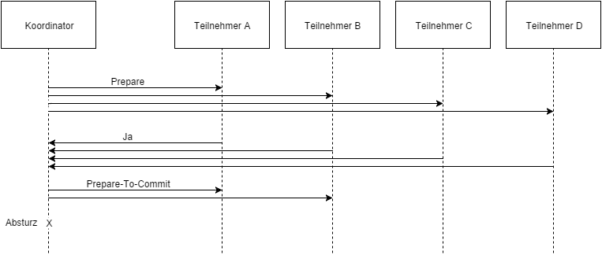
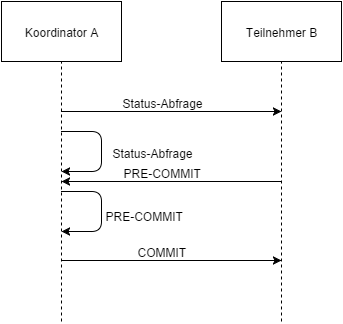
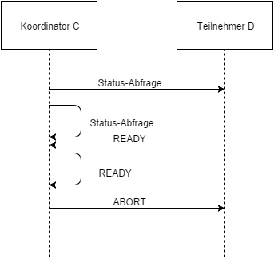

Im Gegensatz zum Two Phase Commit Protokoll ist das Three Phase Commit Protokoll nicht blockierend. Dadurch können Netzwerkfehler, wie eine Partitionierung, zu einer Verletzung der ACID Eigenschaften führen.  

Stürzt der Koordinator, wie in Abbildung 5, nach dem Verteilen der Vote-Commit Nachricht an einige Teilnehmer ab, befinden sich einige Teilnehmer im „WAIT“ Zustand, andere Teilnehmer sind hingegen im „PRE-COMMIT“ Zustand. Nun findet eine Netzwerkpartitionierung statt, sodass beispielsweise Teilnehmer A und B in einem Netzwerk, sowie C und D in einem anderen Netzwerk voneinander getrennt sind.  

Da alle Teilnehmer im weiteren Verlauf in einen Timeout Zustand wechseln, weil der Koordinator nicht mehr erreichbar ist, wird das Termination Protokoll ausgeführt. Durch die Partitionierung wird zwischen Teilnehmer A und Teilnehmer B ein neuer Koordinator gewählt, und zwischen Teilnehmer C und Teilnehmer D wird ebenfalls ein neuer Koordinator gewählt. In beiden Segmenten wird das Termination Protokoll unabhängig voneinander ausgeführt, wie in Abbildung 6 und Abbildung 7 illustriert. Der neue Koordinator A fragt den Zustand von B (und sich selbst) ab und entscheidet durch die Termination Regel 5 zu einem globalen Commit, um die Transaktion erfolgreich durchzuführen. Der Neue Koordinator C fragt den Zustand von Teilnehmer D (und sich selbst) ab. Da beide den Zustand „READY“ haben, wird die
Transaktion nach Termination Regel 3 abgebrochen und der Koordinator C und Teilnehmer D gehen in den „ABORT“ Zustand über.  
  
  
> Abbildung 5: Ablauf bis zum Absturz des Koordinators bei 3PC und Netzwerkpartitionierung  
  
  
> Abbildung 6: Nachrichtenaustausch nach dem Termination Protokoll
  
  
> Abbildung 7: Nachrichtenaustausch nach dem Termination Protokoll    