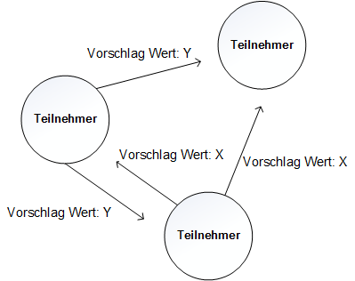

In einem fehlertoleranten, verteilten System ist das Hauptproblem den Konsens zwischen verschiedenen Teilnehmern zu finden. Damit alle Teilnehmer konsistent zueinander sind, wird ein Algorithmus benötigt, welcher nur einen einzelnen Wert akzeptiert. Dieses Vorgehen muss selbst dann gewährleistet sein, sollten mehrere Werte zur Auswahl stehen.

  
> Abbildung 1: Konsensproblem

Um dieses Problem zu lösen, bietet sich der Paxos Algorithmus an. Der Algorithmus ist für asynchrone Netze ausgelegt und liegt in unterschiedlichen Varianten vor. Im Protokoll werden byzantinische Fehler, wie z.B dass Nachrichten absichtlich falsch sein können oder unterschiedliche Werte zufällig versandt werden, nicht berücksichtigt. Das bedeutet das Netz kann sich teilen und selbst wiederherstellen, wenn die Antworten stimmen und das System korrekt arbeitet.