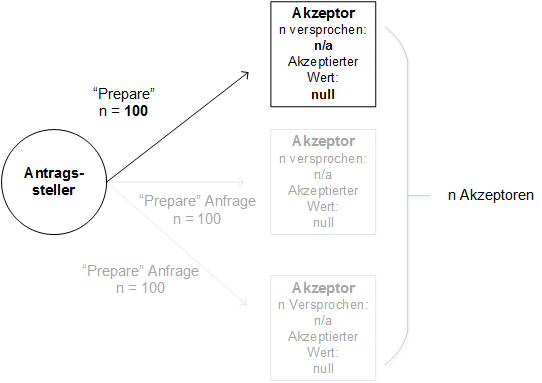
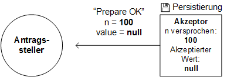
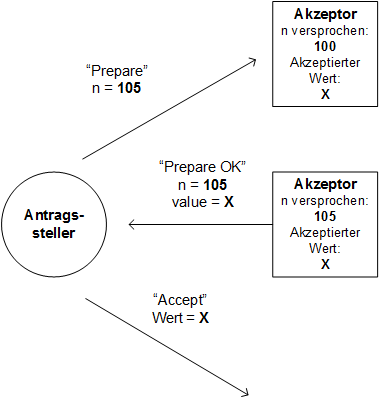
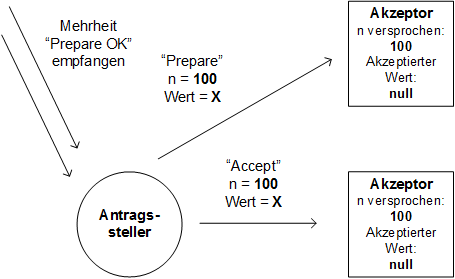
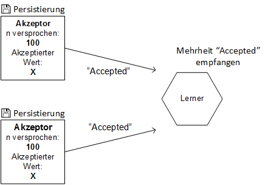
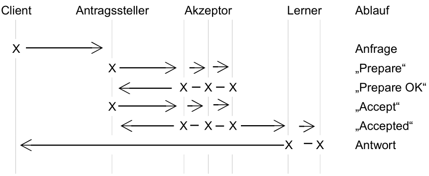
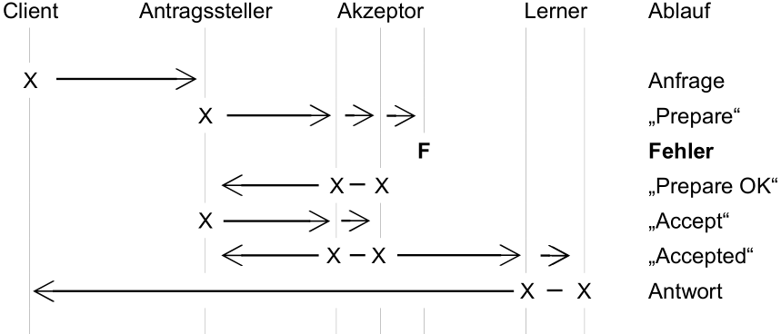
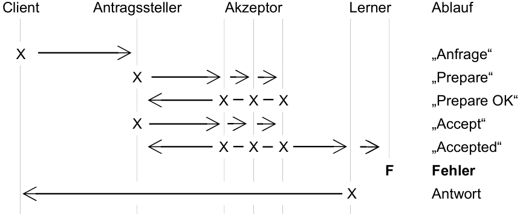
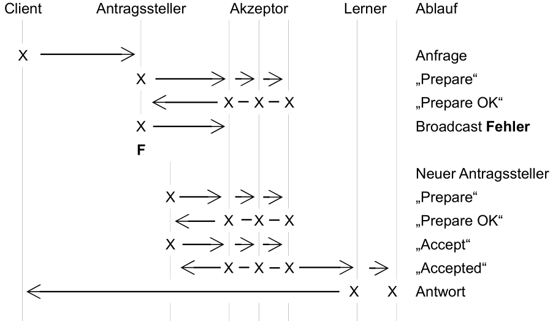

Das Standardprotokoll von Paxos ähnelt stark dem des 2PC: 

1. Auswahl eines Koordinators (Antragsteller)
2. Der Koordinator wählt einen Wert und sendet diesen an alle Teilnehmer (Akzeptoren) in einer Anfrage, welche zustimmen oder ablehnen können.
3. Sobald die Mehrheit der Teilnehmer (Quorum) zugestimmt haben, ist ein Konsens erreicht und eine Nachricht wird an alle Teilnehmer gesendet und das Protokoll wird beendet.

Die Komplexität des Protokolls liegt hierbei in der Kommunikation, wie ein Akzeptor einen Vorschlag und dessen Inhalt akzeptiert oder mit welchen Werten der Antragsteller eine Anfrage, welche von den Akzeptoren angenommen wurde, weiterleitet.
Im Gegensatz von 2PC, wo alle Teilnehmer zustimmen müssen, muss hier nur eine Mehrheit zustimmen (Quorum). Dies stellt sicher, dass wenn die Mehrheit sich auf einen bestimmten Wert geeinigt hat, jeder Akzeptor der versucht einen Wert danach vorzuschlagen, diesen Wert von anderen Akzeptoren lernen und nur diesem Wert zustimmen würde. Dies bedeutet auch, dass Paxos im Unterschied zu 2PC nicht blockiert, selbst wenn einer weniger als die Hälfte der Teilnehmer ausfällt.

Natürlich kann es auch vorkommen, dass der Antragsteller selbst ausfällt. Aus diesem Grund kann jeder Teilnehmer im Paxos Protokoll selbst zu einem Antragsteller werden und versuchen die Anfragen zu koordinieren. Dies bedeutet ebenfalls, dass es vorkommen kann, dass zwei Antragsteller unterschiedliche Werte vorschlagen. Um dies zu umgehen führt das Protokoll zwei Mechanismen ein.
Der Erste erlaubt es jedem Teilnehmer zwischen dem aktuellen und dem alten Antragsteller zu unterscheiden. Dies hilft dabei den Konsens zu wahren, sollte ein Antragssteller nach einem Ausfall wiederhergestellt werden. 
Der zweite Mechanismus schränkt den Antragsteller bei der Auswahl des Wertes ein. Sobald ein Konsens über einen Wert erreicht worden ist, fordert das Protokoll, dass zukünftige Antragsteller immer den selben Wert wählen und den Konsens zu wahren. Dies wird dadurch erreicht, dass die Akzeptoren den neuesten Wert, den sie vereinbart haben, zusammen mit der Sequenznummer des Antragstellers von dem sie gesendet wurde, verschicken. Der neue Antragsteller wählt den Wert, welche die Mehrheit der Teilnehmer ihm zugesendet haben, bzw. den Wert, der eine höhere laufende Nummer hat.

# Sequenznummer
Jeder Vorschlag wird mit einer eindeutigen Sequenznummer markiert, welche von jedem Antragssteller generiert werden kann. Die Nummern werden dazu genutzt die Vorschläge zu ordnen und herauszufinden, welche Vorschläge in welcher Reihenfolge eingegangen sind. Sollte ein Vorschlag eintreffen, gleicht der Akzeptor diese mit seiner höchste empfangenen Sequenznummer ab. Falls diese größer ist als die Sequenznummer des letzten Vorschlags, gibt der Akzeptor ein Versprechen. Dieses Versprechen besagt, dass er keine weiteren Vorschläge mehr annimmt, wessen Sequenznummer kleiner sind als die aktuelle Nummer. Sollte ein Vorschlag eine Sequenznummer haben, welche größer ist als die eigene Nummer wird der Akzeptor diese ablehnen und die Aktuelle zurücksenden, solange eine aktuelle Abstimmung läuft.
So wird sichergestellt, dass die Anfragen immer in der richtigen Reihenfolge am Akzeptor ankommen und er diese akzeptieren kann. Dieses Vorgehen hilft mit einem Aspekt eines asynchronen Netzen, bei dem die Anfragen ungeordnet von verschiedenen Systemen kommen können oder sogar verloren gegangen sind.
#Mehrheiten
Paxos benötigt keine Zustimmung aller Akzeptoren für die Zustimmung eines Vorschlags, welches den Hauptunterschied zu 2PC und 3PC darstellt. 
Nach zwei erfolgreichen Abstimmungen hat mindestens ein Akzeptor der jeweiligen Mehrheit, beide Vorschläge akzeptiert. Somit ist bei einem folgenden Vorschlag mindestens ein Akzeptor dabei, welcher beide Vorschläge akzeptiert hat oder mindestens zwei Akzeptoren, welche jeweils einen Vorschlag akzeptiert haben.
Dies bedeutet, dass das Protokoll unabhängig von dem Zustand in dem es sich befindet, immer genügend Informationen zu der Wiederherstellung aller vorangegangenen Vorschlägen zu Verfügung hat. Eine Mehrheit von Akzeptoren hat immer alle Informationen und stellt somit sicher, dass nur valide Vorschläge angenommen werden.
#Protokoll
Im Algorithmus des Protokolls gibt es folgende drei Akteure: 
* der Antragssteller
* der Akzeptor
* der Lerner

Die Antragssteller schlagen Werte vor, welche von den Akzeptoren angenommen oder abgelehnt werden. Sollte die Mehrheit dieser einverstanden sein, werden die Lerner über den Wert informiert. Dies ist jedoch nur eine logische Einteilung, da ein produktives System alle Rollen zusammenfassen und gemeinsam übernehmen kann.

Der Antragssteller sendet eine „Prepare“ Nachricht an alle Akzeptoren. In der Nachricht fragt er, ob diese versprechen den Vorschlag zu akzeptieren (Abb.3).

  
> Abbildung 3: Versand einer „Prepare“ Anfrage

Die „Prepare“ Anfrage enthält nur eine Sequenznummer „n“. Sobald die Akzeptoren diese empfangen, antworten sie mit einer „Prepare OK“ Nachricht und merken sich die Sequenznummer „n“, welche sie versprechen zu akzeptieren (Abb.4).

  
> Abbildung 4: Versand der „Prepare OK“ Antwort

In Abbildung 4 verspricht der Akzeptor ein Vorschlag für „n = 100“ zu akzeptieren und jede Anfrage „n < 100“ abweisen. Allerdings kann eine „Prepare OK“ Nachricht auch einen Wert enthalten eines bereits akzeptierten Vorschlags, wenn z.B. ein anderer Antragssteller eine „Prepare“ Nachricht sendet (Abb.5).

  
> Abbildung 5: Antwort „Prepare OK“ wird an Antragssteller versandt

Der Antragssteller sendet eine „Prepare“ Anfrage an den Akzeptor, welcher jedoch bereits einen Wert für „n = 100“ akzeptiert hat. Der Antragssteller muss daraufhin diesen Wert benutzen um die Kohärenz zu wahren. Da dies normalerweise jedoch nicht eintritt, kann der Antragssteller meist jeden beliebigen Wert vorschlagen.

  
> Abbildung 6: Vorschlag wird akzeptiert

Sollte der Akzeptor in der Zwischenzeit keine neuen Vorschlag für ein höheres „n“ bekommen, wird er den Vorschlag akzeptieren (Abb.6).

  
> Abbildung 7: Lerner erlernt vorgeschlagenen Wert

Sobald von der Mehrheit der Akzeptoren die „Accepted“ Anfrage empfangen wurde, erlernt der Lerner den vorgeschlagenen Wert. In Abbildung 4 und in Abbildung 7 signalisiert das Diskettensymbol, dass alle Attribute der Akzeptoren persistiert werden müssen. So kann das Protokoll im Notfall den vorherigen Zustand wiederherstellen, sollte es zu einem Ausfall kommen.

  
> Ablaufdiagramm 1: Basic Paxos

# Fehlerfälle
In Paxos können Fehler auftreten oder Teilnehmer ausfallen und das Protokoll ist in der Lage unter gewissen Bedingungen eine Wiederherstellung einzuleiten.
Sollte ein redundanter Lerner oder ein Akzeptor ausfallen, passt sich das Protokoll mit wenigen zusätzlichen Schritten an.
In Ablaufdiagramm 2 läuft das Protokoll weiter, nachdem ein Akzeptor ausgefallen ist. In diesem Szenario besteht das Quorum aus zwei Akzeptoren.

  
> Ablaufdiagramm 2: Basic Paxos – Akzeptor fällt aus

Sollte einer von mehreren Lernern ausfallen, kann das Protokoll trotzdem weiter ausgeführt werden. Durch die Redundanz wird sichergestellt, dass die versprochenen Werte persistiert werden (Ablaufdiagramm 3), indem der verbleibende Lerner die Antwort sendet.

  
> Ablaufdiagramm 3: Basic Paxos - Ausfall eines Lerners

Sollte während einer Anfrage der Antragssteller ausfallen, so kann diese unterbrochen  werden. Ein neuer Antragssteller wird ermittelt, sendet erneut eine „Prepare“ Anfrage und lässt daraufhin den Vorschlag erlernen (Ablaufdiagramm 4).

  
> Ablaufdiagramm 4: Basic Paxos - Ausfall eines Antragstellers

# Fehlertoleranz
Paxos ist fehlertoleranter als das 2PC. Da Paxos nur eine Zustimmung der Mehrheit fordert anstelle aller Teilnehmer, kann das Protokoll den Ausfall der Hälfte der Akzeptoren ausgleichen. Damit das Protokoll F Ausfälle tolerieren kann, benötigt man 2F+1 Akzeptoren [Lam03]. Sollte ein Antragssteller ausfallen, übernimmt ein anderer Antragssteller das Protokoll und verschickt seinen eigenen Vorschlag. Sollte der alte Antragssteller wieder reagieren stellen Regeln den weiteren Ablauf sicher. Die Regeln besagen, dass nur bereits akzeptierte Werte verbreitet und nur Vorschläge mit einer höheren Sequenznummer angenommen werden dürfen. Somit wird sichergestellt, dass zwei Antragssteller parallel aktiv sein können, ohne die Korrektheit zu verletzen.

Das Paxos Protokoll ist außerdem in der Lage mit zwei aktive Antragsstellern umzugehen, welche parallel Vorschläge unterbreiten. Um dies zu gewährleisten, müssen beide Antragssteller ihre Sequenznummer erhöhen, bis ein Antragssteller die vorherige Sequenznummer des letzten akzeptierten Vorschlags übersteigt. Solange jedoch zwei Antragssteller gleichzeitig existieren kann das Protokoll sich nicht beenden.
In dieser Zeit verletzt das Protokoll den Vorsatz der Terminierung. Da aber dieser Zustand temporär ist und selten eintritt, ist dieser Fall zu vernachlässigen.

Es gibt jedoch auch noch weitere Möglichkeiten in dem Paxos Protokoll sich nicht wiederherstellen kann. So müssen die Akzeptoren abspeichern, welches die höchste Sequenznummer ist und die Werte jedes Vorschlags, welche sie akzeptiert haben. Sollte dieser Speicher ausfallen, kann der Akzeptor nicht mehr am Protokoll teilnehmen, da die Wiederherstellungsinformationen fehlen.

# Effizienz
Sollte Paxos fehlerfrei ausgeführt werden, ist die Anzahl der Schritte gering bis das Protokoll terminiert. In der ersten Phase versendet der Antragssteller zuerst F + 1 Nachrichten und erhält F + 1 Antworten. In „Prepare“ Phase wird dies solange wiederholt bis 4F +4 Nachrichten versandt worden sind. Sollte in dieser Zeit ein Akzeptor ausfallen muss das Protokoll weitere Schritte einleiten, bis es beendet werden kann. Dabei wird der Vorschlag neu unterbreiten und den Akzeptoren zugesandt. Alternativ könnte der Antragssteller seine Nachrichten erneut an alle 2F +1 Akzeptoren senden, so dass erst F Akzeptoren ausfallen müssten, damit sich die Ausführung des Protokolls verzögert.

Auch spielt bei der Effizienz der Schreibzugriff der Speicher für die Wiederherstellungsinformationen eine Rolle. Speicherzugriffe können erheblich länger dauern als Netzwerkzugriffe. Da jedoch das Protokoll nur dann korrekt ausgeführt wird, wenn die Persistierung erfolgreich ist, muss diese Verzögerung auch berücksichtigt werden.