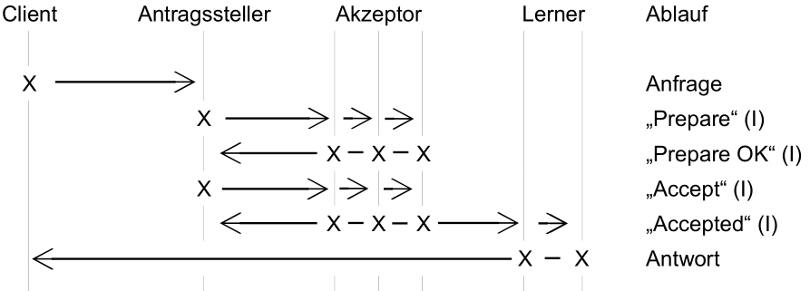
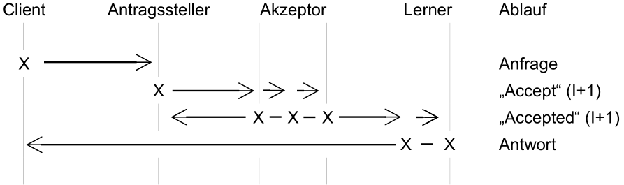
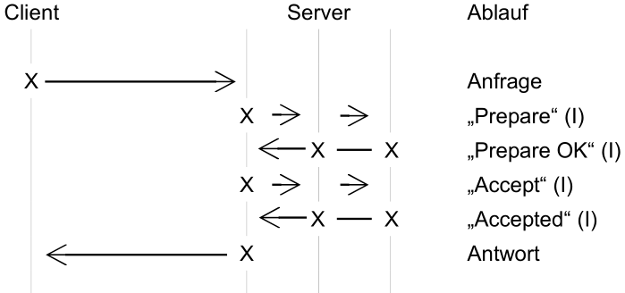
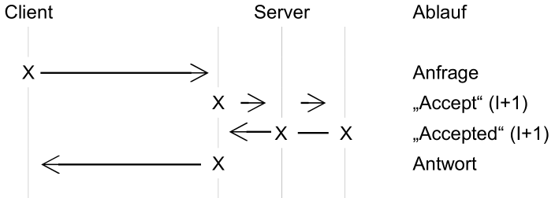

Da jede Anfrage im Basic Paxos Protokoll das Ergebnis einer einzelnen Instanz ist, werden einige Schritte mehrmals ausgeführt. In der wissenschaftlichen Arbeit „Paxos Made Simple“ [Lam02] wird Paxos in ein Multi-Paxos überführt. Diese neue Variante ermöglicht es einem Antragssteller eine unendliche Abfolge von Vorschlägen zu versenden, ohne jedes mal einen „Prepare“ Dialog abzuwarten.
Sollte der Antragssteller nicht ausfallen, wird Phase 1 überflüssig und kann somit dauerhaft übersprungen werden. Dies ermöglicht eine effizientere Bearbeitung von Vorschlägen, da es den fehlerfreien Nachrichtenaustausch von vier auf zwei Schritte reduziert. Um dies zu ermöglichen wird immer die Instanz „I“ mitgesendet.
Der Start des Multi Paxos sieht zunächst wie das Basic Paxos Protokoll aus, nur das die Instanz „I“ mitgesendet wird (Ablaufdiagramm 5).

  
> Ablaufdiagramm 5: Multi Paxos - Phase 1

Sobald der selbe Antragssteller weitere Anfragen versendet, kann das Protokoll beschleunigt, indem der „Prepare“ 
Austausch übersprungen wird. Dies reduziert die Schritte um die Hälfte (Ablaufdiagramm 6).

  
> Ablaufdiagramm 6: Multi Paxos - Phase 2

Im Einsatz in einer Produktivumgebung fallen die Akteure häufig auf einen Server
zusammen. Dies bedeutet, dass die Teilnehmer die Rollen des Antragsstellers, Akzeptors
und des Lerners übernehmen. In Ablaufdiagramm 7 und Ablaufdiagramm 8 sind die Abläufe des
Multi Paxos mit vereinten Rollen dargestellt. Der Server übernimmt alle Rollen gleichzeitig
und antwortet dem Client.

  
> Ablaufdiagramm 7: Multi Paxos - Zusammengefassten Rollen in Phase 1

  
> Ablaufdiagramm 8: Multi Paxos - Zusammengefassten Rollen in Phase 2