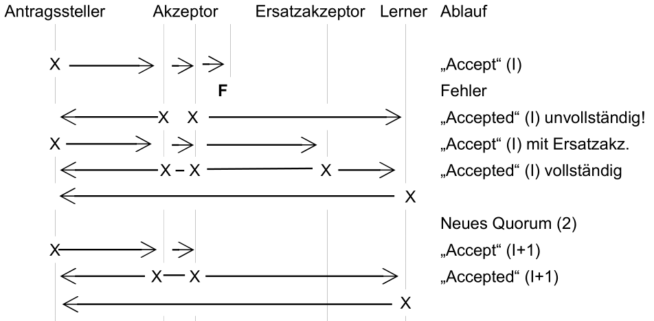

Cheap Paxos [Lam04] erweitert das Basic Paxos Protokoll um einen Ersatzakzeptor. Durch diese neue Rolle können F Fehler mit F + 1 Akzeptoren und dem Ersatzakzeptor ausgeglichen werden. Dazu wird nach jedem aufgetretenem Fehler das System neu konfiguriert. 
Während Multi Paxos 2F +1 Akzeptor benötigt um F Fehler auszugleichen,  benötigt Cheap Paxos nur F+1 Akzeptoren in Kombination mit F Ersatzakzeptoren. Die Ersatzakzeptoren werden nur im Fehlerfall aktiviert und sind ansonsten im Leerlauf.

Cheap Paxos hat ein festes Quorum mit F+1 Akzeptoren und benutzt das Multi Paxos Protokoll mit festem Antragssteller. Sollte ein Akzeptor aus dem Quorum ausfallen, springt der Ersatzakzeptor ein, so dass wieder mit F +1 Akzeptoren ein neues Quorum entsteht. Das neue Quorum beendet zunächst ausstehende Vorschläge und rekonfiguriert das System. Nachdem das Quorum verkleinert ist wird der Ersatzakzeptor deaktiviert und das System geht in den Normalzustand über.

In Ablaufdiagramm 9 ist Cheap Paxos in Phase 2 zu sehen. Es gibt einen Antragssteller, sowie drei Akzeptoren und einen Ersatzakzeptor. Die initiale Größe des Quorums wird mit drei Akzeptoren angegeben. In diesem Szenario fällt ein Akzeptor aus, worauf das System dies erkennt und den Ersatzakzeptor aktiviert. Der Akzeptor beendet den aktuellen Vorschlag und reduziert das neue Quorum auf zwei Akzeptoren. Nach diesem Schritt wird das Protokoll weiter fortgesetzt.

  
> Ablaufdiagramm 9: Cheap Paxos - Phase 2