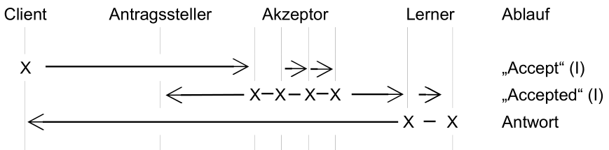
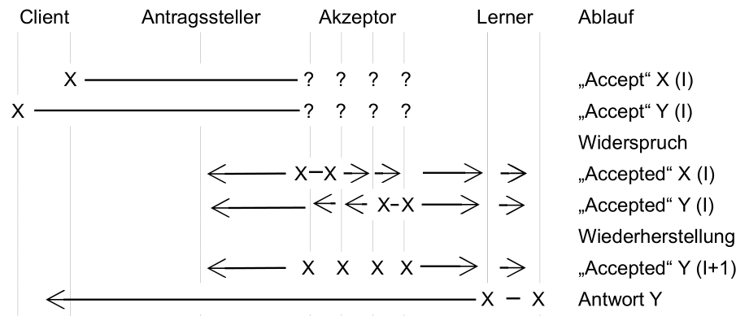

Im Basic Paxos Protokoll benötigt ein neuer Vorschlag mindestens drei Schritte vom Versand der Anfrage des Clients bis zu dem Erlernen durch den Lerner. Sollten jedoch mehrere Antragssteller parallel Vorschläge versenden, so benötigt man vier Schritte um kollidierende Vorschläge anderen Akzeptoren zuzuweisen. Das Fast Paxos Protokoll [Lam07] ist eine Variante von Basic Paxos, welche die Gesamtanzahl der Schritte vom Client zum Lerner reduziert. Der komplette Lernvorgang wird in zwei Schritten ausgeführt und bei einer Kollision um einen Schritt erweitert auf drei Schritte. So darf nur ein Drittel der Akzeptoren (3F +1) ausfallen, anstelle von der Hälfte (2F + 1) wie bei Basic Paxos.
Im Fast Paxos Protokoll versendet der Client seine Vorschläge direkt zu den Akzeptoren und überspringt den Antragssteller. Diese Eigenschaft erlaubt die Schritte auf zwei zu reduzieren, jedoch muss der Client seine Anfrage dafür an mehrere Akzeptoren schicken.
Die Akzeptoren reagieren wie in Basic Paxos und senden „Accepted“ an den Antragssteller und die Lerner. Somit wird die Anfrage mit zwei Schritten abgeschlossen (Ablaufdiagramm 10).

Sollte ein Antragssteller eine Kollision feststellen, kann er diese lösen indem er eine  „Accept“ Anfrage an eine neue Instanz stellt, welche normalerweise akzeptiert wird. Diese Wiederherstellung kostet vier Schritte bis die Anfrage vom Client durch den Lerner beantwortet wird. In Ablaufdiagramm 11 wird dieses Vorgehen demonstriert. Zwei Clients senden gleichzeitig, konkurrierende Vorschläge, welche die Akzeptoren nicht akzeptieren, da die Werte differieren (Widerspruch). Es wird die Wiederherstellung eingeleitet und erneut der letzte Vorschlag unterbreitet.

  
> Ablaufdiagramm 10: Fast Paxos

  
> Ablaufdiagramm 11: Fast Paxos - Konflikte durch mehrere aktive Clients