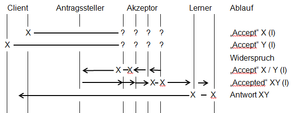

# Generalisiertes Paxos

Generalisiertes Paxos[Lam06] basiert auf dem Fast Paxos Protokoll[Lam07] und hat somit die selben Limitationen bezüglich benötigter Aktoren. Auch hier dürfen im Maximum nur  ein drittel Akzeptoren ausfallen um ein sicheren Ablauf und Terminierung des Paxos Protokolls zu gewährleisten. Die Idee des generalisierten Paxos besteht darin, das Nachrichtenaufkommen noch weiter zu reduzieren. Fast Paxos benötigt nur noch zwei Schritte um eine Anfrage abzuschließen, was bereits das Optimum darstellt [Lam05]. Allerdings ist im Kollisionsfall (zwei Clients stellen konkurrierend  Anfragen an die Akzeptoren) das Nachrichtenaufkommen erhöht. Generalisiertes Paxos verbessert diesen Fehlerfall und reduziert eine Einigung auch auf zwei Nachrichten um eine Einigung zu erzielen. Um dies zu erreichen, führt das generalisierte Paxos so genannte Command-Sets (im weiteren „C-Structs“ genannt) ein. Diese C-Structs stellen eine dynamisch wachsende Liste von Anfragen dar. 

Beim generalisierten Paxos wird davon ausgegangen, dass die Reihenfolge von Anfragen innerhalb eines C-Structs nicht von Interesse ist. Somit wären C-Structs mit {1, 2, 3, 4} und {1, 3, 2, 4} äquivalent und beide gültig, da sie den selben Inhalt haben. {1, 2, 3, 4} und {1, 2, 3, 5} hingegen sind nicht äquivalent und somit ungültig. C-Structs haben einen Operator zum Hinzufügen von neuen C-Structs, welche mehrere Anfragen beinhalten können. Es gilt:

{1, 2, 3} + {4} = {1, 2, 3, 4}

{1, 2, 3} + {4 ,5} = {1, 2, 3, 4, 5}

Doppelte Einträge beim Hinzufügen können mittels erzeugten IDs der einzelnen Anfragen erkannt und verhindert werden. So kann beispielsweise bei Kontobuchungen mittels Paxos verhindert werden, dass zwei mal eine Abbuchung durchgeführt wird auch wenn ein Lerner einen C-Struct zum Lernen erhält, der bereits durchgeführte Buchungen enthält.

{+50€ (ID A), -20€ (ID B), -10€ (ID C)} + {-10€ (ID C), -5€ (ID D)} = {+50€ (ID A), -20€ (ID B), -10€ (ID C), -5€ (ID D)}.

Da der Ablauf des Protokolls beim generalisierten Paxos der selbe ist, wie im Fast Paxos wird hier auf eine Ablauf-Beschreibung verzichtet und auf Fast-Paxos verwiesen.

Allerdings ändert sich der Ablauf im Kollisionsfall. Hier wird dem Antragssteller von den Akzeptoren mitgeteilt, dass sie konkurrierende Anfragen erhalten haben.

{1, 2} + {3} und {1, 2} + {4} seien die konkurrierenden Anfragen. Manche Akzeptoren teilen dem Antragssteller mit, dass sie {1, 2, 3, 4} und andere {1, 2, 4 ,3} als Anfragen haben. Wenn der Antragssteller vom Quorum der Akzeptoren diese Meldungen erhält, erkennt er diesen Konflikt und generiert entweder daraus das C-Struct {1, 2, 3, 4} oder {1, 2, 4, 3} und schickt dies an die Aktzeptoren zurück, die diesen dann akzeptieren und an den / die Lerner verteilen.

  
> Abbildung 1: Ablaufdiagramm General Paxos

Da ein C-Struct eine beliebig große Anzahl von Anfragen beinhalten kann (möglicherweise die gesamte Historie des Paxos-Systems), muss man sich Gedanken darüber machen, wie man die Größe der zu versendenen C-Structs verringert, um das Datenaufkommen zu verringern. Dazu wird ein dediziertes Kommando eingeführt. Dieses Kommando wird „Checkpoint“-Kommando genannt. Ein Antragssteller kann (periodisch) dieses Kommando an die Akzeptoren schicken. Das Kommando enthält die letzte vom Quorum erfolgreich durchgeführte Anfrage. Die Akzeptoren vergessen daraufhin die Historie (alle im C-Struct enthaltenen Werte,  die vor der mitgesendenen Anfrage eingetragen sind, werden gelöscht). Dadurch kann das Datenaufkommen reduziert werden, da nicht mehr benötigte Informationen für aktuell laufende und zukünftigte Informationen nicht mehr mitgesendet werden müssen. Ebenfalls wird hierdurch der nötige Rechenaufwand für das Einfügen von neuen Elementen in das C-Struct verringert, da nicht mehr alte, nicht genutzte Anfragen überprüft werden müssen, ob diese bereits durchgeführt worden sind, um doppelte Einträge von Anfragen zu vermeiden.

Das generalisierte Paxos funktioniert aufgrund der Annahme dass C-Structs wie {1, 2, 3, 4} und {1, 2, 4, 3} äquivalent sind, nur unter der Voraussetzung, dass einzelne Anfragen nicht voneinander abhängig sind. Als Beispiel nochmal Kontobuchungen: In der Summe ist es egal, welche Aktionen durchgeführt werden. 

10€ + 20€ - 25€ = 5€ 

Oder

10€ -25€ + 20€ = 5€

Allerdings lässt sich das generalisierte Paxos dann nicht nutzen, wenn beispielsweise eine Buchung nicht durchgeführt werden darf, falls der Kontostand unter 0€ fallen würde.

Die Buchungen 10€ + 20€ - 25€ wäre gültig und könnte durchgeführt werden, da zu jeder Zeit der Kontostand im positiven Bereich bleibt, allerdings ist bei der Buchung 10€ - 25€ +20€ der Kontostand nach der zweiten Buchung bei -15€ und die Buchung würde abgebrochen werden.

Somit ist der Einsatzzweck beim generalisierten Paxos eingeschränkter als in den anderen Paxos-Implementierungen.
