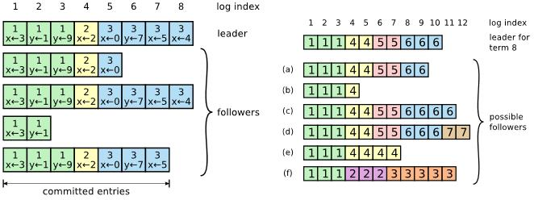

**2. Was ist Raft?**

Um die Funktionsweise des Raft-Algorithmus zu durchdringen, ist es wichtig, zu
verstehen, wie die Grundkonzepte funktionieren. Deshalb werden diese mit ihren
Bestandteilen "leader election", "log replication", "membership changes" und
„log compaction“ nachfolgend beschrieben. Als Orientierung für dieses Kapitel
wurde GLÖCKLE, B. ET AL.[1] genutzt. In Abgrenzung zu anderen Protokollen (z.B.
Paxos) war Verständlichkeit ein großes Ziel bei dessen Entwicklung. Um dies zu
erreichen, wurden Konzepte verwendet, welche einfach zu verstehen sind und
leicht umsetzbar sind. Im Kern des Algorithmus arbeitet ein
Replikationsprotokoll, dass von einem "Leader"(Master) geleitet wird. Der Leader
repliziert folgend die entstehenden Log-Dateien im ganzen Cluster und die
entstehende Log-Datenbank ist eng mit dem „leader election“ Algorithmus
verbunden, um die Konsistenz zu erhalten.

Das Raft-Cluster besteht aus drei verschiedenen Arten von Knoten: Follower,
Kandidaten und Leader. Jeder Server kann zwischen diesen drei Zuständen
wechseln, vorausgesetzt, dass bestimmte Bedingungen erfüllt sind. Das heißt,
jeder Server kann ein Follower, Kandidat oder Leader sein. Die Rollen der drei
Zustände sind wie folgt festgelegt:

>   *Follower: der Zustand, in dem ein Server eine Replikation von einem Leader
>   erhält. Bei Erhalt eines Heartbeats vom Leader startet dieser für ein
>   randomisiertes Zeitintervall Übergänge zu Kandidaten.*

*Kandidat: der Zustand, in dem ein Server versucht, zum Leader gewählt zu
werden.*

>   *Leader: der Zustand, in dem ein Server Befehle von Clients empfängt,
>   Logdateien und Replikate von Befehlen*

>   *an Follower sendet sowie bestimmt, wann Befehle auf einer Mehrheit von
>   Servern abgespeichert werden.*

Leader empfangen Zustandsbefehle und schreiben sie in eine lokale Log-Datei,
welche dann zu den Followern repliziert wird. Sobald ein Befehl, der an einen
Leader gesendet wurde, in einer Mehrheit des Clusters protokolliert und
repliziert wurde, wird der Befehl als verpflichtend betrachtet und der Leader
wendet den Befehl auf seine eigene Zustandsmaschine an und antwortet auf den
Client. Bei einem Neustart des Servers wiederholt der Server die verpflichtenden
Einträge in seinen Protokollen, um den Zustand der Server-Zustandsmaschine neu
zu erstellen.

**2.1 Wahl des Leaders**

Ein Server zählt nach einem Neustart zu den Followern. Diesen Zustand hält er,
solange er gültige RPCs (Remote Procedure Calls) von einem Leader oder einem
Kandidaten empfängt. Wenn der Follower über einen bestimmten Zeitraum
(election-timeout) keine RPCs empfängt, wechselt er den Zustand zu einem
Kandidaten und startet eine Leader-Election.

Raft erlaubt jedem Server ein Kandidat zu sein und eine neue Wahl zu starten.
Bei dem Zustandsübergang zu einem Leader erhöht ein Kandidat seinen Wert, stimmt
für sich selbst und fordert die Stimmen von allen anderen Mitgliedern des
Clusters an. In diesem Zustand bleibt der Server bis dieser die Wahl gewinnt,
ein anderer Server als Leader bestätigt wird oder eine bestimmte Zeitspanne ohne
die Bestimmung eines neuen Leaders verstrichen ist.

Ein Kandidat gewinnt eine Wahl, wenn er die Mehrzahl der Stimmen des Clusters
innerhalb der Zeitspanne erhält. Wenn ein Kandidat eine Abstimmung von einem
Server, dessen Logdatei aktueller ist als die des Kandidaten, anfordert oder
wenn der Server bereits einen anderen Kandidaten gewählt hat, wird die
Abstimmungsanfrage abgelehnt, andernfalls wird sie akzeptiert. Sobald ein
Kandidat Stimmen von einer Mehrheit des Clusters (einschließlich sich selbst)
auf sich vereint hat, wechselt er in den Zustand des Leaders und beginnt mit der
Replikation der Einträge. Die Integration des Raftprotokolls direkt in das
Wahlprotokoll stellt sicher, dass nur Kandidaten gewählt werden können, deren
Logdateien alle Einträge beinhalten.

Wenn nach einer Wahl kein Gewinner feststeht, laufen die Kandidaten in einen
Timeout und starten einen neuen Wahlvorgang. Damit nach diesem Ereignis nicht
alle Server gleichzeitig den Zustand zum Kandidaten ändern, sind die
election-timeouts zufällige Werte in einem vorgegebenen Bereich. Auch bei einem
Gleichstand wird der Wahlvorgang nach diesem Muster erneut gestartet.

**2.2 Replizierung der Log-Datei**

Ist ein Leader gewählt, steht er für Anfragen der Clients bereit. Die Clients
schicken Kommandos an den Leader, die dann über alle Zustandsmaschinen
repliziert werden. Zuerst fügt der Leader das Kommando dem eigenen Log zu und
sendet dann AppendEntries-RPCs an alle Follower. Jede periodische Abfrage von
Einträgen wird mit dem Index und dem Term des vorherigen Eintrags zu dem Leader
gesendet und die Follower verwenden diese Informationen, um Konsistenzprüfungen
mit ihren eigenen Logdateien durchzuführen. Sobald die Mehrheit der Server den
Eingang einer bestimmten Eintragung bestätigt hat, gilt sie als verpflichtend
und wird auf der Zustandsmaschine des Leaders angewendet (siehe Abbildung).

[2]

Schließlich werden die Follower benachrichtigt und sind für ihre eigenen
Logdateien verantwortlich. Der Raft-Algorithmus bietet aufgrund des
beschriebenen Vorgehens Sicherheiten, Konsistenz in den replizierten Daten zu
erreichen. Durch den Index und dem mitgesendeten Term kann eine Abfolge
nachvollzogen werden, in welcher alle Einträge von allen Followern akzeptiert
wurde. Daraus ergeben sich folgende Eigenschaften: haben zwei Einträge den
gleichen Index und den gleichen Term, beinhalten sie das gleiche Kommando. Wenn
zwei Einträge in zwei Logs den gleichen Index und den gleichen Term haben, sind
die Logs bis zu diesem Eintrag identisch. Da der Leader den Index und den Term
des vorherigen Kommandos ebenfalls sendet, können die Follower auf dieser Basis
sicherstellen, dass es sich um eine valide Fortführung des Logs handelt.

Wenn die Logs von Leader und Follower nicht übereinstimmen, fällt der
beschriebene Konsistenzcheck negativ aus. Dies veranlasst den Leader den Index
zu verringern und vorherige Einträge noch einmal an den Follower zu senden. Nach
einer bestimmten Anzahl dieser Re-Übermittlung kommen Leader und Follower zu
einer Übereinstimmung und damit wieder zu einem konsistenten Zustand.

**2.3 Änderungen von Mitgliedschaften**

Raft unterstützt das Konzept der Cluster-Mitgliedschaftsänderungen durch
spezielle Konfigurationseinträge im Raft-Log. Konfigurationsänderungen werden
wie jede andere Zustandsänderung protokolliert und repliziert. Um jedoch
Redundanzen zu verhindern erlaubt Raft nur, dass zu jedem beliebigen Zeitpunkt
ein einzelnes Element hinzugefügt oder aus dem Cluster entfernt werden kann und
somit keine zwei Konfigurationsänderungen gleichzeitig auftreten.

Um die Konsistenz während dieses Vorgangs sicherzustellen, läuft eine
Konfigurationsänderung in zwei Phasen ab. Die erste Phase heißt joint consensus.
In diesem Zustand werden die neue und alte Konfiguration vermischt. Das
bedeutet: Logeinträge werden an alle Server in beiden Konfigurationen gesendet.
Jeder Server beider Konfigurationen kann als Leader fungieren und eine
Bestätigung benötigt die Mehrheit beider Konfigurationen. Durch diese Maßnahmen
kann das Cluster auch während einer Konfigurationsänderung für die Clients
erreichbar bleiben.

 [3]

Die Abbildung zeigt den Prozess der Konfigurationsänderung. In Cold wird begonnen die neue Konfiguration bekannt zu geben. Die Server nehmen Cold,new in die Logs auf, die joint consensus Phase beginnt. Innerhalb dieser Phase wird Cnew bekannt gegeben. Leader, die in Cnew nicht mehr vorkommen, stufen sich herunter, sobald die Konfiguration von Cnew akzeptiert ist.

**1.4 Verdichtung der Log-Datei**

Wenn Befehle an ein Raft-Cluster gesendet, protokolliert und repliziert werden,
wächst die replizierte Logdatei unbegrenzt. Um zu verhindern, dass Server aus
den ihnen zur Verfügung stehenden Speicherplatz herauslaufen, bietet Raft einen
Mechanismus, mit dem Server ihre Protokolle unabhängig voneinander komprimieren
können. Die angewandte Form der Logverdichtung im Raft funktioniert über
Snapshots. Diese Arbeiten durch Speichern des Zustands der Zustandsmaschine zu
einem bestimmten Zeitpunkt in der logischen Zeit für die Wiederherstellung von
der Festplatte. Durch das Speichern des vollständigen Zustandes des Servers auf
der Festplatte können Server alle angewendeten Einträge sicher aus ihren
Protokollen entfernen. Bei einem Neustart des Servers installiert der Server
zuerst den Snapshot vom Datenträger, bevor er das Protokoll an den
Zustandsautomaten abgibt.
