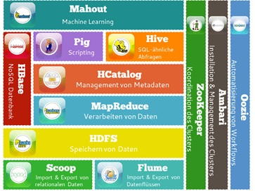
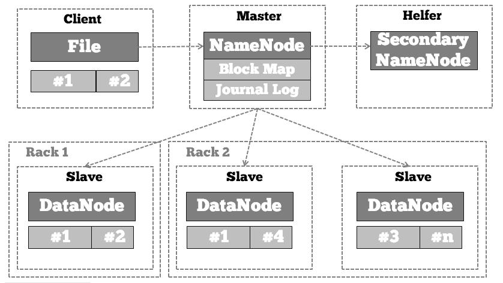
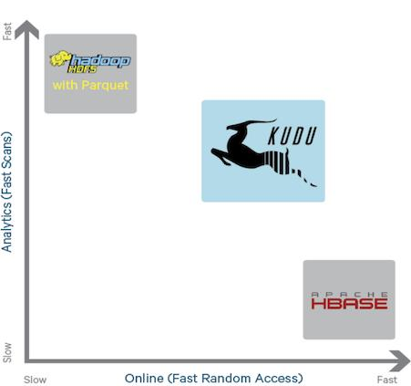

# 3 Apache Kudu
Dieser Teil der Arbeit betrachtet Apache Kudu als praktisches Einsatzgebiet des Raft-Algorithmus. Kudu ist ein Modul des Hadoop Frameworks. Um ein besseres Verständnis für den Gesamtzusammenhang herzustellen und um die Verbesserungen durch Kudu nachvollziehbar zu machen, werden an dieser Stelle ebenfalls das Framework als ganzes und HDFS im speziellen vorgestellt. Im Anschluss wird Kudu detailliert betrachtet und an den entsprechenden Stellen auf die Funktionsweise von Raft (siehe Kapitel 2) verwiesen. Am Ende steht eine Zusammenfassung und eine Bestandsaufnahme zur gegenwärtigen Wahrnehmung von Kudu in der Fachwelt.

## 3.1 Apache Hadoop
Mit Hadoop bietet Apache ein freies  Framework für skalierbare verteilte Software an. Im Grundsatz basiert die Software auf dem MapReduce-Verfahren von Google. Sie bietet die Möglichkeit, intensive Rechenprozesse mit großen Datenmengen auf Cluster zu verteilen und durchzuführen.Das Einsatzgebiet von Hadoop sind in erster Linie Big-Data Anwendungen, also alle Bereiche, in denen viele Daten ausgewertet und gespeichert werden müssen. Hadoop bietet Lösungen für die so genannten drei großen Vs der Big-Data-Probleme:

+	Datenmenge (Volume)
+	Datenvielfalt (Variety)
+	Zugriffsgeschwindigkeit (Velocity)

[4]

Die Abbildung zeigt den Aufbau des Hadoop Frameworks. Der Kern besteht aus den Elementen HDFS (Hadoop Distributed File System) und MapReduce. Allgemein spricht man bei dieser Zusammensetzung von Core Hadoop. Diese ermöglicht die Kernaufgaben Speichern und Auswerten von großen Datenmengen. Allerdings ist HDFS nicht zwingend zu nutzen, MapReduce kann aufgrund der modularen Struktur des Systems auch mit anderen Dateisystemen genutzt werden. Auch alle weiteren Module können zusätzlich, je nach Anforderungen, variiert werden.
Der Kern des Ansatzes ist der MapReduce Algorithmus. Dieser zerteilt Aufgaben in kleine einzelne Schritte und verteilt diese zur Bearbeitungen auf die Knoten eines Clusters. 

## 3.2 Hadoop Distrubuted Filesystem
Das HDFS ist ein verteiltes Dateisystem, das persistente Speicherung von großen Datenvolumen und einen schnellen sequentiellen lesenden Zugriff erlaubt. Das grundsätzliche Paradigma lautet „write once, read many“; im Idealfall werden Daten also einmal in das HDFS geschrieben und danach nur lesend aufgerufen. Einmal geschriebene Daten können nur eingeschränkt weiter bearbeitet werden. Es können grundsätzlich Daten angehängt werden. Beim Speichern werden die Daten in Blöcke geteilt und auf die Knoten des Clusters verteilt. Anhand der Größe der Blöcke, die meist 64 MB oder 128 MB beträgt, wird ersichtlich, dass der Ansatz eher für große Dateien bestimmt ist. Diese Blöcke werden in der Regel mit drei Kopien verteilt. Der Benutzer wird in der Interaktion mit dem Dateisystem nicht durch die automatisch ablaufenden Prozesse innerhalb des Clusters beeinflusst. Bei der Anwendung verhält sich das HDFS nach außen hin wie ein virtuelles Dateisystem, welches auch in der Befehlsstruktur eher an herkömmliche Dateisysteme aus dem Unix Bereich erinnert.
[5]  

Den Aufbau der Architektur unterhalb des virtuellen Dateisystems stellt die obere Abbildung da. Im Grundsatz ist das System nach der klassischen Master/Slave Struktur aufgebaut. 

+	Der NameNode ist der zentrale Master. Er verwaltet die Metadaten für alle im Cluster (auf den DataNodes) gespeicherten Daten. Dazu unterhält er einen Plan mit den aktuellen Speicherorten der Blöcke von Verzeichnissen und Dateien (Block Map) sowie ein Journal Log mit den aktuellen Dateioperationen. Er beantwortet mit diesen Hilfsmitteln eingehende Anfragen, speichert aber selber keine Daten.
+	Die DataNodes hingegen speichern die eigentlichen Daten. Sie sind als Slaves in das Cluster eingebunden und speichern die Daten nach Anweisung durch den Master (NameNode)
+	Zur Sicherstellung einer besseren Performance des Gesamtsystems gibt es zusätzlich zum NameNode einen Secondary NameNode. Anders als in anderen Ansätzen, in denen ein Redundantes Konzept verfolgt wird, hält der Secondary NameNode keine Kopie der Journale und Speicherorten. Er entlastet den NameNode, indem er periodischen Abständen die Block Map und das Journal Log des NameNode zusammenführt und die zusammengeführten Elemente wieder auf den NameNode zurück schreibt.

Will ein Client Daten auf dem HDFS ablegen, fragt er zunächst beim NameNode an. Bestätigt dieser, dass der Client grundsätzlich berechtigt ist zu schreiben, schickt der Client weitere Details zu den zu speichernden Daten. Als Antwort erhält der Client vom NameNode eine Liste mit DataNodes, auf denen Dateien abgelegt werden dürfen. Die weitere Kommunikation findet dann direkt zwischen Client und DataNodes statt. Der Client sendet die Datenblöcke an den DataNode. Intern sorgt das HDFS dafür, dass genügend Kopien zur Herstellung von Ausfallsicherheit angelegt werden. Im Normalfall werden drei Kopien innerhalb des Clusters repliziert.
Beim Lesen kommuniziert der Client wieder zuerst mit dem NameNode. Ist der Client berechtigt, erhält er vom NameNode eine Liste mit den Datenblöcken und den zugehörigen DataNodes. Anhand dieser Liste kann der Client die Daten direkt von den DataNodes lesen.
HDFS bietet sich immer dann an, wenn große Mengen an Daten verarbeitet werden sollen, die sich auf große Dateien verteilen. Durch den Einsatz von Standardhardware kann das System kostengünstig skaliert werden und bei größeren Anforderungen ausgebaut werden. Die implementierte Replikation sorgt automatisch für Backupfunktion und Fehlertoleranz bei Hardwareausfällen.
Werden statt großen Datenpaketen eher kleine Dateien verarbeitet ist das System ineffizient. Betrachtet man im Beispiel das Speichern einer 2 GB großen Datei im Vergleich zu 2000 Dateien mit der Größe von 1 MB und einer Blockgröße von 64 MB ergibt sich folgende Rechnung: 
   
2048 MB / 64 MB = 32 Blöcke * 3 Replikas = 96 Blöcke  
2000* (1 MB / 64 MB = 0,015625 == 1 Block ) *3 = 6000 Blöcke  
  
Weiterhin ist die Ausrichtung auf das ”write-once-read-many”-Paradigma nicht für alle Einsatzwecke geeignet. Bei einem Schreibzugriff auf eine Datei, die aus mehreren Blöcken besteht, wird für jeden Block der NameNode vom HDFS-Client aufgerufen, um das Schreiben des Blocks auf einen DataNode zu adressieren und zusätzlich das Schreiben des Blocks auf die vom NameNode bestimmten Replikate einzuleiten. Für jeden einzelnen dieser Schreibzugriffe muss eine Pipeline zum jeweiligen DataNode hergestellt werden.
Die Entwickler verstehen HDFS als Ergänzung zu traditionellen Datenbanksystemen, und nehmen aus diesem Grund die dargestellten Probleme in Kauf.  
>“HDFS is good for analytics where you’re batch loading large amounts of data, but you typically don’t update the data. It’s just a batch of transactions that took place yesterday or weblogs or something like that”[6]
  
##3.3 Kudu
Kudu ist eine Open Source Storage Engine mit niedrigen Zugriffszeiten bei wahlfreiem Zugriff und mit effizienten analytischen Zugriffsmustern. Kudu nutzt eine horizontale Partitionierung und nutzt zum Replizieren dieser Partitionen auf den Knoten des Clusters Raft.  
>“The idea was to build a storage system for the Hadoop ecosystem that was for mixed workloads”[7]
  
In den letzten Jahren hat sich das Volumen von zu bearbeitenden Daten enorm gesteigert. Aus dem Open Source Bereich hat sich das Framework Hadoop hervorgetan, um die Anforderungen, die Big Data mit sich bringt, zu erfüllen. Dabei hat sich in der Praxis eine Kombination aus verschiedenen Modulen des Frameworks herausgebildet. HDFS wird zum einen zum Speichern von strukturierten Daten in Binären Formaten wie Apache Avro oder Apache Paquet genutzt. Wie bereits beschrieben, zielt HDFS auf das „write-once-read-many“-Paradigma ab. HDFS ist enorm schnell bei sequentiellen Lesezugriffen, ist jedoch nicht geeignet für wahlfreien Zugriff oder für Änderungen an den gespeicherten Datensätzen. Um diese Schwächen zu umgehen werden in der Praxis oftmals veränderbare Daten in Systemen wie Apache HBase oder Apache Cassandra gespeichert. Diese Systeme bieten kleine Latenzen beim Lesen und Schreiben von Daten, haben aber einen geringeren Datendurchsatz beim sequenziellen Lesen (z.B. für Maschine-Learning). Daten und Aktualisierungen werden zuerst in HBase gespeichert und in periodischen Abläufen in Paquet-Dateien exportiert und für spätere Analysen in HDFS abgelegt. Durch diese Architektur ergeben sich folgende Probleme:  

+	Synchronisation zwischen den Systemen muss sichergestellt werden
+	Backup beider Systeme muss durchgeführt werden
+	Zeitdifferenz zwischen der Verarbeitung in HBase und der Ablage für die Analyse in HDFS
+	Spätere Änderungen (nach der Überführung in die Ablage) führen zu großem Aufwand
  
> “When we found HBase was becoming really popular, we found that some users had a mix of the two [HDFS und HBase]. They weren’t just doing this online random access, they also had some analytics. Conversely, other customers started with analytics, then said, ‘Hey wait. With this analytics workload, it’d be really nice to start ingesting it in a streaming fashion instead of just batch. Occasionally I have data corrections – updates or deletes.’ So we had a lot of people in the community and customers at Cloudera who were kind of between a rock and a hard place”[8]
  
Kudu wurde entworfen um diese Probleme zu umgehen und zum einen großen Durchsatz bei sequentiellen Leseoperationen zu ermöglichen und zum anderen geringe Latenzen bei wahlfreiem Zugriff sicherzustellen. Kudu hat dabei durchaus an verschiedenen Stellen Nachteile gegenüber der oben beschriebene etablierte Vorgehensweise ist aber weniger Komplex in der Implementierung. Waren im Jahr 2012 in der Praxis noch 32 GB RAM in Knoten eines Hadoop-Clusters verbreitet, hat sich dieser Wert auf aktuell durchschnittlich 256 GB RAM pro Knoten gesteigert[9]. Dies, und die zusätzliche Verbreitung von SSD in den Knoten lassen die Zugriffszeiten auf persistent abgelegte Daten enorm schrumpfen. Der Flaschenhals hat sich im Laufe dieser Entwicklung von den Speichergeräten zur CPU-Geschwindigkeit verschoben. Kudu ist auf diese Veränderungen abgestimmt.  

Die Kernziele beim Entwurf von Kudu waren:

+	Starke Performance beim Scan und wahlfreiem Zugriff
+	Effiziente CPU- und IO-Nutzung
+	Möglichkeiten Daten direkt zu aktualisieren
+	Möglichkeiten Active-Cluster zu bilden

Aus der Nutzersicht ist Kudu ein Speichersystem für strukturierte Daten. Ein Cluster kann aus einer beliebigen Anzahl aus Tabellen bestehen, die wiederum ein Schema mit definierten Spalten und definierten Formaten haben. Wie aus RDBMS bekannt, haben Datenreihen einen Primärschlüssel. Das Schema wird beim Anlegen der Tabellen definiert, spätere Eintragungen in ungültige Spalten führen zu Fehlermeldungen.
Für das Arbeiten mit Kudu werden INSERT, UPDATE and DELETE APIs genutzt. Dabei unterstützt Kudu momentan Java und C++ (es existiert darüber hinaus eine experimentelle Unterstützung von Pyton). Das Lesen wird über Scans realisiert. Dabei werden die Daten durch Vergleiche von Spaltenwerten mit festen Werten oder durch Angabe von Primärschlüsselbereichen eingeschränkt. Die Auswertung der angegebenen Einschränkungen wird auf dem Client und auf dem Server durchgeführt, um die zu übertragenen Datenmengen gering zu halten.
### 3.3.1 Kudu Architektur

Wie HDFS hat auch Kudu einen zentralen Master, der Metadaten hält, und beliebig viele Slaves auf denen die eigentlichen Daten gespeichert werden. Der Master-Server kann dabei repliziert werden um eine höhere Fehlertoleranz und schnelles Failover zu gewährleisten. Die Hardware kann bei Master und Slave- Knoten die gleiche sein.
#### 3.3.1.1 Master
Der Kudu Master hat folgende Aufgaben:

+	Catalog-Manager; Er weiß welche Tabellen und Tablets existieren, welche Schemas genutzt werden, kennt die Replikationslevel der Tablets und weitere Metadaten
+	Cluster-Coordinator; Er koordiniert das Cluster und überwacht die teilnehmenden Knoten und sorgt für eine saubere Datenverteilung nach einem Ausfall
+	Tablet Directory; Hat die Übersicht, welche Knoten Replikationen von welchen Tablets halten

_Im Detail bedeutet das:_  
  
**Catalog Manager**: Der Master speichert eine Tabelle mit Kataloginformationen zu den verteilten Tabellen. Dazu zählen die Schemata der Tabellen, der Status der Tabellen und der Tablets. Soll eine neue Tabelle angelegt werden, schreibt der Master diese Informationen in den Katalog und vermerkt den Eintrag mit CREATING. Er wählt Server aus, die das Tablet und weitere Replikationen speichern sollen. Auf dem Master werden die Informationen in die Metadaten gespeichert und Anfragen zur Replikation an die Tabletserver geschickt. Wenn die Mehrheit der Tabletserver die Änderungen Übernehmen, ist das neue Tablet angelegt. Ist die Mehrzahl der Replikationen fehlerhaft, kann das Tablet entfernt und neu angelegt werden. Sollte der Master während des Vorganges abstürzen, können die Schritte wiederholt werden; der Prozess ist idempotent.
    
**Cluster Coordination**: Jeder Tabletserver in einem Kudu Cluster meldet sich bei den Kudu-Master-Server. Dafür hält jeder Tabletserver eine Liste mit Hostnamen der Kudu-Master. Beim Start registrieren sich die Tabletserver beim Master und senden eine Übersicht der vorhandenen Tablets (Tablet Report). Der erste Tablet Report enthält alle Informationen über alle Tablets auf dem jeweilligen Server, die nachfolgenden Reports sind inkrementell und enthalten nur Informationen über die geänderten Tablets. In Kudu hält der Master die Kataloginformationen, wie im vorherigen Abschnitt beschrieben, hat aber keinen Einfluss auf die Replikationen. Diese werden von den einzelnen Tabletservern mittels Raft koordiniert. Ein Tabletserver ist somit ein Raft-Leader, der Master wird durch die Tablet Reports über die Datenablage informiert. Der Prozess ist idempotent, da die Tablet Replicas über alle Änderungen über Raft zu einer gemeinsamen Datenbasis kommen. Jede akzeptierte Änderung hat somit einen Raft operation index. Der Master vergleicht den Raft operation index und verwirft Änderungen, wenn dieser nicht aktueller ist, als der auf den Tablet Replicas vorhandene Index.
Dieser Ansatz nimmt den Master aus der Verantwortung, bei einem Absturz eines Tabletservers zu handeln. Die Fehlerbehandlung geschieht in den einzelnen Replikationen durch den Raft Leader. Dieser verfolgt die Kommunikation zu den einzelnen Followern und erklärt einen Follower für tot, wenn er in einer signifikanten Zeitspanne nicht auf Heartbeats antwortet. Er schlägt dann vor, den betreffenden Follower aus der Raft Konfiguration zu entfernen. Wenn diese Änderung (im Sinne von Raft) bestätigt ist, wird der Master über einen Tablet Report über die Änderung der Konfiguration informiert. Um die konfigurierte Anzahl an Replikationen wieder her zu stellen, wählt der Master einen Tabletserver aus dem Cluster aus, der eine weitere Replikation halten soll. Der Master schlägt eine weitere Konfigurationsänderung vor, die der entsprechende Replica Leader bearbeitet. Der Master hat keinen weiteren Einfluss auf die Verarbeitung und wartet auf den nächsten Tablet Report, indem ersichtlich ist, ob die Konfigurationsänderung (via Raft) akzeptiert oder verworfen wurde. Wenn der Versuch der Konfigurationsänderung nicht erfolgreich war, sendet der Master erneut einen Vorschlag an einen Tabletserver, so lang, bis die erforderliche Anzahl an Replikationen wieder hergestellt wurde.  
  
**Tablet Directory**: Clients fragen den Master nach Informationen über die Tablets. Selbst halten sie einen lokalen Cache mit Informationen über die letzten von ihnen genutzten Tablets und deren Speicherorte und Raft Konfigurationen. Der Client sendet die Anforderungen anhand dieses Caches zu den entsprechenden Leader des Tablets. Ist die Information veraltet und der Server ist nicht der Leader des entsprechenden Tablets, lehnt dieser die Anforderungen ab. Dies veranlasst den Client neue Informationen beim Master anzufragen; dieser sendet dann aktualisierte Informationen. Damit kann der Prozess auf Grundlage der neuen Datenbasis erneut durchgeführt werden.

#### 3.3.1.2 Slaves

Slaves sind für die Speicherung der eigentlichen Daten vorgesehen. Die Daten werden dabei in Tablets verwaltet. Für die Replikation der Daten nutzt Kudu Raft. Innerhalb einer Tablet Replica gibt es einen Leader (im Sinne von Raft) und eine Anzahl an Follower. Die Replikation der Daten wird dabei über Raft realisiert. Wie im oberen Abschnitt beschrieben, wird die Replikation in den einzelnen Tablet Replicas durch den jeweiligen Leader koordiniert. Die Speicherung und Replikation der Daten innerhalb der Tablet Replicas sind also losgelöst von der logischen Verwaltung und Bereitstellung der Daten für die Clients über den Master. 

### 3.3.2 Partitionierung
Kudu ist horizontal in sogenannte Tablets partitioniert. Jede Datenreihe kann auf Basis des Primärschlüssels einem Tablet zugeordnet werden. Dadurch kann die Performance beim zufälligen Zugriff verbessert werden, da die Zugriffe über die verschiedenen Tablets verteilt werden. Je Server sollten 10-100 Tablets abgelegt und verwaltet werden. 
Zur Verteilung der Daten auf die Tablets bietet Kudu einen flexiblen Ansatz; BigTable basiert auf eine Zuweisung der Daten nur auf Grundlage der Schlüssel, Cassandra verteilt die Daten auf Basis von Hashwerten. Kudu greift diese Ansätze auf, und bietet ein flexibles Array von Partitionierungsschemen: Wenn eine neue Tabelle erstellt wird, kann der Benutzer diese Schemen vorgeben. Dieses Schema bildet als Funktion das Mapping von eingegebenen Daten auf einen binären Partitionsschlüssel ab. Anhand dieser binären Schlüssel wertet Kudu aus, auf welchen Tablet die Daten abgelegt werden. Die Funktion wird dabei aus hash-partitioning rules und range-partition rules gebildet. Das Schema ist zusammengesetzt aus einer beliebigen Anzahl an hash-partitioning rules und optionalen range-partitioning rules.
Hash-partitioning rules bestehen aus einer Untermenge der Primärschlüssel und einer Anzahl an Buckets. Ein Beispielstatement verdeutlicht die Berechnung des binären Partitionsschlüssel:

 DISTRUBITE BY HASH(hostname, ts) INTO 16 BUCKETS;[10] 

Eine range-partitioning rule besteht aus einer geordneten Untermenge von Primärschlüsseln. Die Regel verbindet die Schlüssel unter Beibehaltung der Reihenfolge um den binären Partitionsschlüssel zu erhalten.
   
Der Nutzer kann durch diese Regeln die Verteilung der Daten innerhalb des Clusters beeinflussen und auf den Einsatzzweck abstimmen. Dabei muss der Kompromiss zwischen verteiltem Schreiben und dem späteren schnellen Auswerten der Daten betrachtet werden. Eine Messreihe in Zeitintervallen lässt sich Anhand einer hash-partitioning rule gut über alle Tablets verteilen; beim Suchen nach einem Datensatz der  Messreihe müssen jedoch alle Tablets gelesen werden. Dies beeinflusst die Lesegeschwindigkeit negativ. Besser ist ein Schema das die Timestamps nach range-partitioning rule bewertet und die Funktion um hash-partitioning rules für Hostname und Daten ergänzt.
### 3.3.3 Replikation
Alle Daten werden im Cluster repliziert. Der Benutzer stimmt die Replikationsfaktoren der Tabellen dabei auf die gewünschte Verfügbarkeit ab. Typische Werte sind Faktoren von 3 oder 5. Der Master stellt sicher, dass die gewünschte Anzahl von Replikationen im Cluster verfügbar ist. Die eigentliche Koordination der Replikationen über das Raft-Protokoll wird durch den jeweiligen Replica Leader in den Replicas durchgeführt (siehe Abschnitt Master,  Cluster Coordination).
Soll ein Schreibvorgang durchgeführt werden, wird im ersten Schritt der Replica leader eines Tablets durch den Client lokalisiert (siehe Kapitel Master, Tablet Directory). Dann sendet der Client einen Write RPC zum Leader. Falls der Empfänger nicht mehr als Leader fungiert, lehnt er den RPC ab. Der Client sendet dann erneut, auf Basis von aktualisierten Daten, einen Write RPC. Ist der Empfänger der Leader, nutzt dieser einen Lockmanager, um die Operation mit anderen eventuell anstehenden Operationen zu serialisieren und schlägt die Änderungen über Raft den Followern vor. Wenn die Mehrzahl der Follower die Änderungen in ihr write-ahead-log aufgenommen und akzeptiert haben, gelten diese als bestätigt und können von allen Follower in die Logs übernommen werden ( Vgl. Kapitel 2.2). Es ist dabei für eine Bestätigung nicht notwendig, dass der Leader die Änderungen in seinem lokalen Log übernommen hat. Dadurch entstehen durch einen ausgelasteten Leader keine Verzögerungen.  
Fällt eine Minderheit der Knoten aus, kann der Leader trotzdem weiter Änderungen vorschlagen und bestätigen lassen. Wenn der Leader selber ausfällt, wird mit Hilfe von Raft ein neuer Leader gewählt. Kudu arbeitet mit einem Heartbeat von 500 ms und einem Leader-Election-Timeout von 1500 ms (Vgl. Kapitel 2.1).  
Bei der Umsetzung der Replikation wurden kleine Verbesserungen am Raft-Protokoll durchgeführt: 

+	Nach einer gescheiterten Leader-Election wird mittels einem Back-Off Algorithmus[11] eine zufällige Zeitspanne ermittelt und gewartet
+	Wenn ein neuer Leader einen Follower kontaktiert, dessen Log sich unterscheidet, geht Raft im Log soweit zurück, bis eine Einigkeit besteht. Kudu springt stattdessen direkt zum letzten verifizierten committedIndex zurück. Dadurch werden während des Rollbacks weniger Daten über das Netzwerk an die Beteiligten Knoten gesendet. Zusätzlich spart dieser Mechanismus Zeit, da kein schrittweiser Vergleich durchgeführt werden muss.

Eine Konfigurationsänderung (Erhöhung des Replikationsfaktors) wird über den „one-by-one“ Algorithmus realisiert. Eine Erhöhung des Replikationsfaktors von 3 auf 5 bedingt also einen Zwischenschritt. Der Weg ist in diesem Fall 3>4>5. Soll ein neuer Knoten aufgenommen werden, wird dieser in einem ersten Schritt in die Raft Konfiguration aufgenommen (Vgl. Kapitel 2.3). Danach sendet der Replica Leader einen StartRemoteBootstrap RPC, was den neuen Teilnehmer veranlasst, einen Snapshot von den Daten und Logs des Replica Leaders zu kopieren. Wenn alle Einträge des Logs abgearbeitet sind, ist die Replikation auf den neuen Teilnehmer beendet und dieser ist nun aktiv und steht für RPC-Anfragen bereit.
Hier existiert momentan ein Flaschenhals, der aber in Zukunft gelöst werden soll. Soll eine Konfiguration von 3 auf 4 Server geändert werden, müssen 3 von 4 Servern Änderungen bestätigen. Solange der neue Server Snapshot und Log repliziert, kann er jedoch nicht auf Anfragen antworten. Fällt nun ein weiterer Server aus, müssen an dieser Stelle Schreiboperationen solange zurück gestellt werden, bis die Replikation beendet ist und der neue Server aus Anfragen antworten kann.  
Soll ein Server aus der Konfiguration ausscheiden, sendet der Raft Leader diesen Vorschlag. Wenn dieser von der Mehrheit der Follower bestätigt wird, und der Vorschlag damit akzeptiert ist, senden die verbleibenden Knoten keine Daten mehr an den ausgeschiedenen Teilnehmer. Sie senden eine Benachrichtigung über den ausgeschiedenen Knoten an den Master, der für das saubere Ausscheiden eines Knoten verantwortlich ist.

### 3.3.4 Zusammenfassung

Kudu tritt als Lösung an, die bisherigen Implementierungsschritte für einerseits schnelle Datenanalyse über Bestandsdaten (HDFS) und andererseits guter Performance beim Update kleiner Datenmengen (HBase) zu vereinfachen. Durch Kudu werden beide Nutzungsvarianten abgebildet, wenngleich die bisherigen Methoden in ihren Disziplinen Vorteile haben.
[12]  

Die Grafik zeigt die Einordnung der Performance im Vergleich zu den bereits etablierten Systemen. Dabei wird deutlich, dass Kudu einen guten Kompromiss zwischen guter Performance bei großen Analysen und vielen kleineren Datenänderungen darstellt.  
Kudu kann als Storage-Engine in Apache Hadoop eingebunden werden und mit anderen Modulen genutzt werden. Kudu unterstützt sowohl den wahlfreien Zugriff mit niedriger Latenzzeit, als auch Analysen mit hohem Durchsatz. Es ergänzt die Kapazitäten von HDFS und HBase, indem es gleichzeitig schnelles Einfügen und Aktualisieren sowie effiziente spaltenweise Scans bietet. Es ist insbesondere auf große Datenströme in Echtzeit optimiert, wie sie beispielsweise durch Internet-der-Dinge-Anwendungen anfallen.  
Raft dient dabei als Grundlage der Replikationen in den einzelnen Tablet Replica. Mit den Replica Leadern und Followern sind die Komponenten des Protokolls, wie in Abschnitt 1 beschrieben, umgesetzt und teilweise Verbessert (Vgl. Kapitel 3.3.3).

### 3.3.5 Stand der Dinge: Kudu, the next big Thing?

Zum Stand der Dinge lässt sich zum jetzigen Zeitraum folgendes festhalten: Kudu ist als Komponente für Hadoop noch relativ neu, wurde aber durch Apache für einen produktiven Einsatz freigegeben. Gestartet wurde die Entwicklung im Jahr 2012 von Cloudera und wurde 2015 (zusammen mit Impala) an Apache zur Integration in Hadoop übergeben.   
Bisher gibt es im Vergleich zu HDFS und HBase eher wenige Treffer in den einschlägigen Suchmaschinen. Die Artikel und Blogeinträge, die sich mit dem Thema Kudu beschäftigen sind teilweise technische Betrachtungen (der großteil verweist dabei auf das Whitepaper), teilweise praxisnahe Betrachtungen. Die Mehrzahl der Autoren sieht Kudu positiv und betrachtet das System als alternative zur Kombination von HDFS und HBase.  
Da das System noch sehr jung ist, gibt es wenige praxisnahe Erfahrungsberichte. 
Eine Sammlung von Zitaten zur Entwicklung und Zukunft von Kudu:  
>If Cloudera is looking to capture the “analytical Hadoop” market – which seems to be the case – it will need to move rapidly to improve on some of the shortcomings and demonstrate to customers the usability and stability of Kudu [13].  
  
>Fast writes, fast updates, fast reads, fast everything [14]. 
  
>HDFS allows for fast writes and scans, but updates are slow and cumbersome; HBase is fast for updates and inserts, but "bad for analytics," said Brandwein. Kudu is meant to do both well [15].
  
>Apache Kudu (incubating), which was started by Cloudera, completes Hadoop's storage layer (different from HDFS) to enable fast analytics on fast data. It supports HBase-like feature to allow fast data ingestion as it arrives in realtime; it also supports Parquet/HDFS-like feature to run analytic workloads on both historic & fresh data. Moreover, it makes data mutation possible, while current HDFS is designed for immutable use case only [16]. 
  
Der Grundtenor lässt sich demnach als positiv erfassen. Es bleibt abzuwarten in welchen Projekten in Zukunft auf Kudu gesetzt wird. Durch die vergleichsweise einfache Implementierung, wird die Verbreitung in der nächsten Zeit merklich zunehmen. Durch eine weitere Verbreitung werden auch Performance und Zuverlässigkeit unter Beweis gestellt und Fehler entdeckt und beseitigt, so das es in einem längerfristigen Zeitraum wahrscheinlich ist, Kudu in einem weiteren praktischen Umfeld zu verbreiten. 
