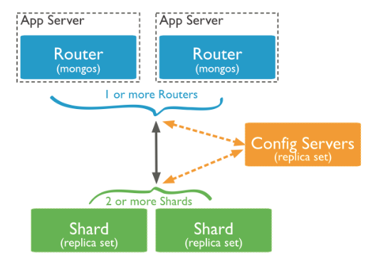

## Sharding am Beispiel MongoDB [MDB2017]

### Was ist MongoDB?
Der Begriff MongoDB bedeutet soviel wie „Humongous Database“ und dies wiederum steht für riesige oder gewaltige Datenmengen. Daraus ergibt sich auch das Einsatzgebiet von MongoDB. Diese Datenbanktechnologie ist speziell für riesige Datenmengen ausgelegt und gilt dabei als sehr performant, flexibel und skalierbar. In MongoDB werden Datensätze als Dokumente organisiert und abgespeichert. Eine Sammlung von Dokumenten werden „Kollektionen“ genannt. Dokumente unterliegen keinem festen Schema, was für eine sehr hohe Flexibilität in der Datenspeicherung sorgt. Die abgespeicherten Dokumente werden im BSON-Format (Binary JavaScript Object Notation) gespeichert. In diesem Dokumenten können dadurch nicht nur einfache Datentypen, wie Integer oder String abgelegt werden, sondern eine Speicherung von Mehrdimensionalen Arrays oder Subdokumenten ist ohne weiteres möglich. Die MongoDB NoSQL (not only SQL) Datenbank bringt von Haus aus einige Features zur Skalierung mit. So auch für das Sharding.

### Einführung
Um Kollektionen, also Sammlungen von Dokumenten, horizontal auf mehrere MongoDB-Systeme zu verteilen ist der Einsatz eines oder mehrer Konfigurationsserver notwendig. Vorab muss ein Shard-Key festgelegt werden. Dies kann, je nach konfiguration, ein beliebiges Datenfeld innerhalb der geshardeten Kollektion sein. Beim Sharding in MongoDB kommunizieren Clientserver mit dem Konfigurationsserver und übermitteln diesem bei Anfragen den Shard-Key des jeweiligen Datensatzes. Dieser antwortet beispielsweise mit einer Datenbankbezeichnung, welche aussagt, auf welchem Shard der betroffene Datensatz gefunden oder abgelegt werden kann.

Das Sharding in MongoDB besteht aus drei Komponenten. Dem Datenbanktreiber der jeweils in der Anwendungssoftware installiert sein muss, einem oder mehreren Konfigurationsservern und den Datenbanken selbst. Der Entwicklerdokumentation von MongoDB nach empfiehlt es sich für Konfigurationsserver und Datenbanken jeweils ganze Replica-Sets einzusetzen. Dadurch soll die Hochverfügbarkeit gewährleistet werden, sodass der Ausfall einer Komponente innerhalb eines Replica-Sets keine weiteren Auswirkungen auf Verfügbarkeit oder auf zu speichernde Datensätze hat.


<center></center>
<center><p style="font-size:12px" >Sharding in MongoDB [MDB2017P]</center>


### Einrichtung und praktisches Beispiel
Nach der Installation von MongoDB werden über den folgenden Kommandozeilenbefehl MongoDB-Deamonprozesse gestartet:

 ```
 mongod --configsvr --replSet --dbpath <path>
 ```
Der Parameter "configsvr" nimmt einen booleschen Wert entgegen und trifft eine Aussage darüber, ob der aktuelle Prozess als Konfigurationskomponente, also als Konfigurationsserver, dienen soll oder nicht. Für den Wert "false" fungiert der Prozess also als eine ganz normale Datenbank. Für "true" hingegen dementsprechend als Konfigurationsserver. Im Parameter "replSet" wird der Name des Replica-Sets, falls vorhanden, eingetragen. Hierbei ist zu beachten, dass der Name für alle Komponenten, die zu einem Replica-Set gehören, den selben Namen haben müssen. Jedes Replica-Set muss zwingend einen eindeutigen Namen haben. Der Parameter "dbpath" gibt den Dateipfad zur eigentlichen Datenbank an, wo die BSON-Dokumente abgelegt werden. [MDB2017C] 

Um in MongoDB Replica-Sets einzurichten gibt es den folgenden Kommandozeilenbefehl:

```
rs.initiate(
  {
    _id: "<replSetName>",
    configsvr: true,
    members: [
      { _id : 0, host : "cfg1.example.net:27017" },
      { _id : 1, host : "cfg2.example.net:27017" },
      { _id : 2, host : "cfg3.example.net:27017" }
    ]
  }
)
```

Durch Anwendung dieses Befehls wird ein Replica-Set erstellt. Das "id" Feld stellt den bereits erwähnten eindeutigen Namen dar, unter dem das Replica-Set bekannt gemacht wird. Das Feld "configsvr" wurde ebenfalls bereits beschrieben und gibt an, ob es sich bei dem zu erstellenden Replica-Set um Konfigurationsserver oder gewöhnliche Datenbankknoten handelt. Der Eintrag von Subdokumenten in das "members" Feld verbindet die einzelnen "mongod" Prozesse der verschiedenen Maschinen.[MDB2017R]

Das Sharding in MongoDB geht anfänglich von einer einzigen Datenbank aus, auf dem das Sharding aktiviert wird und weitere Shard's, also weitere Datenbanken, hinzugeschaltet werden. Um Sharding in MongoDB einzurichten, ist es zunächst notwendig die Sharding-Mechanismen zu aktivieren. Dazu ist die Verwendung des folgenden Kommandozeilenbefehls auf der Hauptdatenbank notwendig:
```
db.runCommand({ enableSharding: "<database name>" })
```
Um nun Shard's hinzuzufügen und mit der Hauptdatenbank zu verbinden ist die Ausführung des folgenden Kommandozeilenbefehls für jeden Shard notwendig:
```
db.runCommand({ addShard: "<hostname><:port>", maxSize: <size>, name: "<shard_name>" })
```
Der Parameter maxSize ist optional und legt die maximale Speichergröße fest, die der aktuelle Shard erreichen darf. Ist diese Speichergröße erreicht, findet kein weiteres Ablegen von Datensätzen auf diesem Shard statt.

Als nächstes muss die Kollektion zum sharden vorbereitet werden. Dazu wird auf der Hauptdatenbank der folgende Befehl ausgeführt:
```
db.runCommand({
  shardCollection: "<database>.<collection>",
   key: <shardkey>,
   unique: <boolean>,
   numInitialChunks: <integer>,
   collation: { locale: "simple" }
})
```

unter dem Feld „key“ wird nun der Shard-Key aus der Kollektion angegeben. Die Verteilung der Daten wird in der Standardeinstellung automatisch erledigt. Dafür gibt es in MongoDB den sogenannten „Balancer“ (https://docs.mongodb.com/manual/reference/glossary/#term-balancer). Es ist jedoch auch möglich den Balancer selbst zu konfigurieren und somit eine eigene Verteilung anhand des Shard-Keys festzulegen, was jedoch laut der hauseigenen Dokumentation von MongoDB nicht ratsam ist.

