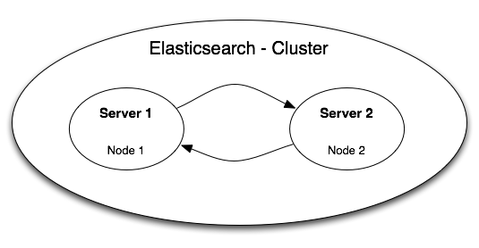

## Beispiel Elasticsearch [ES2017]

Elasticsearch ist eine ist eine Client-Server Suchmaschine, welche die Suchergebnisse in einem JSON-Format speichert und diese über RESTful-Webservice ausgibt. Daher handelt es sich bei der Datenbank, welche sich im Kern von Elasticsearch befindet um einen dokumentenbasierten Speicher. Innerhalb der Elasticsearch-Infrastruktur, dem sog. Cluster,  werden die Daten dann in Indizes gespeichert. Ein Index repräsentiert somit die Datenbank, welcher Typen enthält. Die werden von der Such-Engine wie Tabellen in einer Datenbank behandelt. In diesen Typen befinden sich dann die Dokumente mit Properties und Attributen (als Key-Value Paar)
Die RESTful API, welche Elasticsearch zu Client-Server-Kommunikation nutzt, ist ein Konzept welches Eigenschaften wie Zustandslosigkeit, Addressierbarkeit und festgelegte Operationen für entsprechende Dienste vorschreibt [ICS2000]. Diese Dienste kommunizieren über das HTTP-Protokoll. Da jede Suchanfrage als URL formuliert wird, ist sie auch stets einzigartig und eindeutig adressierbar.

Durch die Eigenschaft von Elasticsearch als Volltext-Suchamschine mit einer NoSQL-Datenbank im Kern, ist es potentiell möglich, dass auch sehr viele Daten aufgenommen werden. Mehrere Milliarden Dokumente in einem Index führen auch zu mehreren TerraByte an benötigtem Festplattenspeicher. Dann ist es wahrscheinlich, dass die Server-Festplatte zu klein oder langsam ist, viele Suchrequests auf einem Index zu verarbeiten

### Komponenten

Um ein genaues Verständnis dafür zu bekommen, wie Elasticsearch das Sharding vollkommen selbständig übernimmt, ist es notwendig einige Basiskonzepte von Elasticsearch zu erkennen.
Vorangegangen wurde ja bereits der Begriff Cluster erwähnt. Doch was zeichnet einen Cluster in Elasticsearch aus? Ein Cluster ist eine Collection von ein oder mehreren Nodes, welche die gesamten Daten eines oder mehrerer Indizes beinhaltet und verwaltet. Außerdem stellt er die "Suchbarkeit" über alle Nodes innerhalb des Clusters bereit. So ist es zum Beispiel möglich, mit entsprechender Konfiguration, auf mehreren Indizes gleichzeitig zu suchen. In der Regel befindet sich in einem Cluster eine Node mit einem Index. Lediglich in großen Datenstrukturen macht es Sinn mehreren Nodes innerhalb eines Clusters zu haben. Dies ist immer dann besonders sinvoll, wenn man über mehrere Server verfügt, die dann als Gesamtheit einen Cluster blden. Ein Cluster wird üblicherweise durch seinen Namen identifiziert. Standardmäßig ist das "elasticsearch".

Wie bereits erwähnt repräsentiert eine Node immer einen Server, genauer gesagt eine Elasticsearch-Instanz auf einem Server. Sie enthält Daten (als Documents) innerhalb eines Index' und trägt ihren Teil zur Indexierung und Suchfunktionalität in dem Cluster bei. Wie ein Cluster verfügt auch eine Node über einen eindeutigen Namen. Dieser wird beim Start der Instanz zufallsgeneriert und der Node zugewiesen. Auch dieser Name kann durch den Nutzer geändert werden. Beim Erzeugen der Node/Instanz erstellt die Node automatisch einen Cluster "elasticsearch" oder treten diesem bei, sofern er schon existiert. Somit lassen sich sehr leicht beliebig viele Nodes in einen Cluster bringen.

Wie bereits beschrieben repräsentiert der Index die Datenbank. Es ist möglich innerhalb einen Clusters beliebig viele Inidzes erstellen lassen. Diese werden dann durch das Sharding "aufgetrennt" und über mehrere Nodes verteilt

Zu einem weiteren Basiskonzept von Elasticsearch gehört das bereits erwähnte Sharding. Elasticsearch wurde entwickelt, um große Datenmengen zu halten und diese in nahezu Echtzeit durchsuchbar zu machen. Deshalb ist es wichtig, ein Verfahren zu entwickeln, welches auch berücksichtigt, dass Datenmengen von bis zu einem TerraByte nicht auf eine einzelne Festplatte eines Servers passen - das entspricht dann einer Node. Auch wenn eine Festplatte in der Lage ist, solche Datenmengen zu halten, so kommt auch die eigentlich sehr performante Such-Engine Elasticsearch an seine Grenzen, wenn es darum geht Suchrequests in Echtzeit zu beantworten. Hierzu wird der Index in einzelne Stücke, die sogenanten Shards, aufgeteilt welche alleine als unabhängige und voll-funktionsfähige Indizes gesehen werden können. Diese Shards könenn dann auf verschiedenen Nodes arbeiten und somit die erwähnten Nachteile ausgleichen.

Beim Hinzufügen von Daten werden die Shards gleichmäßig befüllt, sodass Datenlast stets fair verteilt bleibt. Elasticsearch erstellt die Shards innerhalb des Clusters standardmäßig und vollautomatisch, um die vertikale Skalierbarkeit zu gewährleisten und die Suche performant zu halten. Zusätlich wird zu jedem Shard ein Backup angelegt. Sollte ein Shard unerwartet nicht mehr lesbar oder verfügbar sein, kann auf das Replika zurückgeriffen werden. Das Replika jedes Shards befindet sich niemals auf der selben Node, um die ständige Verfügbarkeit zu gewährleisten.

Außer der Konfiguration von Shard- und Replika-Anzahl muss der Nutzer keine Einstellungen für das Sharding vornehmen. Wie bereits erwähnt muss sich der Nutzer nicht darum kümmern, wie die Shards verteilt sind und wie sie zusammengenommen wieder einen befüllten Index ergeben. Trotzdem gibt es die Möglichkeit die Shards genauer zu untersuchen. Das folgende Beispiel soll das Erstellen eines Index mit benutzerdefinierten Shards verdeutlichen und zeigen, dass die Daten gleichmäßig auf die Shards verteilt werden.

Ein Beispiel zeigt, wie sich dieses Prinzip in der Praxis verhält:
Für die Elasticsearch-Suchengine werden zwei identische Server gemietet, welche die Suchanfragen verarbeiten sollen. Auf diesen läuft dann jeweils eine Elasticsearch-Instanz (Node). Wenn ein Server aufgrund von Stromausfall oder ähnlichen Problemen nicht erreichbar ist, kann die Suche immer noch auf der anderen Maschine erfolgen. Die Server teilen sich also normalerweise die Arbeit, wenn es aber zu Problemen eine Servers kommt, so „springt“ der andere für ihn ein, um die komplette Funktionalität weiter zu gewährleisten.

<center></center>
<center><p style="font-size:12px" >Infrastruktur eines Clusters mit zwei Server in Elasticsearch</center>

Die Daten des Index’ werden durch Elastiscsearch wie gesagt in 5 Shards mit jeweils einem Replika aufgeteilt. Für eine Infrastruktur mit zwei Nodes kann die Aufteilung dann folgendermaßen aussehen:

| Node-Shard   | Shard      | Shard-Replika  |
| -------------|:----------:| --------------:|
| 1            | Server 1   | Server 2       |
| 2            | Server 1   | Server 2       |
| 3            | Server 1   | Server 2       |
| 4            | Server 2   | Server 1       |
| 5            | Server 2   | Server 1       |

Besitzt das Cluster dann noch mehrere Indizes, werden diese wiederum in neue Shards aufgeteilt, welche dann völlig anders auf dem Server verteilt werden können.
Folgendes Schaubild zeigt die Verteilung von zwei Indizes innerhalb der Beispiel-Topologie:

<center></center>
<center><p style="font-size:12px" >Sharding mehrerer Indizes auf zwei Servern</center>

Dieses Besipiel verdeutlicht, wie Elasticsearch das Sharding selbständig ausführt. Doch wie gewährleistet Elasticsearch die vertikale Skalierbarkeit? Darüber soll folgendes Beispiel Aufschluss geben:

### Beispiel
Im ersten Schritt wird ein neuer Index auf dem gestarteten Elasticsearch-Server angelegt. Nun besitzen wir einen Index auf einer Node, welche sich in einem Cluster befindet. Eine Erstellung meherer Nodes, welche dann über eigenständige Shards verfügen ist ebenfalls möglich, soll in diesem Beispiel aber erstmal nicht weiter vertieft werden.

Der Index auf dem Node verfügt immer über das Standard-Setting mit 5 Shards und einem Replika pro Shard.

Das Anlegen erfolgt indem ein HTTP-POST auf den Elasticsearch-Server mit entsprechenden Document angelegt wird. Sollte es den Index noch nicht geben, wird er gleich mit erstellt.
```javascript
POST /books/book/1
{
  "title" : "Elefant",
  "author": "Martin Suter"
}
```
Nun verfügen wir über ein Dokument in dem Type „book“ (analog zum Table in SQL) auf dem Index „books“.
Der Response gibt Aufschluss darüber, dass das Document erfolgreich angelegt wurde:

```javascript
{
   "_index": "books",
   "_type": "book",
   "_id": "1",
   "_version": 1,
   "created": true
}
```

Ein HTTP-GET auf die Settings des Index' liefert nun folgenden Response:
```javascript
GET /books/_settings
{
   "books": {
      "settings": {
         "index": {
            "number_of_shards": "5",
            "number_of_replicas": "1",
            "version": {
               "created": "1030499"
            },
            "uuid": "71AAXyRPTBKhJWrTy4vp-w"
         }
      }
   }
}
```
Es ist zu erkennen, dass Elasticsearch einen Cluster mit 5 Shards angelegt hat. Um mehr oder weniger Shards zur Verfügung zu stellen muss ein neuer Index angelegt werden. Dazu wird im ersten Schritt ein PUT auf den neuen Index mit den folgenden Settings ausgeführt.
```javascript
PUT /books_less_shards/
{
    "settings" : {
        "number_of_shards" : 3,
        "number_of_replicas" : 2
    }
}
```
Der GET-Request auf die Settings des neu angelegten Index bestätigt die neue Konfiguration
```javascript
GET /books_less_shards/_settings
{
  "books_less_shards": {
     "settings": {
        "index": {
           "number_of_shards": "3",
           "number_of_replicas": "2",
           "version": {
              "created": "1030499"
           },
           "uuid": "vQT1cqNAQWS9t3Yim8Ailw"
        }
     }
  }
}
```
Nun können Documents hinzugefügt werden, die sich selbstständig auf die einzelnen Shards aufteilen. Es wurden insgesamt 53 Documents vom Type book hinzugefügt
```javascript
GET /books_less_shards/_search
{
   "took": 12,
   "timed_out": false,
   "_shards": {
      "total": 3,
      "successful": 3,
      "failed": 0
   },
   "hits": {
      "total": 121,
      "max_score": 1,
      "hits": [
         {
           ...
         }
      ]
    }
}
```
Der Response zeigt an, dass sich nun 4 Documents im Index mit 3 Shards befinden.

Um die Aufteilung auf die einzelnen Shards genauer zu untersuchen kann folgender Befehl Aufschluss geben,:

```javascript
GET /_cat/shards/books_less_shards
books_less_shards 2 p STARTED    38  8.4kb 127.0.0.1 Acrobat
books_less_shards 2 r UNASSIGNED                             
books_less_shards 1 p STARTED    42 14.6kb 127.0.0.1 Acrobat
books_less_shards 1 r UNASSIGNED                             
books_less_shards 0 p STARTED    41 23.7kb 127.0.0.1 Acrobat
books_less_shards 0 r UNASSIGNED                             
```

Diese Übersicht gibt verschiedene Informationen.
- Spalte 1: der Index, auf dem der Shard gefunden wurde.
- Spalte 2: für die Shard-Nummer auf der entsprechenden Node
- Spalte 3: steht für primary (p) oder replica (r)
- Spalte 4: Zustand des Shards. Die Replika-Shards wurden auf dieser Node bisher nicht zugewiesen
- Spalte 5: Anzahl der Documents auf dem Shard
- Spalte 6: Größe des Shards (steigt mit zunehmender Anzahl an Documents)
- Spalte 7: IP-Adresse
- Spalte 8: Node auf dem der Shard liegt.

Zum Einen ist zu erkennen, dass 6 Shards existieren - drei Shards mit je einem Replika. Außerdem fällt auf, dass die Shard sehr gleichmäßig verteilt sind. Elasticsearch gewährleistet somit, dass auch die Lastverteiliung bei mehreren Queries stets ausgeglichen bleibt. In diesem Beispiel liegen alle Shards auf einer Node, wleche sich auf einem Server befindet. Wie jedoch bereits erwähnt, ermöglicht Elasticsearch es ebenfalls Shards auf unterschiedlichen Nodes zu haben, welche gemeinsam den Index bilden.

Außerdem ist zu erkennen, dass die Replika-Shards keine Daten enthalten. Damit ist jedoch die doppelte Datenhaltung nicht gewährleistet. Der Grund hierfür ist, dass der Replika-Shard niemals auf der gleichen Node wie der Prmär-Shard liegen darf. Wie bereits erwähnt dient das der Ausfallsicherheit, sollte ein Node nicht verfügbar sein.
Deshalb werden zwei weitere Elasticsearch-Instanzen innerhalb des Clusters gestartet.

Nun ist zu erkennen, dass auch die Replika-Shards auf den anderen Nodes zugewiesen wurden:
```javascript
GET /_cat/shards/books_less_shards
books_less_shards 1 r STARTED 42 14.6kb 127.0.0.1 Zombie  
books_less_shards 1 p STARTED 42 14.6kb 127.0.0.1 Jekyll  
books_less_shards 2 r STARTED 38  8.4kb 127.0.0.1 Zombie  
books_less_shards 2 p STARTED 38  8.4kb 127.0.0.1 Acrobat
books_less_shards 0 r STARTED 41 23.7kb 127.0.0.1 Jekyll  
books_less_shards 0 p STARTED 41 23.7kb 127.0.0.1 Acrobat

```
### Shards verschieben

Um zu verdeutlichen, dass Elasticsearch sehr flexibel in der Verwaltung von Shards ist, sollen nun einzelne Shards auf andere Nodes verschoben werden. Hierfür stellt ELasticsearch den Reroute Befehl bereit:
```javascript
POST /_cluster/reroute
{
    "commands" : [ {
        "move" :
            {
              "index" : "books_less_shards", "shard" : 0,
              "from_node" : "Acrobat", "to_node" : "Zombie"
            }
        }
    ]
}

GET /_cat/shards/books_less_shards
books_less_shards 2 r STARTED 38  8.4kb 127.0.0.1 Zombie  
books_less_shards 2 p STARTED 38  8.4kb 127.0.0.1 Acrobat
books_less_shards 1 p STARTED 42 14.6kb 127.0.0.1 Jekyll  
books_less_shards 1 r STARTED 42 14.6kb 127.0.0.1 Acrobat
books_less_shards 0 p STARTED 41 23.7kb 127.0.0.1 Zombie  
books_less_shards 0 r STARTED 41 23.7kb 127.0.0.1 Jekyll  

```
Der Shard 0 wurde von der Acrobat-Node auf die Zombie-Node verschoben. Der Replika Shard wurde davon nicht beeinflusst.

Somit wurde verdeutlicht, dass es trotz der automatisierten Verwaltung der Shards durch Elasticsearch möglich ist die Shards auf den Nodes individuell zu verteilen. Das ist beispielsweise besonders hilfreich, wenn die Server unterschiedlich stark sind und somit auch unterschiedlich viele Shards enthalten sollten.

### Shard-Konfigurationen
Elasticsearch überwacht standardmäßig den Festplattenspeicher einer Node und macht davon abhängig, ob der Node weitere Shards zugewiesen werden dürfen [DBSA2017]. Somit wird jederzeit sichergestellt, dass Nodes nicht "volllaufen". Durch folgenden Befehl lässt sich diese Einstellung jedoch deaktivieren, auch wenn davon in den meisten Fällen abzuraten ist:
```javascript
PUT /_cluster/settings
{
    "transient" : {
        "cluster.routing.allocation.disk.threshold_enabled" : false
    }
}
```
Ist dieser Wert jedoch aktiviert so gibt es zwei Settings, die von Bedeutung sind:
```javascript
cluster.routing.allocation.disk.watermark.low
cluster.routing.allocation.disk.watermark.high
```
Der Low-Watermark Wert beträgt standardmäßig 85% Festplattenspeicher und bewirkt, dass ab diesem Wert keine neuen Shards der Node hinzugefügt werden. Der High-Watermark beträgt standardmäßig 90% und bewirkt, dass wenn dieser Wert überstiegen wurde, Shards von der Node auf eine andere verlegt werden. Auch diese Wert können angepasst werden und beispielsweise auch absoulte Werte tragen:
```javascript
PUT _cluster/settings
{
  "transient": {
    "cluster.routing.allocation.disk.watermark.low": "50%",
    "cluster.routing.allocation.disk.watermark.high": "20gb"
  }
}
```

Zusätzlich zur Festplatten-basierten Shardzuweisung stellt Elasticsearch noch weitere Einstellmöglichkeiten für die Shardzuweisung bereit. So kann die maximale Anzahl an Shards pro Node festgelegt werden oder die Shardzuweisung von bestimmten Attributen innerhalb des Index' oder Clusters abhängig gemacht werden.

Auch wenn Elasticsearch den Erstellungs- und Verwaltungsprozess von Shards vollkommen selbstständig übernimmt, so hat der Nutzer vielfältige Möglchkeiten das Shardingverfahren an seine Architektur anzupassen und in seinem Sinne zu optimieren.
